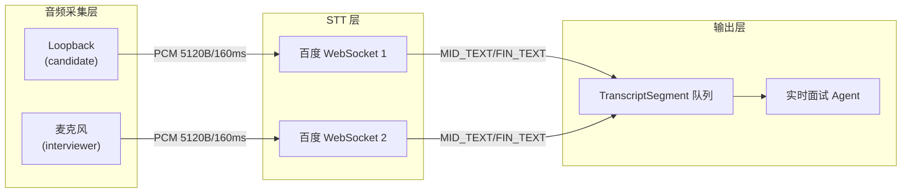

# STT 方案：百度实时语音识别 API

## 方案概述

使用百度实时语音识别 WebSocket API，与现有 `AudioStreamManager` 对接。百度 API 要求 16kHz PCM，与当前采集层完全兼容，无需修改采集代码。禁用本地 VAD，完全依赖百度服务端自动切句。

## 架构设计



远程面试模式下为 candidate 和 interviewer 各开一个独立 WebSocket 会话，天然区分说话人。

## 核心实现

### 1. 新建 `demo/audio/stt.py`

```python
@dataclass
class TranscriptSegment:
    text: str
    source: str           # "candidate" | "interviewer" | "mixed"
    is_final: bool        # MID_TEXT=False, FIN_TEXT=True
    start_time: int | None  # ms, 仅 FIN_TEXT 有
    end_time: int | None    # ms, 仅 FIN_TEXT 有
    timestamp: float

class BaiduRealtimeSTT:
    """百度实时语音识别 WebSocket 客户端（async 版本）"""

    def __init__(self, appid: int, appkey: str, dev_pid: int, source_label: str): ...

    async def connect(self) -> None:
        """建立 WebSocket 连接，发送 START 帧"""

    async def send_audio(self, pcm_chunk: bytes) -> None:
        """发送二进制 PCM 音频帧"""

    async def receive_loop(self) -> AsyncIterator[TranscriptSegment]:
        """接收识别结果，yield TranscriptSegment"""

    async def close(self) -> None:
        """发送 FINISH 帧并关闭连接"""
```

关键实现细节：
- 使用 `websockets` 库（async 版）而非 `websocket-client`（同步版），与现有 asyncio 架构一致
- 连接地址：`wss://vop.baidu.com/realtime_asr?sn=<UUID>`
- 音频帧大小：5120 bytes = 160ms（百度推荐值）
- 我们采集层每帧 300ms = 9600 bytes，需在发送时切分为 2 个 160ms 帧（5120B x 2 = 10240B 约等于 9600B），或直接按 5120B 切片发送

### 2. 新建 `demo/audio/transcription_manager.py`

```python
class TranscriptionManager:
    """整合音频采集和 STT 的管理器"""

    def __init__(self, mode: CaptureMode, appid: int, appkey: str, dev_pid: int = 15372): ...

    async def start(self) -> None:
        """启动音频采集（禁用 VAD）+ 建立 STT WebSocket 连接"""

    async def transcript_stream(self) -> AsyncIterator[TranscriptSegment]:
        """统一输出所有说话人的转写结果（合并多个 source）"""

    async def stop(self) -> None:
        """停止采集，发送 FINISH 帧，关闭连接"""
```

内部逻辑：
- 创建 `AudioStreamManager(enable_vad=False)`，禁用本地 VAD
- 为每个 source（candidate / interviewer）启动一个 `BaiduRealtimeSTT` 实例
- 启动后台 task：从 `AudioStreamManager.stream(source)` 读取帧 → 切成 5120B 块 → 发送给对应的百度 WebSocket
- 合并所有 STT 实例的 `receive_loop()` 输出到统一的 transcript 队列

### 3. 音频帧切分

当前采集帧为 300ms (4800 samples x 2 bytes = 9600 bytes)，百度推荐 160ms (5120 bytes)。解决方案：

```python
BAIDU_CHUNK_BYTES = 5120  # 160ms at 16kHz 16bit mono

async def _feed_audio(self, source: str, stt: BaiduRealtimeSTT):
    async for frame in self._stream_manager.stream(source):
        pcm = frame.to_int16_bytes()
        # 按 5120 bytes 切片发送
        offset = 0
        while offset < len(pcm):
            chunk = pcm[offset:offset + BAIDU_CHUNK_BYTES]
            await stt.send_audio(chunk)
            offset += BAIDU_CHUNK_BYTES
```

不需要 sleep，因为音频本身是实时采集的，天然有时间间隔。

### 4. 断线重连

百度 API 特性：5s 无数据会断开。面试过程中可能有较长沉默。处理策略：
- 保存最后收到的 `end_time`
- 连接断开时自动重连，重新发送 START 帧
- 后续结果的时间戳加上偏移量，保证全局时间连续

## 文件变更清单

| 文件 | 操作 | 说明 |
|------|------|------|
| `demo/audio/stt.py` | 新建 | 百度 STT WebSocket 客户端 |
| `demo/audio/transcription_manager.py` | 新建 | 采集 + STT 管理器 |
| `demo/audio/__init__.py` | 修改 | 添加新模块导出 |
| `requirements.txt` | 修改 | 添加 `websockets>=12.0` |
| `demo/audio/capture.py` | 不变 | 16kHz 采样率与百度兼容 |
| `demo/audio/vad.py` | 不变 | 保留代码但不在 STT 流程中启用 |

## 配置项

需要用户提供的百度 API 配置：
- `APPID`：百度 AI 平台应用 ID
- `APPKEY`：对应的 API Key
- `DEV_PID`：识别模型，默认 15372（中文普通话+加强标点）

建议通过 `.env` 文件或环境变量管理。

## 最终使用方式

```python
import asyncio
from demo.audio import TranscriptionManager, CaptureMode

async def main():
    manager = TranscriptionManager(
        mode=CaptureMode.REMOTE,
        appid=10000000,
        appkey="your_app_key",
        dev_pid=15372,
    )
    await manager.start()

    async for segment in manager.transcript_stream():
        speaker = "面试官" if segment.source == "interviewer" else "候选人"
        status = "✓" if segment.is_final else "..."
        print(f"[{speaker}] {segment.text} {status}")

asyncio.run(main())
```
