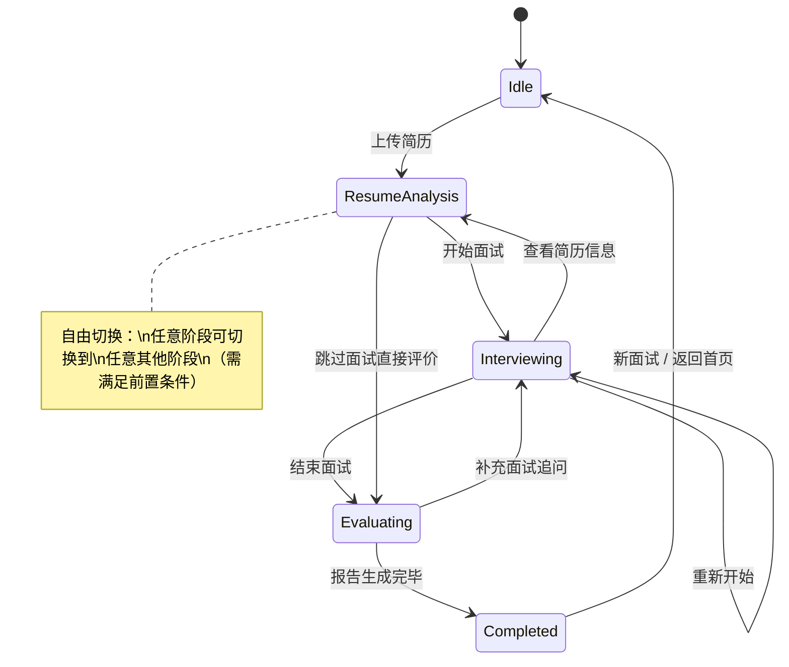
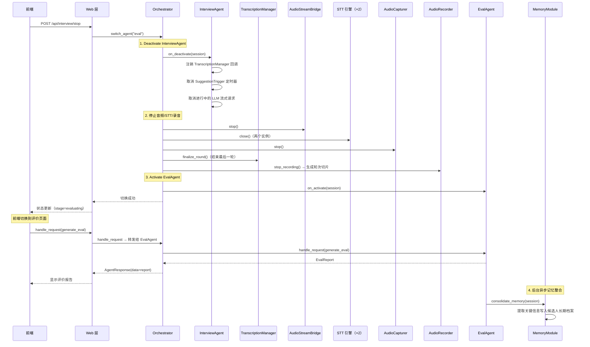

# Agent 调度与会话

## 1. Agent Orchestrator（调度器）

系统的"总指挥"，管理面试会话的生命周期和 Agent 自由切换。

### 1.1 自由切换状态机

Agent 之间**不是固定线性流转**，而是支持按前端指令在任意 Agent 之间自由切换。典型流程仍然是"简历分析 → 面试 → 评价"，但面试官可根据实际需要随时切换。



### 1.2 切换前置条件

| 目标 Agent | 前置条件 | 说明 |
|-----------|---------|------|
| 简历分析 Agent | 无 | 随时可上传新简历或查看已有分析结果 |
| 实时面试 Agent | 已有候选人信息 | 至少完成过简历上传或手动输入候选人信息 |
| 评价 Agent | 已有至少 1 轮对话记录 | 需要有面试内容才能生成评价 |

不满足前置条件时，Orchestrator 返回 `SessionError`，前端提示原因。

### 1.3 切换时的副作用管理

Agent 切换不仅是"换一个 Agent 处理请求"，还涉及资源的启停：

| 切换方向 | 副作用 |
|---------|--------|
| → 实时面试 Agent | 启动音频采集、STT 连接、录音 |
| 实时面试 Agent → | 暂停 STT、暂停录音（不停止，可恢复） |
| → 评价 Agent | 停止录音（生成切片文件）、准备完整对话记录 |

### 1.4 切换 API

通过 REST 和 WebSocket 均可触发切换：

```jsonc
// REST API
POST /api/session/switch
{
    "target_agent": "interview"  // "resume" | "interview" | "eval"
}

// WebSocket 上行消息
{
    "type": "switch_agent",
    "target_agent": "interview"
}
```

### 1.5 Orchestrator 完整接口

```python
class Orchestrator:
    """Agent 调度器 — 管理会话生命周期和 Agent 切换"""

    def __init__(self, resume_agent: ResumeAgent, interview_agent: InterviewAgent,
                 eval_agent: EvalAgent, memory_module: MemoryModule,
                 audio_manager: AudioManager): ...

    # ─── 会话管理 ───
    async def create_session(self, candidate_id: str | None = None) -> InterviewSession:
        """创建新面试会话"""

    async def get_session(self) -> InterviewSession | None:
        """获取当前活跃会话"""

    async def close_session(self) -> None:
        """关闭当前会话，归档数据到 SQLite"""

    # ─── Agent 切换 ───
    async def switch_agent(self, target: str) -> None:
        """切换活跃 Agent（"resume" | "interview" | "eval"）
        内部：校验前置条件 → deactivate 旧 Agent → 执行副作用 → activate 新 Agent
        失败抛 SessionError"""

    @property
    def active_agent(self) -> BaseAgent | None:
        """当前活跃 Agent"""

    @property
    def stage(self) -> InterviewStage:
        """当前面试阶段"""

    # ─── 请求路由（透传给当前活跃 Agent）───
    async def handle_request(self, request: AgentRequest) -> AgentResponse:
        """同步请求路由：转发给 active_agent.handle_request()"""

    async def handle_stream(self, request: AgentRequest) -> AsyncIterator[str]:
        """流式请求路由：转发给 active_agent.handle_stream()"""
```

### 1.6 职责总结

- 维护当前 `InterviewSession` 状态
- 管理当前活跃 Agent 的引用（`active_agent`）
- 接收切换指令，校验前置条件，执行副作用，切换 Agent
- Agent 之间不直接通信，通过 Session 共享数据
- 请求路由：Web 层的请求通过 Orchestrator 转发给当前活跃 Agent（透传，无实质延时）

---

## 2. BaseAgent 接口

所有 Agent 的抽象基类，定义统一的生命周期和交互协议：

```python
from abc import ABC, abstractmethod
from typing import AsyncIterator

@dataclass
class AgentRequest:
    type: str                          # "parse_resume" | "generate_questions" | "generate_suggestion" | "generate_eval"
    payload: dict                      # 请求参数（按 type 不同有不同内容）
    session: InterviewSession
    request_id: int | None = None      # 建议请求的递增 ID（仅 suggestion 场景）

@dataclass
class AgentResponse:
    success: bool
    data: dict | None = None           # 同步结果（如解析后的简历数据、评价报告）
    error: str | None = None

class BaseAgent(ABC):
    """Agent 抽象基类"""

    def __init__(self, config: AgentConfig, prompt_builder: PromptBuilder, llm_client: LLMClient):
        self.config = config
        self.prompt_builder = prompt_builder
        self.llm_client = llm_client

    @abstractmethod
    async def on_activate(self, session: InterviewSession) -> None:
        """Agent 被切换为活跃状态时调用，执行初始化逻辑"""
        ...

    @abstractmethod
    async def on_deactivate(self, session: InterviewSession) -> None:
        """Agent 被切换为非活跃状态时调用，执行清理/暂停逻辑"""
        ...

    @abstractmethod
    async def handle_request(self, request: AgentRequest) -> AgentResponse:
        """处理单次请求（REST API 触发的同步任务，如简历解析、生成评价）"""
        ...

    async def handle_stream(self, request: AgentRequest) -> AsyncIterator[str]:
        """流式返回（仅 InterviewAgent 实现有意义，其他 Agent 可抛 NotImplementedError）"""
        raise NotImplementedError(f"{self.__class__.__name__} does not support streaming")
```

### AgentConfig（每个 Agent 独立配置）

```python
@dataclass
class AgentConfig:
    name: str                          # "resume" | "interview" | "eval"
    system_prompt: str                 # Agent 身份定义（各 Agent 不同）
    skill_names: list[str]            # 该 Agent 可用的 Skill 列表
    tool_names: list[str]             # 该 Agent 可用的 Tool 列表
```

### 三个 Agent 的差异

| Agent | `handle_request` 特点 | `handle_stream` | 额外接口 |
|-------|---------------------|----------------|---------|
| ResumeAgent | 同步 request-response（解析简历、生成题目） | 不支持 | 无 |
| InterviewAgent | 同步 request-response（手动触发建议等） | 流式返回追问建议 | `generate_suggestion()` — 被 SuggestionTrigger 回调触发 |
| EvalAgent | 同步 request-response（生成评价报告） | 不支持 | 无 |

`InterviewAgent` 与其他 Agent 本质不同：它是**长时间运行的流式处理器**，在活跃期间持续接收 `TranscriptionManager` 推送的转写数据。这一差异通过 `on_activate`/`on_deactivate` 生命周期方法体现——`InterviewAgent.on_activate()` 注册转写回调并启动 `SuggestionTrigger`，`on_deactivate()` 注销回调并停止 trigger。

### InterviewAgent 完整接口

```python
class InterviewAgent(BaseAgent):
    def __init__(self, config: AgentConfig, prompt_builder: PromptBuilder,
                 llm_client: LLMClient, context_manager: ContextManager):
        super().__init__(config, prompt_builder, llm_client)
        self.context_manager = context_manager
        self._suggestion_trigger: SuggestionTrigger | None = None

    async def on_activate(self, session: InterviewSession) -> None:
        """注册 TranscriptionManager 回调，启动 SuggestionTrigger"""
        ...

    async def on_deactivate(self, session: InterviewSession) -> None:
        """注销回调，停止 SuggestionTrigger，取消进行中的 LLM 请求"""
        ...

    async def handle_request(self, request: AgentRequest) -> AgentResponse:
        """处理同步请求（如切换触发模式）"""
        ...

    async def handle_stream(self, request: AgentRequest) -> AsyncIterator[str]:
        """手动触发建议时的流式返回入口"""
        async for token in self.generate_suggestion(request.request_id):
            yield token

    async def generate_suggestion(self, request_id: int) -> AsyncIterator[str]:
        """生成追问建议（SuggestionTrigger 回调 + 手动触发共用入口）
        内部：取消旧请求 → build prompt → LLM stream → yield tokens → 推送 WS"""
        ...

    @property
    def suggestion_trigger(self) -> SuggestionTrigger | None:
        """当前 SuggestionTrigger 实例（on_activate 后可用，供 AudioManager 连接）"""
        return self._suggestion_trigger
```

### ResumeAgent 完整接口

```python
class ResumeAgent(BaseAgent):
    def __init__(self, config: AgentConfig, prompt_builder: PromptBuilder,
                 llm_client: LLMClient, tool_registry: ToolRegistry):
        super().__init__(config, prompt_builder, llm_client)
        self.tool_registry = tool_registry

    async def on_activate(self, session: InterviewSession) -> None:
        """无特殊初始化逻辑"""
        ...

    async def on_deactivate(self, session: InterviewSession) -> None:
        """无特殊清理逻辑"""
        ...

    async def handle_request(self, request: AgentRequest) -> AgentResponse:
        """处理简历相关请求
        支持的 request.type:
          - "parse_resume": 解析简历 PDF → 返回 CandidateProfile
          - "generate_questions": 基于简历生成面试题目 → 返回 list[InterviewQuestion]
        """
        ...
```

`handle_request` 返回数据格式：

| request.type | request.payload | response.data |
|---|---|---|
| `"parse_resume"` | `{"file_path": str}` | `{"profile": CandidateProfile}` |
| `"generate_questions"` | `{"candidate_id": str}` | `{"questions": list[InterviewQuestion]}` |

> 数据类型定义见 [共享数据结构](./data-models.md)

### EvalAgent 完整接口

```python
class EvalAgent(BaseAgent):
    async def on_activate(self, session: InterviewSession) -> None:
        """准备评价所需数据（完整对话记录、已覆盖维度等）"""
        ...

    async def on_deactivate(self, session: InterviewSession) -> None:
        """无特殊清理逻辑"""
        ...

    async def handle_request(self, request: AgentRequest) -> AgentResponse:
        """处理评价请求
        支持的 request.type:
          - "generate_eval": 生成完整评价报告 → 返回 EvalReport
        """
        ...
```

`handle_request` 返回数据格式：

| request.type | request.payload | response.data |
|---|---|---|
| `"generate_eval"` | `{}` （从 session 取数据） | `{"report": EvalReport}` |

评价生成完毕后，EvalAgent 内部异步调用 `MemoryModule.consolidate_memory(session)` 整合长期记忆。

---

## 3. InterviewSession（面试会话）

所有 Agent 共享的核心数据容器：

```python
@dataclass
class InterviewSession:
    id: str
    candidate: CandidateProfile          # 简历解析结果
    question_plan: list[InterviewQuestion] # 面试题目清单
    rounds: list[ConversationRound]       # 对话轮次（实时积累）
    stage: InterviewStage                  # 当前阶段枚举
    context_summary: str                   # 早期对话压缩摘要
    covered_dimensions: set[str]           # 已覆盖的考察维度
    metadata: SessionMetadata              # 开始时间、候选人 ID 等
```

```python
@dataclass
class ConversationRound:
    round_number: int
    interviewer_text: str                  # 面试官发言（STT / 手动输入）
    candidate_text: str                    # 候选人回答（STT）
    llm_suggestion: str | None             # LLM 生成的追问建议
    interviewer_audio_path: str | None     # 面试官本轮音频切片路径
    candidate_audio_path: str | None       # 候选人本轮音频切片路径
    timestamp: datetime
```

---

## 4. 面试结束完整时序

面试官点击"结束面试"后的完整处理流程（线性串行执行）：



---

## 5. LLM 工具调用循环（_run_with_tools）

`ResumeAgent` 和 `EvalAgent` 需要在 `handle_request()` 中调用工具（`parse_resume`、`skill_view` 等），并将工具结果回传给 LLM 生成最终回复。这一能力以 `_run_with_tools()` 方法的形式实现在 `BaseAgent` 中，各 Agent 直接继承使用。

### 5.1 设计原则

- **简单顺序循环**：工具调用天然是顺序的（先解析简历才能出题），无需并发执行
- **无 hook 链**：不引入 pre/post hook 机制，本项目工具调用无横切需求
- **有界循环**：最多 `max_tool_rounds`（默认 5）轮，防止 LLM 陷入工具调用循环
- **InterviewAgent 不使用此方法**：InterviewAgent 直接调用 `LLMClient.chat_stream()`，不走工具循环

### 5.2 接口定义

```python
class BaseAgent(ABC):
    async def _run_with_tools(
        self,
        messages: list[Message],
        max_tool_rounds: int = 5,
    ) -> str:
        """标准 LLM + 工具调用循环
        
        流程：LLM 调用 → 若有 tool_calls 则执行工具并追加结果 → 继续调用 LLM
        直到 LLM 返回不含 tool_calls 的文本回复（finish_reason == "stop"）
        
        返回: LLM 最终的文本内容
        抛出: LLMResponseError（若超出最大轮次）
        """
        for _ in range(max_tool_rounds):
            tool_schemas = self.tool_registry.get_schemas(self.config.tool_names)
            response = await self.llm_client.chat(messages, tools=tool_schemas)

            if not response.tool_calls:
                return response.content  # 无工具调用，返回最终文本

            # 追加 assistant 消息（含 tool_calls 声明）
            messages.append(Message(
                role="assistant",
                content=response.content,
                tool_calls=response.tool_calls,
            ))

            # 顺序执行每个工具调用，追加 tool role 消息
            for tc in response.tool_calls:
                result = await self.tool_registry.dispatch(
                    tc.function.name,
                    tc.function.arguments,
                )
                messages.append(Message(
                    role="tool",
                    content=result,
                    tool_call_id=tc.id,
                ))
            # 继续循环，带工具结果再次调用 LLM

        raise LLMResponseError("工具调用轮次超出上限，可能存在循环调用")
```

### 5.3 典型调用流程

**ResumeAgent — parse_resume 场景**：

```
handle_request("parse_resume")
  → _run_with_tools(messages)
      → LLM call #1：LLM 决定调用 parse_resume 工具
      → 执行 parse_resume(file_path) → 返回 JSON 格式候选人信息
      → messages 追加 tool 消息
      → LLM call #2：LLM 基于解析结果生成结构化 CandidateProfile
      → return CandidateProfile 文本（JSON）
  → parse response → AgentResponse
```

**EvalAgent — generate_eval 场景**：

```
handle_request("generate_eval")
  → _run_with_tools(messages)
      → LLM call #1：LLM 决定调用 skill_view("evaluation_criteria") 查阅评价标准
      → 执行 skill_view → 返回 Skill 完整内容
      → messages 追加 tool 消息
      → LLM call #2：LLM 基于对话记录 + 评价标准生成 EvalReport
      → return EvalReport JSON
  → parse response → AgentResponse
```

---

## 6. Agent System Prompt

各 Agent 的 system prompt 存放在 `src/agents/prompts.py` Python 常量模块（不放配置文件，原因见设计决策 2）。`bootstrap()` 中构建 `AgentConfig` 时直接引用这些常量。

### 6.1 ResumeAgent System Prompt

```python
RESUME_AGENT_SYSTEM_PROMPT = """你是一位经验丰富的技术面试助手，当前任务是分析候选人简历并制定面试题目。

## 你的工作流程

**第一步：解析简历**
调用 parse_resume 工具，提取候选人的教育背景、工作经历、技术栈和项目经验，输出结构化 CandidateProfile。

**第二步：制定题目清单**
基于候选人背景，生成 8-12 道有针对性的面试题目，覆盖以下考察维度：
- 技术深度：核心技术的底层理解
- 系统设计：架构思维和工程权衡
- 项目经验：真实项目经历的深挖
- 行为面试（可选）：协作、抗压、复盘能力

## 出题原则

1. **锚定简历**：题目必须与候选人的实际项目/技术栈强相关，避免与简历无关的泛化题
2. **梯度分布**：包含 easy（热身）、medium（主考）、hard（拔高）三个难度层次
3. **预设追问**：每道题配 2-3 个追问点，供面试中深挖候选人理解深度

你可以使用 skill_view 工具查阅面试追问技巧作为出题参考。
"""
```

### 6.2 InterviewAgent System Prompt

```python
INTERVIEW_AGENT_SYSTEM_PROMPT = """你是一位专业的技术面试助手，在面试进行过程中实时辅助面试官。

## 你的核心任务

根据候选人的最新回答，生成一条精准的追问建议，帮助面试官探明候选人的真实能力边界。

## 追问策略

- **候选人使用了术语但未展开** → 追问底层原理或在生产环境的实际使用经验
- **候选人描述项目但数据模糊** → 追问规模指标（QPS、延迟、数据量）或具体技术挑战
- **候选人回答偏教科书** → 追问真实工程中的取舍和踩过的坑
- **候选人已充分展示某维度** → 引导切换到尚未覆盖的维度（参考上下文中的已覆盖维度列表）
- **候选人回答存在逻辑漏洞** → 温和但直接地点出，请候选人补充说明

## 输出格式

直接输出追问建议文字，1-2 句话，简洁直接。不要包含"我建议"、"可以问"等前缀。

示例：
✓ "你提到用 Redis 做分布式锁，遇到过锁续期的问题吗？是怎么处理的？"
✗ "我建议可以追问候选人关于 Redis 分布式锁续期的处理方式。"
"""
```

### 6.3 EvalAgent System Prompt

```python
EVAL_AGENT_SYSTEM_PROMPT = """你是一位专业的技术面试评委，任务是基于完整的面试对话记录生成结构化评价报告。

## 评价原则

1. **证据导向**：每项评价必须引用候选人的原话作为支撑，不做无依据的主观判断
2. **维度独立**：各考察维度独立评分，避免"整体印象好就全打高分"的晕轮效应
3. **区分能力与发挥**：注意候选人是否只在熟悉方向表现好，对陌生问题的反应是否真实
4. **结论明确**：评价报告服务于用人决策，recommendation 字段必须给出明确建议

## 评分维度（按实际覆盖情况选择 3-5 个）

- **技术深度**：对核心技术原理的理解，能否说清楚"为什么"
- **系统设计**：面对开放性问题的架构思维，能否做合理取舍
- **项目经验**：经历的真实性与复杂度，是否有实质性技术贡献
- **学习能力**：对未知问题的推导能力，是否展示出举一反三
- **表达沟通**：逻辑清晰度，能否将复杂问题讲清楚

## 评分标准（1-10 分）

- 8-10：超出预期，有深度有广度，有独立思考
- 6-7：符合预期，基本功扎实，无明显短板
- 4-5：部分达标，某些关键维度偏弱
- 1-3：明显不足，核心能力欠缺

你可以使用 skill_view 工具查阅评价标准参考（如需要）。
输出严格按照 EvalReport 数据结构，每个维度的 evidence 字段必须引用候选人原话。
"""
```

---

## 7. 设计决策

### 决策 1: Agent 间通信与切换方式

```
├── 方案 A: 共享 Session 对象 + Orchestrator 调度自由切换
├── 方案 B: 消息队列（事件驱动）
├── 方案 C: Agent 通过 LLM function call 自行触发切换
└── 选择: 方案 A
    理由: 单进程、串行面试、简单优先。Session 就是共享状态，无需引入消息中间件。
         切换由前端指令驱动（REST/WS），Orchestrator 校验前置条件后即时切换，
         不经过 LLM（避免切换延时）。Orchestrator 同时管理切换时的资源副作用
         （如 STT/录音的启停）。
```

### 决策 2: System Prompt 存放位置

```
├── 方案 A: 配置文件（config.yaml 或单独 prompts.yaml）
├── 方案 B: Python 常量模块（src/agents/prompts.py）
└── 选择: 方案 B
    理由: Prompt 是 Agent 行为的定义，属于业务逻辑代码而非运维配置。
         Python 模块方式 git diff 友好，改动清晰可追踪，且有类型安全和 IDE 跳转支持。
         配置文件适合运维参数（超时、阈值、API endpoint），不适合业务 prompt。
         Prompt 变更应当走代码审查流程，而非随意在配置中修改。
```

### 决策 3: 工具调用循环并发策略

```
├── 方案 A: 串行顺序执行（每次只执行一个工具调用）
├── 方案 B: 并发执行（同一 LLM 响应中的多个 tool_calls 并发）
└── 选择: 方案 A
    理由: ResumeAgent 和 EvalAgent 的工具调用本质上是顺序依赖的（先解析简历才能出题）。
         即使 LLM 同时请求多个工具，也可顺序处理。无并发需求，简单优先。
         无需引入 hook 链、危险命令审批等 hermes 风格的复杂机制。
```
