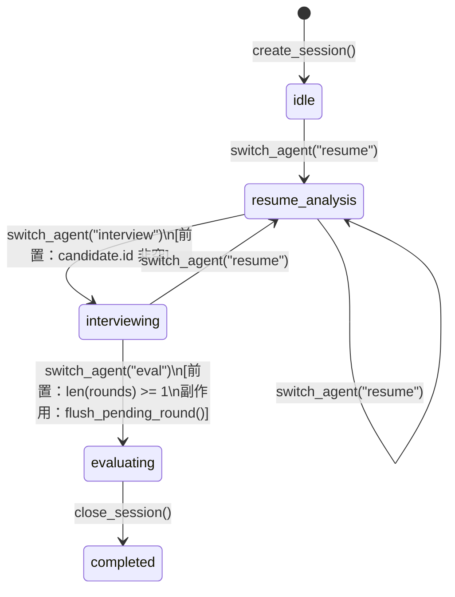

# Agent 层设计

Agent 层负责所有 AI 推理逻辑，由 Orchestrator 统一调度三个专职 Agent。

---

## 1. Orchestrator（调度器）

**文件**：`src/agents/orchestrator.py`

### 职责

- 创建和维护唯一的 `InterviewSession` 运行时对象
- 按前置条件切换 Agent（`resume → interview → eval`）
- 管理 WebSocket 多连接广播（`attach_ws_sender / detach_ws_sender`）
- 在 Agent 切换时触发音频管道的启动/暂停/停止副作用
- 会话关闭时持久化到 SQLite

### 状态机

Orchestrator 跟踪 `InterviewSession.stage`，每次切换 Agent 时同步更新：



**合法状态转换与前置条件**：

| 目标 Agent | 前置条件 | 切换时副作用 |
|---|---|---|
| `resume` | 无 | 若当前为 `interview`，暂停音频 |
| `interview` | `session.candidate.id` 非空 | 启动音频管道；绑定 WS 广播到 `InterviewAgent` |
| `eval` | `len(session.rounds) >= 1` | 先调 `flush_pending_round()`；停止音频 |

**音频启动失败不阻断**：`switch_agent("interview")` 内部捕获音频启动异常并记录警告，面试流程仍可继续（手动输入仍有效）。

### 核心方法

| 方法 | 参数 | 返回 | 副作用 |
|---|---|---|---|
| `create_session(candidate_id?)` | `str \| None` | `InterviewSession` | 初始化运行时会话，重置 active agent |
| `switch_agent(target, ws_sender?)` | `str` | `None` | 切换 Agent、更新 stage、管理音频生命周期 |
| `close_session()` | — | `None` | 持久化会话到 SQLite，重置会话状态 |
| `handle_request(request)` | `AgentRequest` | `AgentResponse` | 路由到当前活跃 Agent |
| `handle_stream(request)` | `AgentRequest` | `AsyncIterator[str]` | 路由流式请求到当前活跃 Agent |
| `attach_ws_sender(ws_sender)` | `WsSender` | `None` | 注册 WS 连接到广播池 |
| `detach_ws_sender(conn_id)` | `int` | `None` | 移除 WS 连接 |

---

## 2. ResumeAgent（简历分析）

**文件**：`src/agents/resume_agent.py`

### 职责

解析候选人 PDF 简历，提取结构化信息（`CandidateProfile`），并基于该信息生成面试题目清单（写入 `session.question_plan`）。

**工具**：`parse_resume`（读取 PDF）、`skills_list`（列出面试技巧）、`skill_view`（查看技巧详情）

### 核心方法

| 方法 | 触发方式 | 输入 | 返回 | 副作用 |
|---|---|---|---|---|
| `_parse_resume(request)` | `AgentRequest(type="parse_resume", payload={"file_path": ...})` | PDF 路径 | `AgentResponse(data={"profile_data", "file_path"})` | 更新 `session.candidate` 字段 |
| `_generate_questions(request)` | `AgentRequest(type="generate_questions")` | 当前 `session.candidate` | `AgentResponse(data={"questions": [...]})` | 无（由调用方写入 `session.question_plan`） |

**`_parse_resume` 流程**：

1. 调用 `PromptBuilder.build()` 组装上下文消息
2. 附加用户消息，指示 LLM 调用 `parse_resume_pdf` 工具读取 PDF
3. `_run_with_tools()` 执行工具调用循环，直到 LLM 返回最终文本
4. 用 `_extract_json()` 从 LLM 输出提取 JSON
5. `_update_candidate_from_data()` 将解析结果写回 `session.candidate`

**`_generate_questions` 流程**：

1. 将 `session.candidate` 序列化为 JSON
2. 直接调用 `llm_client.chat()`（不用工具）
3. 返回 8–12 道题目的 JSON 数组（含 `dimension / question / follow_ups / difficulty` 字段）

---

## 3. InterviewAgent（实时面试）

**文件**：`src/agents/interview_agent.py`

### 职责

面试过程中，实时监听转写内容，流式生成追问建议并通过 WebSocket 推送给前端。核心机制为 `SuggestionTrigger`：候选人 final segment 后静默约 2 秒自动触发，或由前端 `request_suggestion` 手动触发。

### SuggestionTrigger

**文件**：`src/audio/trigger.py`

| 模式 | 触发条件 |
|---|---|
| `auto` | 候选人 final segment 后静默 `silence_threshold_sec`（默认 2s），且距上次触发超过 `min_interval_sec`（默认 5s） |
| `manual` | 仅响应前端 `request_suggestion` 消息 |

### 核心方法

| 方法 | 触发方式 | 输入 | 返回 | 副作用 |
|---|---|---|---|---|
| `on_activate(session)` | Orchestrator 切换 | `InterviewSession` | `None` | 初始化 `SuggestionTrigger` |
| `on_deactivate(session)` | Orchestrator 切换 | `InterviewSession` | `None` | 停止 Trigger，取消进行中的流式 Task |
| `generate_suggestion(request_id)` | SuggestionTrigger 回调 / 手动触发 | `int` | `AsyncIterator[str]` | 取消上一次未完成的流 |
| `_on_trigger_fired(request_id)` | SuggestionTrigger 内部 | `int` | `None` | 创建后台 Task，流式推送 `suggestion_delta` 和 `suggestion_final` |
| `attach_ws_sender(ws_sender)` | Orchestrator | `WsSender` | `None` | 绑定推送回调 |

**流式推送消息序列**：

```
suggestion_delta {"type": "suggestion_delta", "request_id": N, "delta": "..."}
suggestion_delta ...（多次）
suggestion_final {"type": "suggestion_final", "request_id": N}
```

候选人继续说话时，旧的流式 Task 会被 `cancel()`，新 `request_id` 的建议替代之。

---

## 4. EvalAgent（评价报告）

**文件**：`src/agents/eval_agent.py`

### 职责

面试结束后，基于 `session.rounds` 中的全部对话记录，调用 LLM 生成 `EvalReport`（维度评分、优劣势、推荐决策），并将报告持久化到 SQLite。

### 核心方法

| 方法 | 触发方式 | 输入 | 返回 | 副作用 |
|---|---|---|---|---|
| `handle_request(request)` | `AgentRequest(type="generate_eval")` | `InterviewSession` | `AgentResponse(data={"report": EvalReport})` | 持久化报告，异步触发 `consolidate_memory` |
| `_generate_eval(request)` | 内部 | `InterviewSession` | `AgentResponse` | 同上 |

**`_generate_eval` 流程**：

1. 将所有 `session.rounds` 拼接为对话文本
2. 调用 `PromptBuilder.build()` + `_run_with_tools()`（实际无工具调用）
3. 解析 LLM 返回的 JSON，构造 `EvalReport`
4. 调用 `memory_module.save_eval_report(report)` 持久化
5. 异步触发 `memory_module.consolidate_memory(session)`（更新候选人历史洞察，不阻塞返回）

**EvalReport 字段**：

| 字段 | 类型 | 说明 |
|---|---|---|
| `dimensions` | `list[DimensionScore]` | 各维度评分（`dimension / score / comment / evidence`） |
| `overall_score` | `float` | 综合分（1–10） |
| `strengths` | `list[str]` | 优势列表 |
| `weaknesses` | `list[str]` | 不足列表 |
| `recommendation` | `str` | `strong_hire \| hire \| weak_hire \| no_hire` |
| `summary` | `str` | 整体评价文字 |

---

## 5. InterviewSession（Agent 间共享数据）

**文件**：`src/models/session.py`

所有 Agent 通过 `AgentRequest.session` 访问同一个运行时 `InterviewSession` 对象。该对象在 Orchestrator 中创建，贯穿整个面试生命周期。

| 字段 | 类型 | 说明 |
|---|---|---|
| `id` | `str` | 会话 UUID，也是 SQLite `Interview.id` |
| `candidate` | `CandidateProfile` | 候选人画像（ResumeAgent 写入） |
| `question_plan` | `list[InterviewQuestion]` | 题目清单（ResumeAgent 生成，可前端编辑） |
| `rounds` | `list[ConversationRound]` | 已归档的对话轮次（TranscriptionManager 写入） |
| `stage` | `InterviewStage` | 当前阶段（Orchestrator 维护） |
| `context_summary` | `str` | 上下文压缩摘要（ContextManager 维护） |
| `covered_dimensions` | `set[str]` | 已覆盖的考察维度 |
| `working_notes` | `str` | Agent 工作便签（保留字段，当前未使用） |
| `metadata` | `SessionMetadata` | 时间戳、触发模式、token 统计 |

**InterviewStage 枚举**：

| 值 | 含义 |
|---|---|
| `idle` | 会话已创建，尚未激活任何 Agent |
| `resume_analysis` | ResumeAgent 活跃，正在解析简历 |
| `interviewing` | InterviewAgent 活跃，面试进行中 |
| `evaluating` | EvalAgent 活跃，生成评价中 |
| `completed` | 会话已关闭 |
