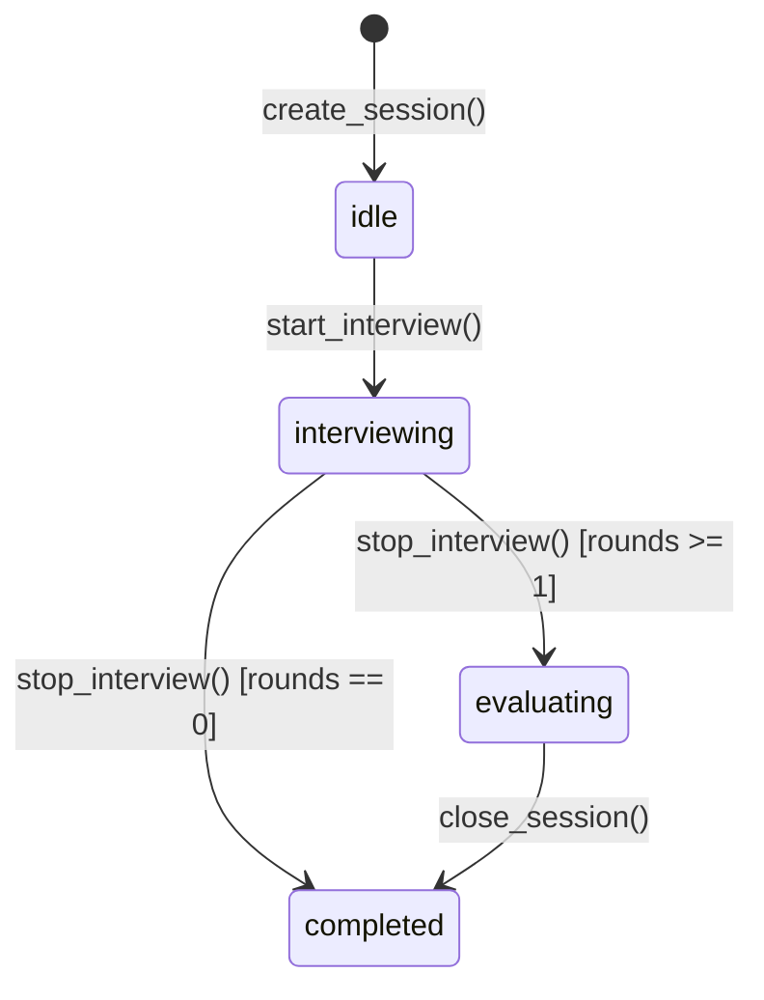

# Agent 层设计

Agent 层负责所有 AI 推理与对话逻辑。采用 **MainAgent 单入口** 架构，由常驻的 MainAgent 处理所有用户对话，通过工具调用委托其他 Agent 执行专项任务。

---

## 1. MainAgent（面试官对话入口）

**文件**：`src/agents/main_agent.py`

### 职责

面试官的唯一对话入口，全程常驻单例。通过分层系统提示感知面试官偏好、候选人信息和当前会话状态；通过工具完成对话本身无法直接执行的操作。

### 系统提示结构（分层，按顺序组装）

| 层级 | 内容 | 加载时机 |
|---|---|---|
| 1 | 角色定义：面试助手，帮助面试官管理候选人、准备问题、支持面试 | 固定 |
| 2 | USER.md 全文：面试官偏好、岗位要求 | 服务启动时加载一次 |
| 3 | 当前候选人信息：姓名、职位、工作年限、技能、简历摘要、题目清单 | 选中候选人时注入，切换时替换 |

### 对话历史管理

- 在内存中以 `list[Message]` 维护，上限 24 条，超出时截断保留最新 24 条
- 切换候选人时**只替换系统提示第 3 层**，对话历史不清空（保留上下文连续性）
- 服务重启时历史清空（不持久化对话历史，只持久化 USER.md 和面试数据）

### 对话持久化

使用 `ConversationLogger` 将每轮 `handle_chat()` 的完整消息列表（含 system prompt 快照）以 JSONL 格式异步写入 `conversations/main_agent.jsonl`。system prompt 变更时才写入 system 行（去重），避免冗余。

### 工具列表

| 工具 | 签名 | 说明 |
|---|---|---|
| `delegate_to_resume_agent` | `(pdf_path: str, instructions: str) -> str` | 同步调用 ResumeAgent，返回解析结果和题目清单 |
| `update_user_memory` | `(content: str) -> str` | 将面试官提供的岗位要求/偏好写入 USER.md |
| `get_session_info` | `() -> str` | 查询 InterviewController 当前 stage 和会话基本信息 |
| `get_candidate_info` | `() -> str` | 读取当前候选人完整 profile 和题目清单 |

### 核心方法

| 方法 | 说明 |
|---|---|
| `handle_chat(message: str) -> AsyncIterator[str]` | 处理用户消息，流式返回 |
| `set_candidate_context(profile, questions)` | 切换候选人时由 API 层调用，替换系统提示第 3 层 |
| `reload_user_memory()` | USER.md 更新后重新加载第 2 层 |

---

## 2. InterviewController（面试状态机控制器）

**文件**：`src/agents/interview_controller.py`

### 职责

纯状态机控制器（非 AI Agent），负责面试会话生命周期、音频管道管理、WebSocket 广播和阶段状态追踪。

### 状态机



### 核心方法

| 方法 | 说明 |
|---|---|
| `create_session(candidate_id?)` | 创建 InterviewSession |
| `start_interview()` | 启动音频管道，激活 InterviewAgent |
| `stop_interview()` | 停止音频，flush pending round，设置 evaluating 状态 |
| `close_session()` | 持久化到 SQLite，重置状态 |
| `get_session_info() -> dict` | 供 MainAgent 工具查询当前状态 |
| `attach_ws_sender / detach_ws_sender` | WebSocket 连接管理 |

---

## 3. ResumeAgent（简历分析）

**文件**：`src/agents/resume_agent.py`

### 职责

解析候选人 PDF 简历，提取结构化信息（`CandidateProfile`），并基于该信息生成面试题目清单。

**工具**：`parse_resume`（读取 PDF）、`read_resume_markdown`（读取简历 Markdown 完整内容）、`skills_list`（列出面试技巧）、`skill_view`（查看技巧详情）

### 触发方式

由 MainAgent 通过 `delegate_to_resume_agent` 工具同步调用。

### 核心方法

| 方法 | 触发方式 | 输入 | 返回 |
|---|---|---|---|
| `execute(pdf_path, instructions)` | MainAgent 工具调用 | PDF 路径 + 额外指示 | `{"profile": dict, "questions": list}` |
| `_parse_resume(request)` | execute 内部 | AgentRequest | AgentResponse |
| `_generate_questions(request)` | execute 内部 | AgentRequest | AgentResponse |

### 调用流程

```
用户上传 PDF → 前端 POST /api/resume/upload → 文件保存，返回 file_path
    ↓
前端在聊天框触发 MainAgent："请解析简历 {file_path}"
    ↓
MainAgent LLM 决定调用 delegate_to_resume_agent(pdf_path, instructions)
    ↓
ResumeAgent.execute() 同步执行（parse → generate_questions）
    ↓
返回 {profile, questions} 给 MainAgent
    ↓
MainAgent 更新 candidate context，流式回复用户
```

---

## 4. InterviewAgent（实时面试）

**文件**：`src/agents/interview_agent.py`

### 职责

面试过程中，实时监听转写内容，流式生成追问建议并通过 WebSocket 推送给前端。核心机制为 `SuggestionTrigger`：候选人 final segment 后静默约 2 秒自动触发，或由前端 `request_suggestion` 手动触发。

**工具**：`read_resume_markdown`（可按需读取候选人完整简历）

### SuggestionTrigger

**文件**：`src/audio/trigger.py`

| 模式 | 触发条件 |
|---|---|
| `auto` | 候选人 final segment 后静默 `silence_threshold_sec`（默认 2s），且距上次触发超过 `min_interval_sec`（默认 5s） |
| `manual` | 仅响应前端 `request_suggestion` 消息 |

### 对话持久化

使用 `ConversationLogger` 将每次追问建议的完整消息列表以 JSONL 格式异步写入会话级文件 `conversations/interview_agent_{session_id}.jsonl`。Logger 在 `on_activate()` 时创建，`on_deactivate()` 后不再写入。

### 核心方法

| 方法 | 触发方式 | 说明 |
|---|---|---|
| `on_activate(session)` | InterviewController.start_interview() | 初始化 SuggestionTrigger 和 ConversationLogger |
| `on_deactivate(session)` | InterviewController.stop_interview() | 停止 Trigger，取消进行中的流式 Task |
| `generate_suggestion(request_id)` | SuggestionTrigger 回调 / 手动触发 | 取消上一次未完成的流 |

**流式推送消息序列**：

```
suggestion_delta {"type": "suggestion_delta", "request_id": N, "delta": "..."}
suggestion_delta ...（多次）
suggestion_final {"type": "suggestion_final", "request_id": N}
```

---

## 5. EvalAgent（评价报告）

**文件**：`src/agents/eval_agent.py`

### 职责

面试结束后，基于 `session.rounds` 中的全部对话记录，调用 LLM 生成 `EvalReport`（维度评分、优劣势、推荐决策），并将报告持久化到 SQLite。

### 核心方法

| 方法 | 触发方式 | 返回 |
|---|---|---|
| `handle_request("generate_eval")` | InterviewController.stop_interview() 后由 API 层调用 | AgentResponse(data={"report": EvalReport}) |

---

## 6. USER.md 记忆模块

**文件**：`USER.md`（项目根目录）

- 纯文本 Markdown，面试官的全局记忆：招聘岗位要求、面试风格偏好等
- 服务启动时由 `MainAgent.__init__()` 加载一次，写入系统提示第 2 层
- 面试官在对话中提供新信息时，MainAgent 调用 `update_user_memory` 工具追加写入 USER.md，并调用 `reload_user_memory()` 刷新提示词

---

## 7. InterviewSession（Agent 间共享数据）

**文件**：`src/models/session.py`

所有 Agent 通过 `InterviewSession` 对象共享运行时数据。该对象在 InterviewController 中创建，贯穿整个面试生命周期。

| 字段 | 类型 | 说明 |
|---|---|---|
| `id` | `str` | 会话 UUID |
| `candidate` | `CandidateProfile` | 候选人画像 |
| `question_plan` | `list[InterviewQuestion]` | 题目清单 |
| `rounds` | `list[ConversationRound]` | 已归档的对话轮次 |
| `stage` | `InterviewStage` | 当前阶段 |
| `context_summary` | `str` | 上下文压缩摘要 |
| `covered_dimensions` | `set[str]` | 已覆盖的考察维度 |
| `metadata` | `SessionMetadata` | 时间戳、触发模式、token 统计 |

**InterviewStage 枚举**：

| 值 | 含义 |
|---|---|
| `idle` | 会话已创建，尚未开始面试 |
| `interviewing` | InterviewAgent 活跃，面试进行中 |
| `evaluating` | EvalAgent 活跃，生成评价中 |
| `completed` | 会话已关闭 |
