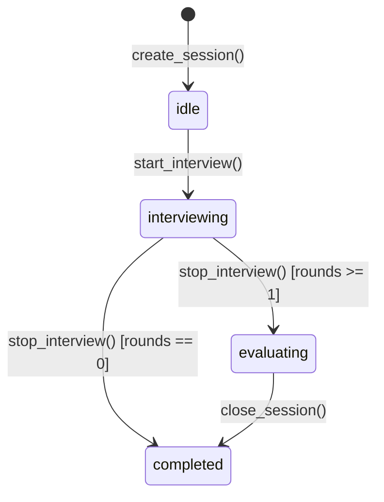

# Agent 层设计

Agent 层负责所有 AI 推理与对话逻辑。采用 **MainAgent 单入口** 架构，由常驻的 MainAgent 处理所有用户对话，通过工具调用委托其他 Agent 执行专项任务。

---

## 1. MainAgent（面试官对话入口）

**文件**：`src/agents/main_agent.py`

### 职责

面试官的唯一对话入口，全程常驻单例。通过分层系统提示感知面试官偏好、候选人信息和当前会话状态；通过工具完成对话本身无法直接执行的操作。

### 系统提示结构（分层，按顺序组装）

| 层级 | 内容 | 加载时机 |
|---|---|---|
| 1 | 角色定义：面试助手，帮助面试官管理候选人、准备面试、支持面试；包含简历解析后引导式对话工作流 | 固定 |
| 2 | USER.md 全文：面试官偏好、岗位要求（由 `UserMemoryStore.render()` 读取） | 服务启动时加载一次 |
| 3 | 当前候选人信息：姓名、职位、工作年限、技能、简历内容（前 1500 字）、面试简报预览（前 800 字） | 选中候选人时注入，切换时替换 |

### 对话历史管理

- 在内存中以 `list[Message]` 维护，上限 24 条，超出时截断保留最新 24 条
- 切换候选人时**只替换系统提示第 3 层**，对话历史不清空（保留上下文连续性）
- 服务重启时历史清空（不持久化对话历史，只持久化 USER.md 和候选人数据）

> **有意设计**：切换候选人（通过 `/candidate/select` 或 `create_session`）时，不清空 MainAgent 的对话历史（`_history`）。理由：面试官通常在同一工作流中连续讨论多位候选人，保留历史维持对话连贯性；需要完全隔离时可刷新页面。

### 对话持久化

使用 `ConversationLogger` 将每轮 `handle_chat()` 的完整消息列表以 JSONL 格式异步写入 `conversations/main_agent.jsonl`。system prompt 变更时才写入 system 行（去重），避免冗余。

### 工具列表

| 工具 | 签名 | 说明 |
|---|---|---|
| `dispatch_to_agent` | `(agent: str, task: str) -> str` | 委托指定 Agent 执行任务（当前仅支持 `agent="resume"`） |
| `manage_user_memory` | `(action: str, index?: int, content?: str) -> str` | 管理面试官记忆条目（list/add/replace/remove） |

### 核心方法

| 方法 | 说明 |
|---|---|
| `handle_chat(message: str) -> AsyncIterator[str]` | 处理用户消息，流式返回（`delta` 文字 + `tool_call` 事件） |
| `set_candidate_context(profile, interview_brief?)` | 切换候选人时由 API 层调用，替换系统提示第 3 层 |
| `reload_user_memory()` | USER.md 更新后重新加载第 2 层（`UserMemoryStore` 已是最新，无需重读磁盘） |

> `bind_resume_agent` / `bind_controller` 方法已移除，依赖通过 `ToolContext`（`tools/_context.py`）单例注入。

### Memory Nudge（后台记忆审查）

每隔 `_NUDGE_INTERVAL`（默认 10 轮）自动触发一次后台记忆审查（`_background_memory_review()`）：
- 取最近 12 条消息发给 LLM，仅暴露 `manage_user_memory` 工具
- LLM 判断是否有值得保存的信息；若有则调用工具，若无则直接结束
- 最多迭代 3 次；捕获所有异常，不影响主流程
- 若当前轮 LLM 主动调用了 `manage_user_memory`，重置 nudge 计数器

---

## 2. InterviewController（面试状态机控制器）

**文件**：`src/agents/interview_controller.py`

### 职责

纯状态机控制器（非 AI Agent），负责面试会话生命周期、音频管道管理、WebSocket 广播和阶段状态追踪。

### 状态机



### 核心方法

| 方法 | 说明 |
|---|---|
| `create_session(candidate_id?)` | 创建 InterviewSession，从文件加载候选人历史记忆和简历内容 |
| `start_interview()` | 激活 InterviewAgent，启动音频管道，调用 `memory.start_interview(session)` |
| `stop_interview()` | flush pending round，停止音频，设置 evaluating 状态 |
| `close_session()` | 调用 `memory.finish_interview(session)`（写 transcript / 更新 index），重置状态 |
| `get_session() -> InterviewSession | None` | 返回当前会话 |
| `attach_ws_sender(sender) / detach_ws_sender(conn_id)` | WebSocket 连接管理（多连接广播） |

**`create_session` 数据加载流程**：
```
candidate_id 非空时：
  memory.get_candidate(candidate_id)         → 基础 profile
  memory.get_candidate_history(candidate_id) → history_summary 注入 session.candidate
  memory.get_resume_markdown(candidate_id)   → resume_content 注入 session.candidate
  memory.get_brief(candidate_id)             → interview_brief 注入 session
```

---

## 3. ResumeAgent（简历分析）

**文件**：`src/agents/resume_agent.py`

### 职责

解析候选人 PDF 简历，提取结构化信息（`CandidateProfile`），并基于该信息和面试官关注点生成面试简报。采用 **ReAct 模式**（最大 `RESUME_AGENT_MAX_TOOL_ROUNDS` 轮工具调用，默认 15）。

**工具**：`parse_resume_pdf`（读取 PDF）、`file_read`（读取文件）、`file_write`（写出 Markdown）、`skill_view`（查看技巧详情）

### 触发方式

由 MainAgent 通过 `dispatch_to_agent(agent="resume", task=...)` 工具委托调用。`dispatch_to_agent` 工具会自动将当前 session 的文件路径信息注入到 task 上下文中（`candidates/{cid}/profile.md`、`candidates/{cid}/brief.md`、`resumes/{stem}.pdf` 等）。

### 结果类型

| 结果类型 | 说明 |
|---|---|
| `parse_done` | 简历解析完成，包含 `profile` dict 和 `markdown_path` |
| `brief_done` | 简报生成完成，包含 `candidate_id` 和 `brief`（Markdown 文本） |
| `error` | 执行失败 |

### 副作用（由 `dispatch_to_agent` 处理）

- `parse_done`：`update_candidate_from_data(session.candidate, profile_data)` → 读取临时 Markdown → `memory.save_candidate(profile, markdown)` → 更新 `session.candidate.resume_content`
- `brief_done`：`memory.save_brief(cid, brief_text)` 落盘 → `session.interview_brief = brief_text` → `memory.start_interview(session)`（写 session.json）→ `main_agent.set_candidate_context()` 刷新第 3 层

### 调用流程

```
用户上传 PDF → 前端 POST /api/resume/upload → 文件保存，返回 file_path
    ↓
前端在聊天框触发 MainAgent："请解析简历 {file_path}"
    ↓
MainAgent LLM 决定调用 dispatch_to_agent(agent="resume", task="...")
    ↓
dispatch_to_agent 注入 session 上下文，调用 resume_agent.execute(task)
    ↓
ResumeAgent 执行（ReAct 循环，调用 parse_resume_pdf / file_write / file_read 等工具）
    ↓
返回 parse_done → dispatch_to_agent 触发副作用（save_candidate）
    ↓
MainAgent 进入引导式对话（阶段一：呈现分析；阶段二：收集关注点）
    ↓
用户确认后，MainAgent 调用 dispatch_to_agent(agent="resume", task="生成面试简报，关注点：...")
    ↓
ResumeAgent 读取 candidates/{cid}/profile.md，生成结构化简报
    ↓
返回 brief_done → dispatch_to_agent 触发副作用（save_brief + start_interview + 刷新 Layer 3）
    ↓
MainAgent 流式回复用户
```

---

## 4. InterviewAgent（实时面试）

**文件**：`src/agents/interview_agent.py`

### 职责

面试过程中，实时监听转写内容，生成追问建议并通过 WebSocket 推送给前端。核心机制为 `SuggestionTrigger`：候选人 final segment 后静默约 2 秒自动触发，或由前端 `request_suggestion` 手动触发。

**AgentConfig**：`full_history=True`（使用 ContextManager 的全量 rounds），无 `skill_names`，无 `tool_names`。

**追问输出格式**：`generate_suggestion()` 使用非流式 `chat()` 调用，要求 LLM 直接输出**一句中文追问话术**，不使用 JSON action 格式。内容通过 `suggestion_delta`/`suggestion_final` 推送至前端。

### SuggestionTrigger

**文件**：`src/audio/trigger.py`

| 模式 | 触发条件 |
|---|---|
| `auto` | 候选人 final segment 后静默 `silence_threshold_sec`（默认 2s），且距上次触发超过 `min_interval_sec`（默认 5s） |
| `manual` | 仅响应前端 `request_suggestion` 消息 |

### 对话持久化

使用 `ConversationLogger` 将每次追问建议的完整消息列表以 JSONL 格式异步写入会话级文件 `conversations/interview_agent_{session_id}.jsonl`。Logger 在 `on_activate()` 时创建，`on_deactivate()` 后不再写入。

### 核心方法

| 方法 | 触发方式 | 说明 |
|---|---|---|
| `on_activate(session)` | `InterviewController.start_interview()` | 初始化 SuggestionTrigger 和 ConversationLogger |
| `on_deactivate(session)` | `InterviewController.stop_interview()` | 停止 Trigger，取消进行中的 LLM Task |
| `generate_suggestion(request_id)` | SuggestionTrigger 回调 / 手动触发 | 非流式调用 LLM，yield 完整建议文本；超过 token 预算时截断历史或跳过 |
| `cancel_current_stream()` | 切换到 manual 模式时 | 取消正在进行的 LLM 生成 task |

**流式推送消息序列**：

```
suggestion_delta {"type": "suggestion_delta", "request_id": N, "delta": "..."}
suggestion_delta ...（多次）
suggestion_final {"type": "suggestion_final", "request_id": N}
```

---

## 5. EvalAgent（评价报告）

**文件**：`src/agents/eval_agent.py`

### 职责

面试结束后，基于 `session.rounds` 中的全部对话记录，调用 LLM 生成 `EvalReport`（维度评分 + evidence、优劣势、推荐决策），并将报告持久化到文件系统。

### 核心方法

| 方法 | 触发方式 | 返回 |
|---|---|---|
| `handle_request("generate_eval")` | 路由层 `GET /api/interview/eval` | `AgentResponse(data={"report": EvalReport})` |

### 特性

- 自行组装 messages（不使用 PromptBuilder），避免 Layer 6/7 滑动窗口干扰评价
- 每次 eval 从 `UserMemoryStore.render()` 读取岗位要求注入
- 评分维度新增 `evidence` 字段（候选人原话引用数组）
- 根据 token 估算（字符数，中文约 1 char/token）自动选择单次或 map-reduce 分块路径（阈值 30000）
- 不再调用 `consolidate_memory`（旧版更新候选人 `last_interview_insights` 的逻辑已移除）

---

## 6. UserMemoryStore（面试官记忆管理）

**文件**：`src/storage/user_memory.py`，`USER.md`（项目根目录）

`UserMemoryStore` 管理面试官的**持久化偏好文件** USER.md，支持**条目级精确操作**，是跨服务重启的唯一记忆载体。

### 条目化存储格式

USER.md 内容以 `\n\n---\n\n` 分隔多个独立条目：

```markdown
招聘后端工程师，要求 3 年以上 Go 或 Python 经验，熟悉分布式系统设计

---

面试风格偏好：重点考察候选人的系统思维，对项目经历要多追问细节和量化指标
```

### API

| 方法 | 说明 |
|---|---|
| `load()` | 从磁盘读取并解析条目列表 |
| `render()` | 拼接所有条目为完整文本，供注入 system prompt |
| `list_entries()` | 返回 `[{"index": 0, "content": "..."}]` |
| `add(content)` | 追加新条目，超出字符上限（默认 3000）时拒绝 |
| `replace(index, content)` | 替换指定索引的条目 |
| `remove(index)` | 删除指定索引的条目 |

所有写操作通过 `mkstemp + os.replace` 原子写入。

### `manage_user_memory` 工具调用方式

```json
{"action": "list|add|replace|remove", "index": 0, "content": "..."}
```

典型工作流：
```
面试官: "这次招 Go 方向，要求有 Kubernetes 运维经验"
  ↓
MainAgent 调用 manage_user_memory(action="list")
  → 返回现有条目列表
  ↓
若已有相似条目：manage_user_memory(action="replace", index=0, content="Go 方向…")
若无相似条目：  manage_user_memory(action="add", content="Go 方向…")
  ↓
工具执行：原子写入 USER.md
  ↓
reload_user_memory()：MainAgent + PromptBuilder 刷新内存中的 _user_memory
```

---

## 7. InterviewSession（Agent 间共享数据）

**文件**：`src/models/session.py`

所有 Agent 通过 `InterviewSession` 对象共享运行时数据。该对象在 InterviewController 中创建，贯穿整个面试生命周期。

| 字段 | 类型 | 说明 |
|---|---|---|
| `id` | `str` | 会话 UUID |
| `candidate` | `CandidateProfile` | 候选人画像（含 `resume_content` 和 `history_summary` 运行时字段） |
| `interview_brief` | `str` | 面试简报 Markdown 文本（从 `candidates/{id}/brief.md` 加载，或由 `brief_done` 写入） |
| `rounds` | `list[ConversationRound]` | 已归档的对话轮次 |
| `stage` | `InterviewStage` | 当前阶段 |
| `context_summary` | `str` | 上下文压缩摘要（由 ContextManager 异步更新） |
| `metadata` | `SessionMetadata` | 时间戳、触发模式、录音路径 |

**InterviewStage 枚举**：

| 值 | 含义 |
|---|---|
| `idle` | 会话已创建，尚未开始面试 |
| `interviewing` | InterviewAgent 活跃，面试进行中 |
| `evaluating` | EvalAgent 活跃，生成评价中 |
| `completed` | 会话已关闭 |
