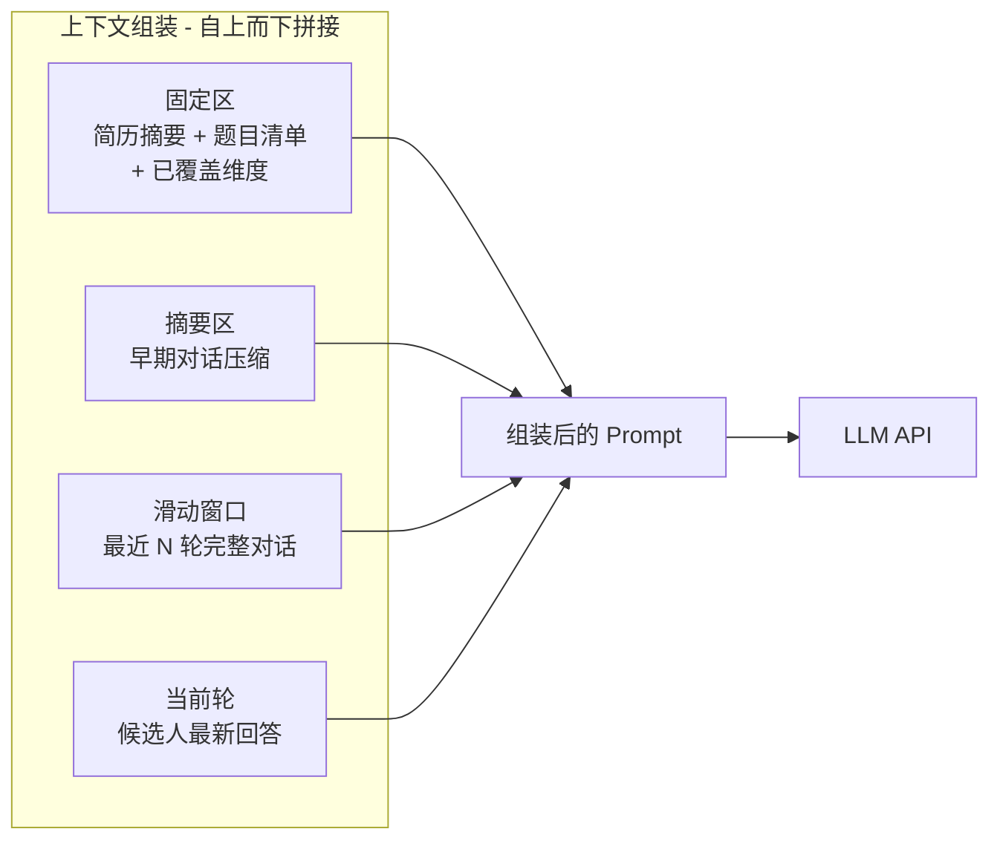
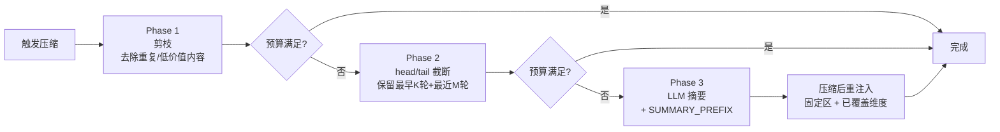

# 上下文管理与 Prompt 构建

## 1. 上下文管理器（ContextManager）

面试持续 30-60 分钟，上下文管理是保证 LLM 输出质量和控制 token 开销的关键模块。

### 1.1 上下文组装结构



### 1.2 各区域说明

| 区域 | 内容 | 大小估算 |
|------|------|----------|
| 固定区 | 候选人简历摘要 + 面试题目清单 + 已覆盖维度 + 系统提示词 | ~1000-2000 tokens，始终在头部，不被截断 |
| 摘要区 | 超出窗口的早期对话由 LLM 压缩生成，保留关键信息（技术短板、亮点、疑点） | 动态大小，超预算时优先压缩此区 |
| 滑动窗口 | 最近 N 轮完整对话（默认 5-8 轮），确保当前话题连续性 | ~3000-8000 tokens |
| 当前轮 | 候选人最新回答文本 | 可变 |

### 1.3 摘要触发机制

当满足以下**任一**条件时触发摘要压缩：

1. **轮次阈值**：对话轮次数超过配置值（如 > 8 轮），最早的轮次被压缩进摘要区
2. **Token 预算阈值**：当前上下文总 token 数超过预算值（根据模型窗口动态计算，如 DeepSeek 128K 设 80K 预算），超出部分通过压缩摘要区释放空间

### 1.4 三阶段压缩流程

触发压缩后，分三个阶段依次执行，直至 token 预算满足要求：



- **Phase 1 — 剪枝**：去除重复或低价值内容（如中间态的 LLM 建议文本、同一问题的多次追问中的中间轮次）
- **Phase 2 — head/tail 截断**：保留最早 K 轮（提供面试背景）和最近 M 轮（保证连续性），丢弃中间轮次；K、M 根据 token 预算动态调整
- **Phase 3 — LLM 摘要**：将待压缩的轮次发给 LLM 生成结构化摘要，结果加 `SUMMARY_PREFIX` 标头后写入摘要区

**SUMMARY_PREFIX**：摘要区内容开头固定添加 `[以下为早期面试对话的压缩摘要，非原始记录]`，告知 LLM 该段为摘要内容，避免对摘要中的细节进行不恰当的追问或假设。

**压缩可行性检查**：执行 Phase 3 前，检查所选 LLM 的上下文窗口是否足以容纳本次摘要请求（被压缩的轮次 + 指令 token）。若窗口不足（如 32K 模型），自动降低压缩触发阈值并减少单次压缩轮次数，分批执行。

**压缩后重注入**：压缩完成后，调用 `PromptBuilder` 将固定区（候选人简历摘要、题目清单、已覆盖维度）完整重置到上下文头部。

### 1.5 上下文感知能力

- 追踪已提问的题目和已覆盖的维度，注入固定区，避免重复提问
- 在摘要中标注候选人的关键表现（亮点/疑点），供评价 Agent 最终使用
- Token 预算实时追踪，前端可展示用量

### 1.6 ContextManager 接口定义

```python
class ContextManager:
    """上下文管理器 — 存储 + 自主异步压缩"""

    def __init__(self, config: ContextConfig, llm_client: LLMClient): ...

    async def add_round(self, round: ConversationRound) -> None:
        """新增对话轮次，内部异步检查是否需要触发压缩
        压缩在后台 task 执行，不阻塞调用方"""

    def get_context(self) -> ContextData:
        """返回当前最新的上下文数据（摘要区 + 滑动窗口）
        无论压缩是否完成，总是快速返回当前已有的最新数据"""

    @property
    def is_compressing(self) -> bool:
        """是否正在执行后台压缩"""

    @property
    def token_usage(self) -> TokenUsageInfo:
        """当前上下文 token 用量统计"""

@dataclass
class ContextData:
    summary: str                       # 摘要区内容（含 SUMMARY_PREFIX）
    window_rounds: list[ConversationRound]  # 滑动窗口中的轮次
    covered_dimensions: set[str]       # 已覆盖维度
    token_count: int                   # 当前上下文总 token 数

@dataclass
class TokenUsageInfo:
    """ContextManager.token_usage 属性返回类型"""
    total_used: int                    # 当前上下文总 token 数
    budget: int                        # token 预算上限
    fixed_zone_tokens: int             # 固定区占用
    summary_zone_tokens: int           # 摘要区占用
    window_zone_tokens: int            # 滑动窗口占用
    is_compressing: bool               # 是否正在后台压缩
    utilization: float                 # 预算使用率（0.0 - 1.0）
```

> 完整定义见 [共享数据结构](./data-models.md)

**职责边界**：
- `ContextManager`：存储对话轮次 + 自主管理压缩（后台异步执行，不阻塞） + 维护 token 统计
- `PromptBuilder`：从 ContextManager 获取 `ContextData`，组装最终 messages 列表返回给 Agent

**压缩时序**：
```
每轮对话结束 → InterviewAgent 调用 ContextManager.add_round()
                  → ContextManager 内部异步检查 token 预算
                  → 若超预算，后台启动压缩 task（不阻塞）

生成建议时 → PromptBuilder.build() 调用 ContextManager.get_context()
                  → 返回当前最新数据（即使压缩进行中也快速返回）
                  → 20% token 安全余量保证不会真正超模型窗口
```

---

## 2. PromptBuilder

**唯一对外输出 `messages` 列表的模块**，负责按固定层次顺序构建各 Agent 的完整 prompt。`ContextManager` 只管理摘要区和滑动窗口的内部状态（压缩、淘汰、token 追踪），将数据交给 `PromptBuilder` 做最终组装。

### 2.1 调用关系

```
Agent → PromptBuilder.build(session, agent_config) → 内部调用 ContextManager.get_context()
                                                   → 组装完整 messages 列表
                                                   → 返回给 Agent
Agent → LLMClient.chat(messages) 或 LLMClient.chat_stream(messages)
```

Agent 不直接调用 `ContextManager`，统一通过 `PromptBuilder` 获取最终的 messages。

### 2.2 PromptBuilder 接口

```python
class PromptBuilder:
    def __init__(self, skill_loader: SkillLoader, tool_registry: ToolRegistry,
                 memory_module: MemoryModule, context_manager: ContextManager): ...

    def build(self, session: InterviewSession, agent_config: AgentConfig) -> list[Message]:
        """按七层顺序构建完整 messages 列表
        - 第 1-5 层使用 session 级缓存
        - 第 6-7 层每次从 ContextManager 获取最新数据
        """
```

### 2.3 七层构建顺序

| 层次 | 内容 | 来源 |
|------|------|------|
| 1. Agent 身份 | Agent 的角色定义和行为准则 | `agent_config.system_prompt` |
| 2. Skill 索引 | 该 Agent 可用 Skill 的名称 + 一句话描述 | `SkillLoader.load_index()`，按 `agent_config.skill_names` 过滤 |
| 3. 工具指引 | 该 Agent 可调用工具的使用说明 | `ToolRegistry`，按 `agent_config.tool_names` 过滤 |
| 4. 候选人长期记忆 | 历史面试摘要（再次面试时注入） | `MemoryModule`（长期记忆） |
| 5. 面试固定区 | 候选人简历摘要 + 题目清单 + 已覆盖维度 | `InterviewSession` |
| 6. 摘要区 | 早期对话压缩摘要 | `ContextManager.get_context().summary` |
| 7. 滑动窗口 | 最近 N 轮完整对话 + 当前轮 | `ContextManager.get_context().window_rounds` |

- **第 1-5 层**（稳定基础）：`PromptBuilder` 自行构建，session 级缓存
- **第 6-7 层**（动态区）：`PromptBuilder` 每次从 `ContextManager` 获取最新数据后拼接

**Skill 作为 Tool 暴露**：对于 ResumeAgent 和 EvalAgent，Skill 通过 `skills_list` 和 `skill_view` 两个 Tool 暴露给 LLM，实现 progressive disclosure（system prompt 注入轻量索引，LLM 按需调用 Tool 加载完整内容）。InterviewAgent 不使用 Skill。

### 2.4 Session 级缓存

同一场面试中，前 5 层内容变化频率低，构建一次后缓存为 `_prompt_base`。仅在以下情况清除并重建：
- 压缩事件发生后（`covered_dimensions` 更新）
- 面试阶段切换时（Agent 身份变更）

---

## 3. 设计决策

### 决策 6: Token 计数

```
├── 方案 A: tiktoken 本地预估
├── 方案 B: 模型 API 返回 usage 字段
└── 选择: 两者结合
    理由: tiktoken 做发送前粗估以控制预算，API 返回值做发送后实际统计以追踪消耗。
         tiktoken 对国产模型的中文分词有偏差，预算预留 20% 安全余量补偿。
```

> 参见 [LLM Client](./llm-client.md) 中 Token 计数双轨方案的实现细节。
