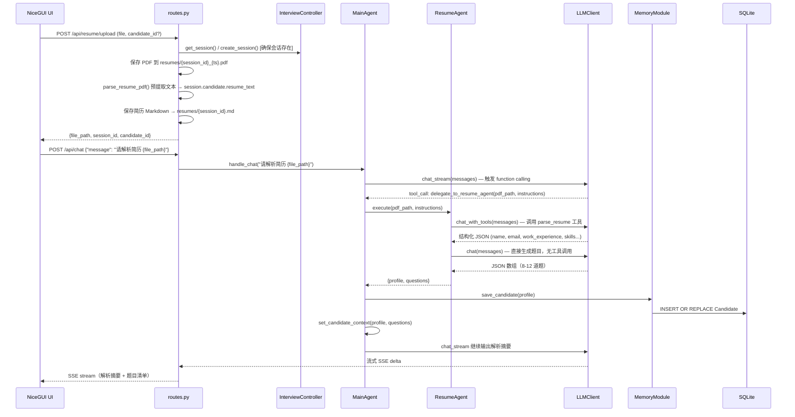
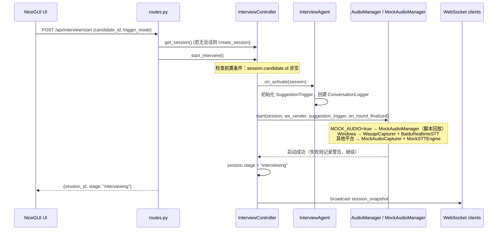
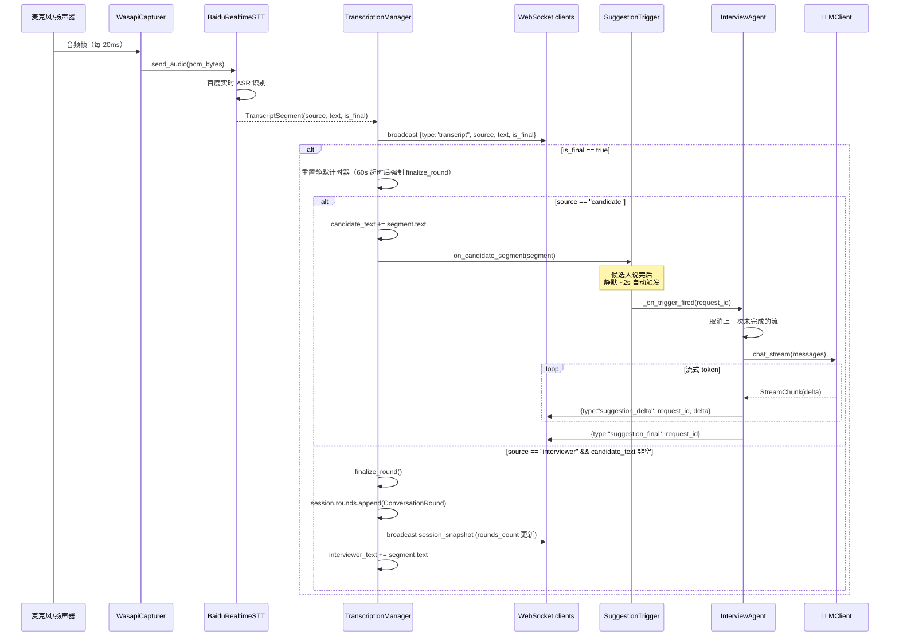
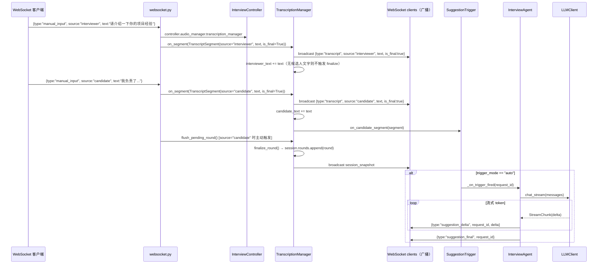
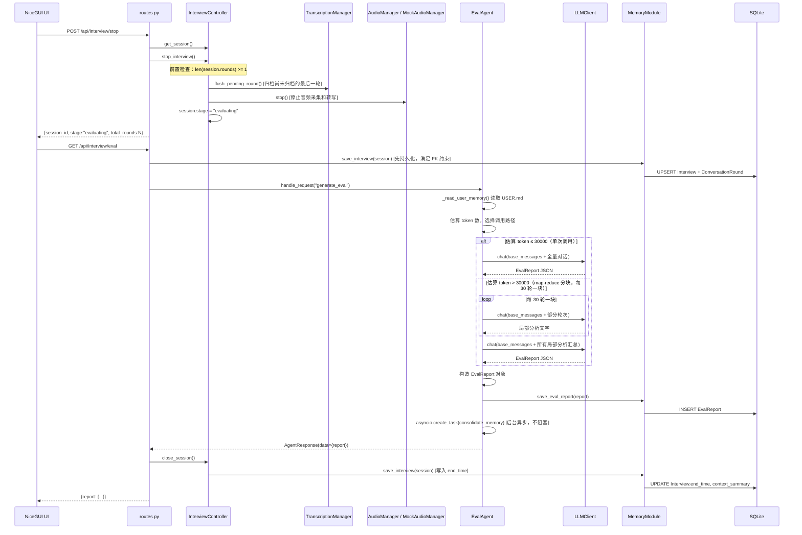

# 主要功能流程

五条核心功能的时序图与说明。

---

## 1. PDF 简历上传与解析

简历上传分两步：**① 文件保存**（REST API 直接处理）、**② 解析与题目生成**（面试官通过聊天触发 MainAgent）。

**关键数据流转**：

- 上传 API 只负责保存文件、预提取文本并写 Markdown，**不触发 LLM 解析**，返回 `file_path`
- 解析由面试官在聊天框告知 MainAgent，MainAgent 通过 `delegate_to_resume_agent` 工具委托 ResumeAgent 执行
- `ResumeAgent.execute()` 内部串行执行 `_parse_resume()` → `_generate_questions()`，两步共享同一 session
- 候选人数据由 MainAgent 写入 SQLite，并更新自身的 candidate context（Layer 3）

---

## 2. 面试开始

**关键数据流转**：

- `on_activate()` 时 `InterviewAgent` 创建新的 `SuggestionTrigger` 实例和会话级 `ConversationLogger`（写入 `conversations/interview_agent_{session_id}.jsonl`）
- 音频模式由 `MOCK_AUDIO` 配置决定：`true` 时使用 `MockAudioManager` 按 `MOCK_AUDIO_SCRIPT` 脚本回放，无需真实麦克风；`false` 时按平台选择
- 音频启动失败不阻断面试：异常被捕获后记录 `WARNING` 日志，`stage` 仍切换为 `interviewing`，手动输入路径完整可用

---

## 3. 实时转写与追问建议（自动触发）

**关键数据流转**：

- `WasapiCapturer` 通过 `run_coroutine_threadsafe` 将音频帧回调桥接到 asyncio 事件循环
- `TranscriptionManager` 是 STT 结果和上层 Agent 的缓冲层：累积转写文本，管理轮次归档
- 轮次归档触发条件：面试官新 segment 到来且候选人已有文字时，自动调用 `finalize_round()`
- 追问建议基于 `session.rounds[-1]`（最近一轮的面试官问题 + 候选人回答）生成

---

## 4. 手动输入 fallback

**关键数据流转**：

- `websocket.py` 通过 `InterviewController.audio_manager.transcription_manager` 获取 `TranscriptionManager`，构造 `TranscriptSegment(is_final=True)` 直接注入，与音频转写走相同路径
- `source="candidate"` 时 `websocket.py` 主动调用 `flush_pending_round()`，确保轮次及时归档（音频路径依赖静默超时，手动路径不依赖）
- 整个追问建议生成链路与音频路径完全相同

---

## 5. 面试结束与评价生成

**关键数据流转**：

- `stop_interview()` 在 `InterviewController` 内部先 `flush_pending_round()`，确保候选人最后一段回答不丢失
- `GET /api/interview/eval` 在调用 EvalAgent 前先 `save_interview()`，确保 `EvalReport` 的外键约束（`REFERENCES Interview(id)`）可以满足
- EvalAgent 自建 messages（不使用 PromptBuilder），每次 eval 直接读取 USER.md 注入岗位要求；根据 token 估算自动选择单次调用或 map-reduce 分块路径
- 评价报告生成后，`consolidate_memory()` 在后台更新候选人 `profile_json` 中的 `last_interview_insights` 字段，供下次面试时作为历史上下文
- `close_session()` 将 `session.stage` 设为 `completed`，写入 `end_time`，并重置内存中的会话对象
