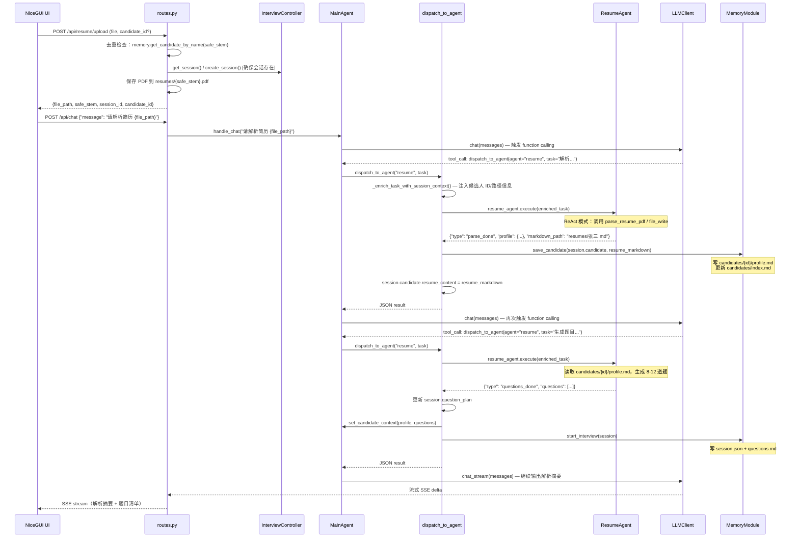
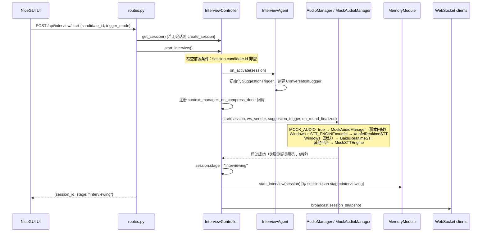
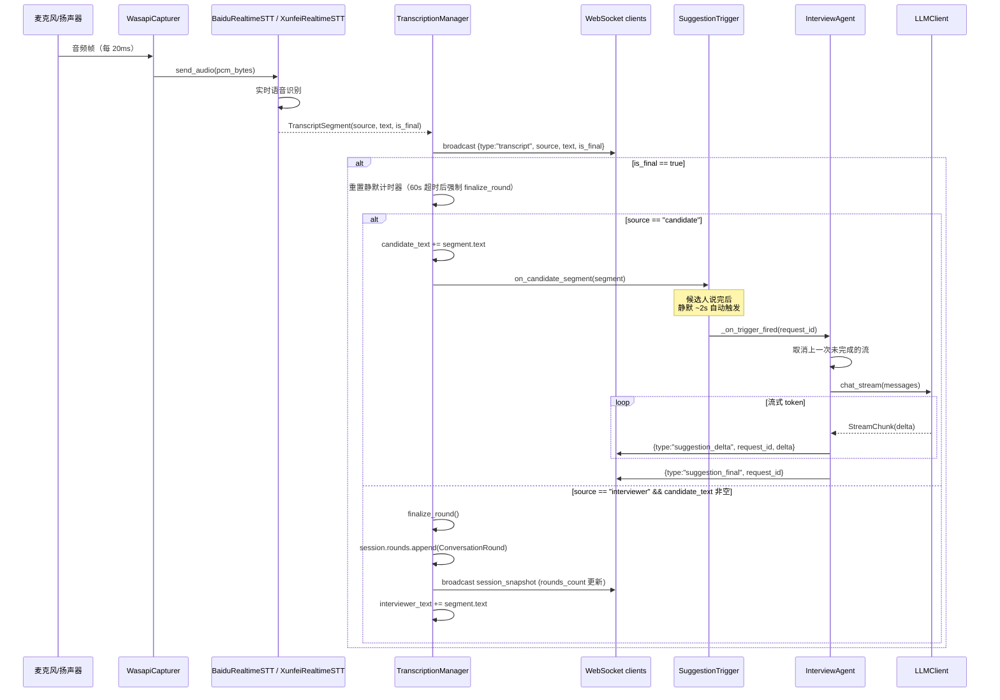
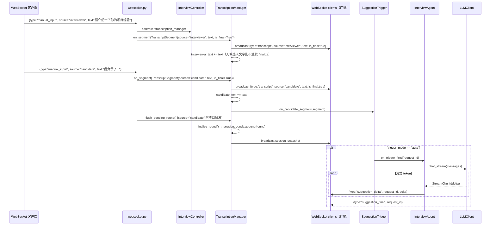
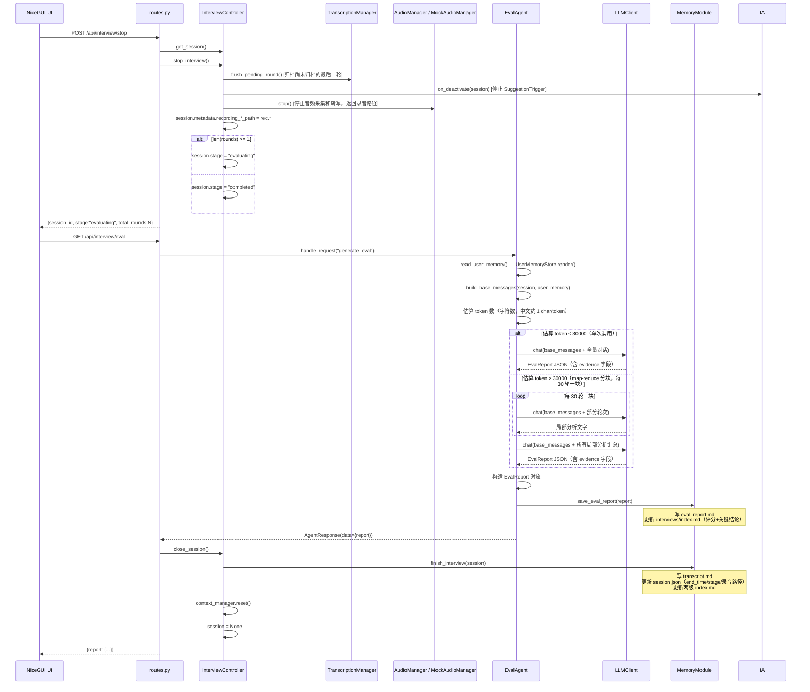

# 主要功能流程

五条核心功能的时序图与说明。

---

## 1. PDF 简历上传与解析

简历上传分两步：**① 文件保存**（REST API 直接处理）、**② 解析与题目生成**（面试官通过聊天触发 MainAgent）。

**关键数据流转**：

- 上传 API 通过 `get_candidate_by_name(safe_stem)` 检查同名候选人（文件名去扩展名 = 候选人姓名），存在则返回 409
- 解析由面试官在聊天框告知 MainAgent，MainAgent 通过 `dispatch_to_agent` 工具委托 ResumeAgent 执行（两步：先解析，再生成题目）
- `dispatch_to_agent` 自动注入 session 上下文（候选人 ID、profile.md 路径等），避免 ResumeAgent 猜测错误路径
- `parse_done` 副作用：读取临时 Markdown 文件 → `save_candidate()` → 删除临时文件；`questions_done` 副作用：更新 session + `start_interview()`

---

## 2. 面试开始

**关键数据流转**：

- `on_activate()` 时 `InterviewAgent` 创建新的 `SuggestionTrigger` 实例和会话级 `ConversationLogger`
- `context_manager._on_compress_done` 回调注册：压缩完成时自动将 summary 同步到 `session.context_summary`
- 音频模式由 `MOCK_AUDIO` 和 `STT_ENGINE` 配置决定；音频启动失败不阻断面试，`stage` 仍切换为 `interviewing`
- `memory.start_interview(session)` 写 `session.json`（stage=interviewing）；`questions.md` 在 `dispatch_to_agent` questions_done 时已写入

---

## 3. 实时转写与追问建议（自动触发）

**关键数据流转**：

- `WasapiCapturer` 通过 `run_coroutine_threadsafe` 将音频帧回调桥接到 asyncio 事件循环
- `TranscriptionManager` 是 STT 结果和上层 Agent 的缓冲层：累积转写文本，管理轮次归档
- 轮次归档触发条件：面试官新 segment 到来且候选人已有文字时，自动调用 `finalize_round()`
- 追问建议基于 `session.rounds[-1]`（最近一轮的面试官问题 + 候选人回答）生成

---

## 4. 手动输入 fallback

**关键数据流转**：

- `websocket.py` 通过 `controller.transcription_manager` 获取 `TranscriptionManager`，构造 `TranscriptSegment(is_final=True)` 直接注入，与音频转写走相同路径
- `source="candidate"` 时 `websocket.py` 主动调用 `flush_pending_round()`，确保轮次及时归档（音频路径依赖静默超时，手动路径不依赖）
- 整个追问建议生成链路与音频路径完全相同

---

## 5. 面试结束与评价生成

**关键数据流转**：

- `stop_interview()` 先 `flush_pending_round()` 确保最后一段不丢失，再停止 InterviewAgent 和音频
- 录音路径从 `audio.stop()` 返回，写入 `session.metadata`，由 `finish_interview()` 持久化到 `session.json`
- 路由层**不再在调用 EvalAgent 前主动 `save_interview`**；面试数据由 `close_session()` → `memory.finish_interview()` 统一写入
- `finish_interview()` 同时更新两级 index：`interviews/index.md`（含评价后的评分）和 `candidates/index.md`（更新 latest_interview）
- EvalAgent 不再调用 `consolidate_memory`（旧版更新 `last_interview_insights` 的逻辑已移除，历史摘要改由 `interviews/index.md` 中的 `key_findings` 字段承载）
