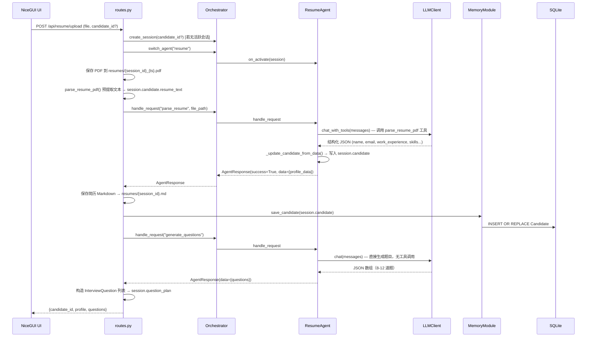
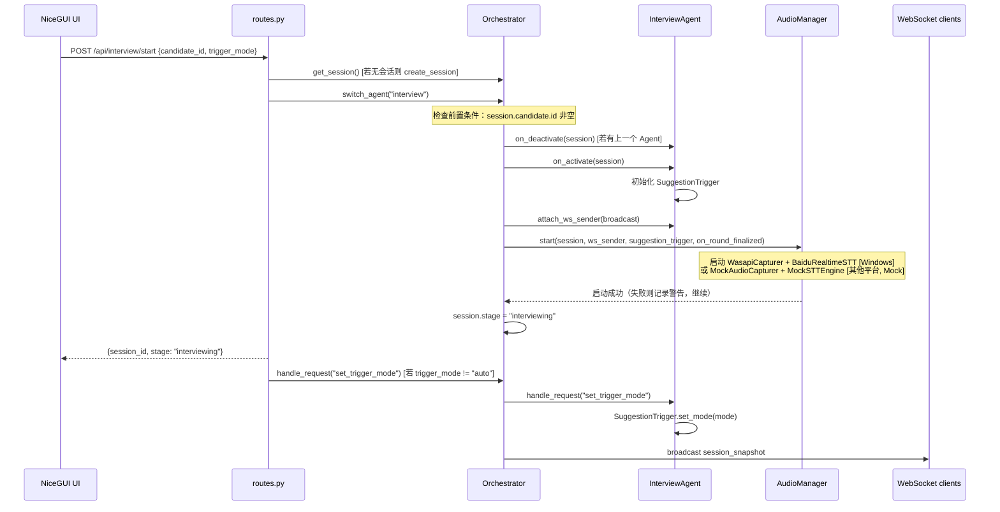
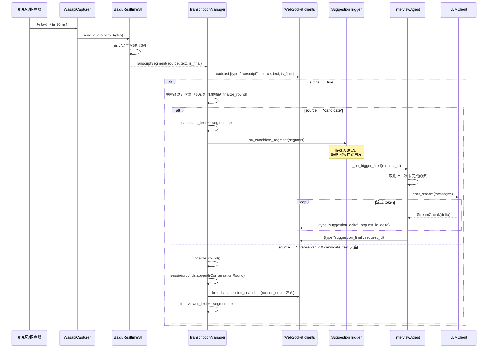
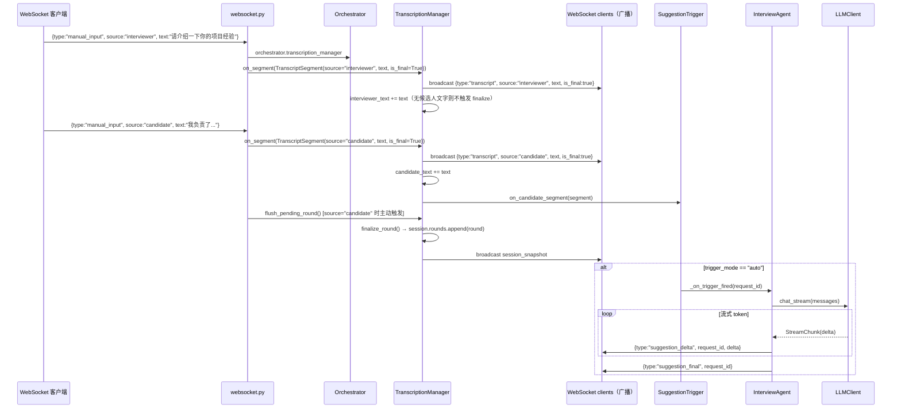
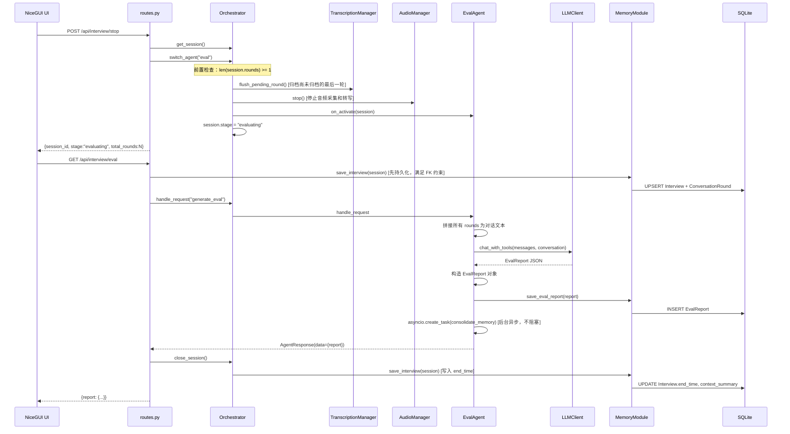

# 主要功能流程

五条核心功能的时序图与说明。

---

## 1. PDF 简历上传与解析

**关键数据流转**：

- `routes.py` 先做 PDF 文本预提取（`parse_resume_pdf`），将原始文本存入 `session.candidate.resume_text`，之后 `ResumeAgent` 再用 LLM 工具调用做结构化解析
- `ResumeAgent._parse_resume()` 通过 `_run_with_tools()` 循环执行 LLM 工具调用，直到 LLM 停止调用工具
- 题目生成（`generate_questions`）不调用工具，直接 `llm_client.chat()`
- 候选人数据先写内存（`session.candidate`），再异步持久化到 DB

---

## 2. 面试开始

**关键数据流转**：

- `on_activate()` 时 `InterviewAgent` 创建新的 `SuggestionTrigger` 实例，绑定 `_on_trigger_fired` 回调
- 音频启动失败不阻断面试：异常被捕获后记录 `WARNING` 日志，`stage` 仍切换为 `interviewing`，手动输入路径完整可用

---

## 3. 实时转写与追问建议（自动触发）

**关键数据流转**：

- `WasapiCapturer` 通过 `run_coroutine_threadsafe` 将音频帧回调桥接到 asyncio 事件循环
- `TranscriptionManager` 是 STT 结果和上层 Agent 的缓冲层：累积转写文本，管理轮次归档
- 轮次归档触发条件：面试官新 segment 到来且候选人已有文字时，自动调用 `finalize_round()`
- 追问建议基于 `session.rounds[-1]`（最近一轮的面试官问题 + 候选人回答）生成

---

## 4. 手动输入 fallback

**关键数据流转**：

- `websocket.py` 构造 `TranscriptSegment(is_final=True)` 直接注入 `TranscriptionManager`，与音频转写走相同路径
- `source="candidate"` 时 `websocket.py` 主动调用 `flush_pending_round()`，确保轮次及时归档（音频路径依赖静默超时，手动路径不依赖）
- 整个追问建议生成链路与音频路径完全相同

---

## 5. 面试结束与评价生成

**关键数据流转**：

- `switch_agent("eval")` 前先 `flush_pending_round()`，确保候选人最后一段回答不丢失
- `GET /api/interview/eval` 在调用 EvalAgent 前先 `save_interview()`，确保 `EvalReport` 的外键约束（`REFERENCES Interview(id)`）可以满足
- 评价报告生成后，`consolidate_memory()` 在后台更新候选人 `profile_json` 中的 `last_interview_insights` 字段，供下次面试时作为历史上下文
- `close_session()` 将 `session.stage` 设为 `completed`，写入 `end_time`，并重置内存中的会话对象
