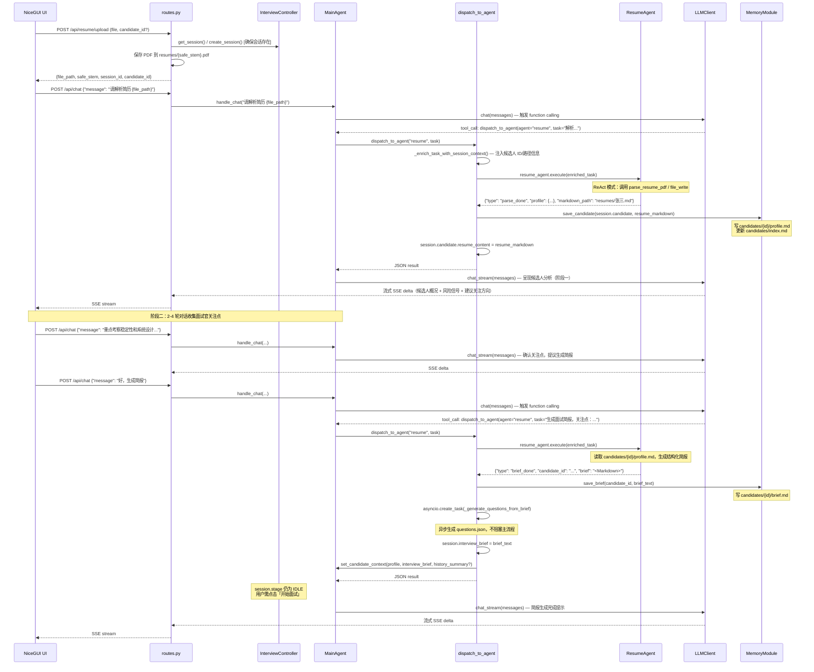
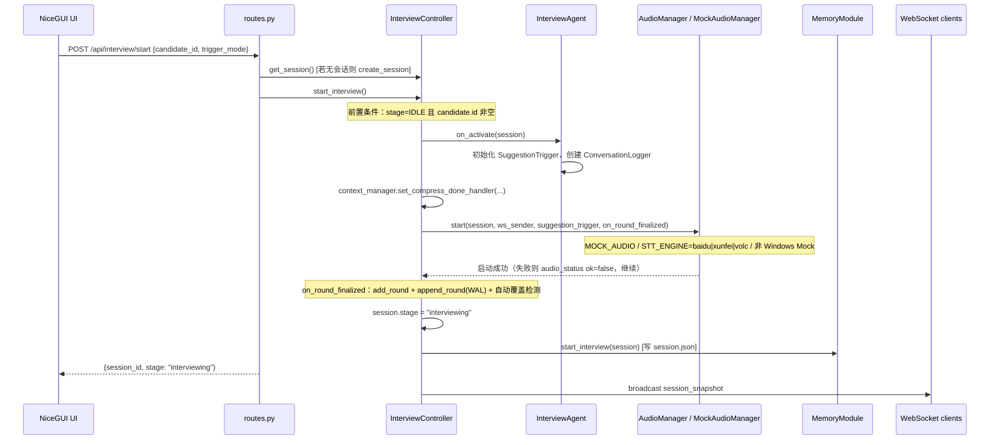
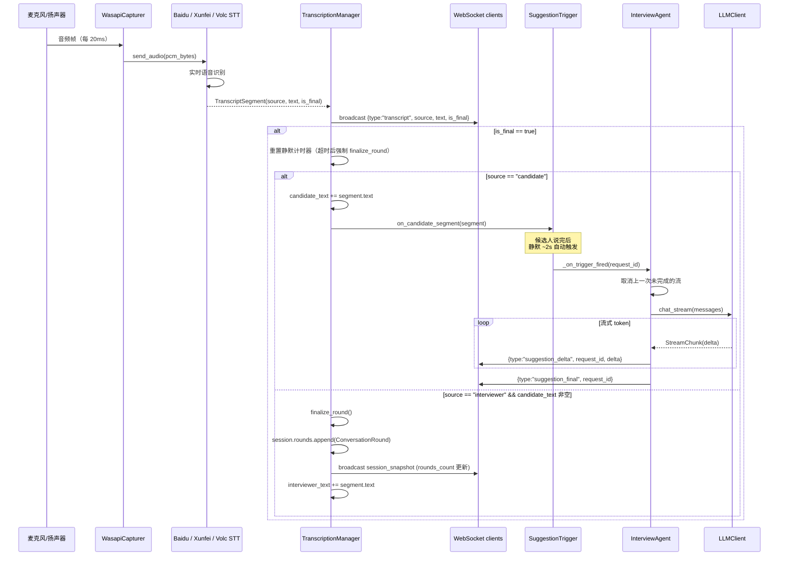
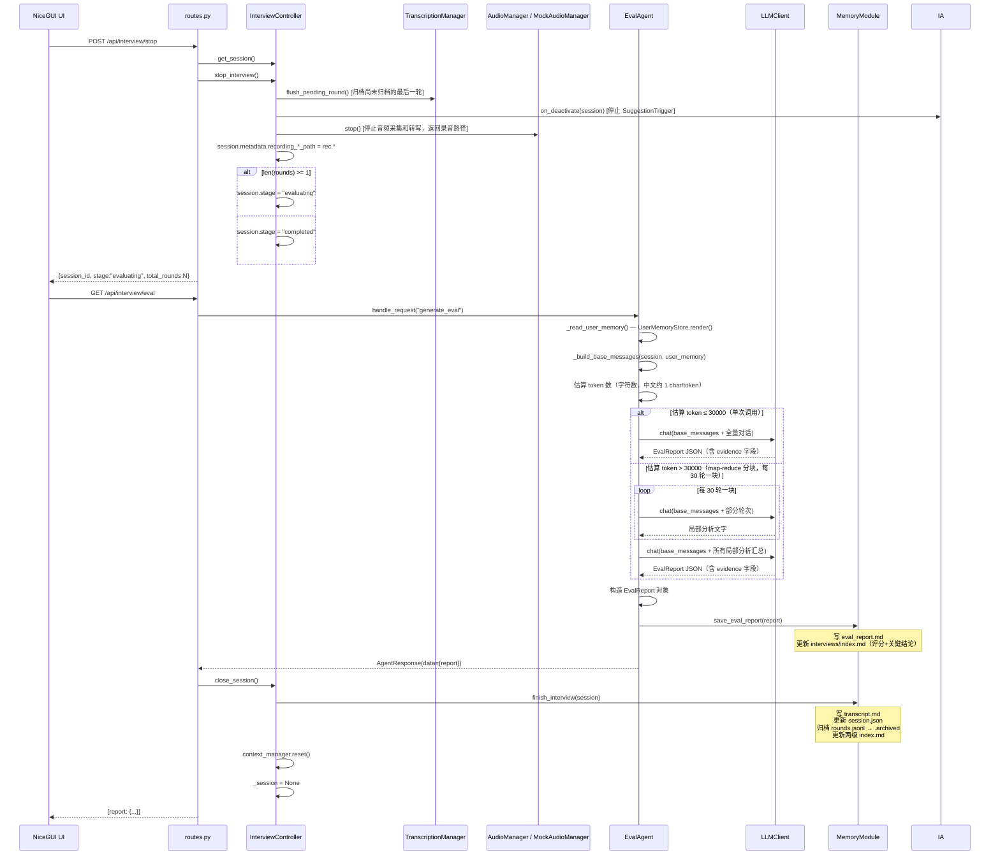

# 主要功能流程

五条核心功能的时序图与说明。

---

## 1. PDF 简历上传与解析

简历上传分两步：**① 文件保存**（REST API 直接处理）、**② 解析与简报生成**（面试官通过与 MainAgent 对话触发）。

**关键数据流转**：

- 解析由面试官聊天触发 MainAgent，MainAgent 通过 `dispatch_to_agent` 工具委托 ResumeAgent 执行
- 解析完成后 MainAgent 进入两阶段引导：① 呈现分析 + 风险信号；② 对话收集关注点后生成简报
- `dispatch_to_agent` 自动注入 session 上下文（候选人 ID、profile.md 路径、brief.md 路径等）
- `parse_done` 副作用：解析出 `real_name` 后**先判重再落盘**；若与已有候选人同名，将 profile + resume_markdown 暂存到进程内 `pending_duplicates`，通过 SSE `duplicate_candidate` 事件通知前端三选一（覆盖 / 保留两份 / 取消），由 `POST /api/resume/resolve-duplicate` 执行决议；未命中重名则正常 `save_candidate()`
- `brief_done` 副作用：`save_brief()` 落盘 → 异步生成结构化问题清单（`questions.json`）→ 更新 `session.interview_brief` → 刷新 MainAgent Layer 3；**不写 `session.json`，`session.stage` 维持 IDLE**；用户需显式 `POST /api/interview/start`

---

## 2. 面试开始

**关键数据流转**：

- `on_activate()` 时 `InterviewAgent` 创建新的 `SuggestionTrigger` 与会话级 `ConversationLogger`
- 压缩完成回调经 `ContextManager.set_compress_done_handler` 同步到 `session.context_summary`
- 音频模式由 `MOCK_AUDIO` 与 `STT_ENGINE`（`baidu` / `xunfei` / `volc`）决定；音频启动失败不阻断面试，经 WebSocket 推送 `audio_status`
- 每轮 `finalize_round` 后由 `on_round_finalized`：① `ContextManager.add_round`；② `memory.append_round`（WAL）；③ 异步 `_auto_check_coverage`（问题覆盖检测）
- **`memory.start_interview(session)` 在 Controller `start_interview()` 内调用**（写 `session.json`，stage=interviewing），与 brief 生成解耦

---

## 3. 实时转写与追问建议（自动触发）

**关键数据流转**：

- `WasapiCapturer` 通过 `run_coroutine_threadsafe` 将音频帧回调桥接到 asyncio 事件循环
- `TranscriptionManager` 缓冲 STT 结果、管理轮次归档；归档条件为面试官新 segment 到来且候选人已有文字
- 追问建议基于 PromptBuilder 组装的上下文（含全量/窗口历史）流式生成
- `InterviewAgent.generate_suggestion()` 通过 `chat_stream()` 逐 token yield，WebSocket 推送 `suggestion_delta` / `suggestion_final`；新触发会取消上一次流

---

## 4. 面试结束与评价生成

**关键数据流转**：

- `stop_interview()` 先 `flush_pending_round()`，再停 InterviewAgent 与音频
- 录音路径从 `audio.stop()` 写回 `session.metadata`，由 `finish_interview()` 持久化到 `session.json`
- 路由层不在调用 EvalAgent 前主动 `save_interview`；面试数据由 `close_session()` → `memory.finish_interview()` 统一写入
- `finish_interview()` 更新两级 index，并将 WAL 归档为 `rounds.jsonl.archived`
- EvalAgent 不调用 `consolidate_memory`；历史摘要由 `interviews/index.md` 的 `key_findings` 承载

---

## 5. 问题清单与覆盖检测（简报后）

简报生成后异步产出 `candidates/{id}/questions.json`；面试中每轮归档可自动覆盖检测，也可手动触发。

| 入口 | 行为 |
|---|---|
| `brief_done` → `_generate_questions_from_brief` | LLM 从简报提取 5–10 题，写入 `questions.json` |
| `GET /api/interview/questions` | 读取问题清单 |
| `PATCH /api/interview/questions/{id}` | 手动标记 covered |
| `POST /api/interview/questions/check-coverage` | 用 LLM 根据对话文本标记已覆盖题 |
| `on_round_finalized` → `_auto_check_coverage` | 轮次落盘后自动覆盖检测（静默失败） |
