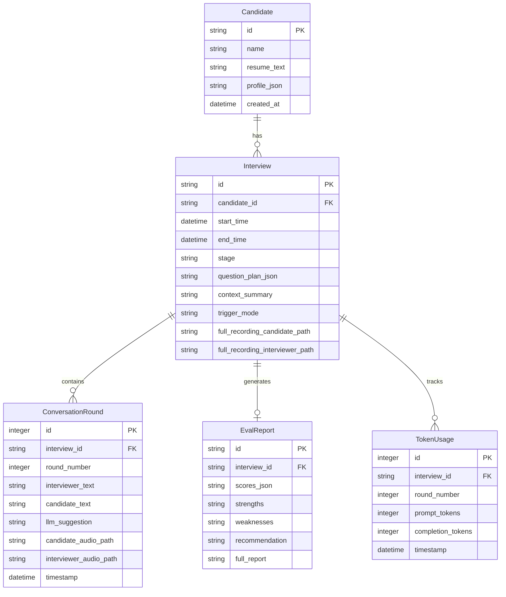

# 记忆与数据持久化

## 1. 记忆模块（MemoryModule）

记忆分为短期和长期两层，职责独立，通过 `MemoryModule` 统一接口访问。

### 1.1 短期记忆（in-session）

存活在运行时的 `InterviewSession` 对象中，随面试进行实时更新：

| 字段 | 类型 | 说明 |
|------|------|------|
| `covered_dimensions` | `set[str]` | 本场面试已覆盖的考察维度，注入固定区避免重复提问 |
| `context_summary` | `str` | 当前摘要区内容（三阶段压缩的输出），由 `ContextManager` 维护 |
| `working_notes` | `str` | 本场面试实时积累的候选人关键表现标注（亮点/短板），压缩时保留到摘要 |

面试结束后，这些字段随 `Interview` 记录一并归档到 SQLite。

### 1.2 长期记忆（cross-session）

持久化到 SQLite，支持跨面试会话的数据积累与查询：

| 数据 | 存储位置 | 说明 |
|------|----------|------|
| 候选人信息与历史面试列表 | `Candidate` + `Interview` 表 | 基础 CRUD，按姓名/时间检索 |
| 对话文本记录 | `ConversationRound` 表 | 每轮完整问答 + LLM 建议 |
| LLM 上下文摘要 | `Interview.context_summary` | 压缩后的完整摘要，可供后续回顾 |
| 评价报告 | `EvalReport` 表 | 结构化评分 + 文字总结 |
| 录音文件路径 | `ConversationRound` + `Interview` 表 | 引用，不存二进制 |
| **候选人档案** | `Candidate.profile_json` | 从历次面试中提炼的关键标签（技术短板、优势特征） |

### 1.3 历史记忆注入时机

在**面试准备阶段**（`ResumeAnalysis` 状态），`MemoryModule` 检查候选人是否有历史记录：

```
查询 Candidate 历史面试 → 读取最近 N 次评价报告和档案 → 生成历史摘要
    → 写入 InterviewSession.candidate.history_summary
    → PromptBuilder 将其注入固定区第 4 层（候选人长期记忆）
```

若为首次面试，第 4 层为空，不增加 token 开销。

> 参见 [上下文管理与 Prompt 构建](./context-and-prompt.md) 中 PromptBuilder 七层构建顺序。

### 1.4 面试后记忆整合

评价报告生成完毕后，系统后台异步执行记忆整合（不阻塞主流程）：

```python
async def consolidate_memory(session: InterviewSession) -> None:
    """评价完成后，将本次关键信息写入候选人长期档案"""
    candidate = await memory.get_candidate(session.candidate.id)
    # 将本次面试识别的技术短板、亮点追加到 candidate.profile_json
    await memory.update_candidate_profile(candidate.id, new_insights)
```

### 1.5 MemoryModule 完整接口

> 数据类型定义见 [共享数据结构](./data-models.md)

```python
class MemoryModule:
    """记忆模块 — 统一管理短期/长期记忆的读写"""

    def __init__(self, storage: Database): ...

    # ─── 候选人管理 ───
    async def get_candidate(self, candidate_id: str) -> CandidateProfile | None:
        """按 ID 获取候选人画像"""

    async def save_candidate(self, profile: CandidateProfile) -> str:
        """保存候选人画像，返回 candidate_id"""

    async def search_candidates(self, keyword: str = "", limit: int = 20) -> list[CandidateProfile]:
        """按姓名模糊搜索候选人列表"""

    # ─── 候选人历史记忆（PromptBuilder 第 4 层调用）───
    async def get_candidate_history(self, candidate_id: str, limit: int = 3) -> CandidateHistory | None:
        """获取候选人历史面试摘要
        若无历史记录返回 None，PromptBuilder 第 4 层为空"""

    # ─── 面试记录 ───
    async def save_interview(self, session: InterviewSession) -> None:
        """面试结束后，将 session 完整归档到 SQLite
        写入：Interview 表 + ConversationRound 表 + TokenUsage 表"""

    async def get_interview_detail(self, interview_id: str) -> InterviewDetail | None:
        """获取面试完整详情（含对话记录、评价报告、录音路径）"""

    # ─── 评价报告 ───
    async def save_eval_report(self, report: EvalReport) -> None:
        """保存评价报告到 EvalReport 表"""

    async def get_eval_report(self, interview_id: str) -> EvalReport | None:
        """按面试 ID 获取评价报告"""

    # ─── 面试后记忆整合 ───
    async def consolidate_memory(self, session: InterviewSession) -> None:
        """评价完成后异步调用：将本次面试的关键发现写入候选人长期档案
        提取技术短板、亮点等标签 → 更新 Candidate.profile_json"""
```

#### 辅助数据结构

```python
@dataclass
class CandidateHistory:
    """get_candidate_history() 返回 — 候选人历史面试记录"""
    past_interviews: list[InterviewSummary]
    history_summary: str                   # 可直接注入 prompt 第 4 层的文本摘要

@dataclass
class InterviewSummary:
    """单次历史面试摘要"""
    interview_id: str
    date: datetime
    overall_score: float | None
    recommendation: str | None
    key_findings: str                      # 关键发现摘要文本

@dataclass
class InterviewDetail:
    """get_interview_detail() 返回 — 面试完整详情"""
    interview_id: str
    candidate_id: str
    start_time: datetime
    end_time: datetime | None
    rounds: list[ConversationRound]
    eval_report: EvalReport | None
    recording_paths: RecordingPaths | None

@dataclass
class RecordingPaths:
    full_candidate: str
    full_interviewer: str
```

---

## 2. 数据模型

### 2.1 ER 图



### 2.2 索引设计

| 表 | 索引 | 用途 |
|----|------|------|
| `Candidate` | `name` | 按姓名模糊搜索候选人 |
| `Interview` | `candidate_id, start_time DESC` | 按候选人查历史面试，按时间倒序 |
| `ConversationRound` | `interview_id, round_number` | 按面试 + 轮次顺序查询对话记录 |
| `TokenUsage` | `interview_id` | 按面试统计 token 消耗 |

### 2.3 Database 与 Repository 接口

#### Database

```python
class Database:
    """SQLite 连接管理"""

    def __init__(self, db_path: str): ...

    async def initialize(self) -> None:
        """创建表结构（若不存在），执行必要的 migration"""

    async def close(self) -> None:
        """关闭数据库连接"""

    def connection(self) -> AsyncContextManager[aiosqlite.Connection]:
        """获取数据库连接（async 上下文管理器）"""
```

#### Repository 层

`MemoryModule` 内部通过 Repository 访问各表，Repository 提供基础 CRUD，返回 `dict`，由 `MemoryModule` 负责 dict → dataclass 转换。

```python
class CandidateRepository:
    def __init__(self, db: Database): ...
    async def insert(self, id: str, name: str, resume_text: str,
                     profile_json: str) -> None: ...
    async def get_by_id(self, id: str) -> dict | None: ...
    async def search_by_name(self, keyword: str, limit: int = 20) -> list[dict]: ...
    async def update_profile(self, id: str, profile_json: str) -> None: ...

class InterviewRepository:
    def __init__(self, db: Database): ...
    async def insert(self, id: str, candidate_id: str, start_time: datetime,
                     question_plan_json: str, trigger_mode: str) -> None: ...
    async def get_by_id(self, id: str) -> dict | None: ...
    async def get_by_candidate(self, candidate_id: str,
                               limit: int = 10) -> list[dict]: ...
    async def update_on_finish(self, id: str, end_time: datetime,
                               context_summary: str,
                               recording_candidate_path: str,
                               recording_interviewer_path: str) -> None: ...

class RoundRepository:
    def __init__(self, db: Database): ...
    async def insert(self, interview_id: str,
                     round: ConversationRound) -> int: ...
    async def get_by_interview(self, interview_id: str) -> list[dict]: ...

class EvalReportRepository:
    def __init__(self, db: Database): ...
    async def insert(self, report: EvalReport) -> None: ...
    async def get_by_interview(self, interview_id: str) -> dict | None: ...

class TokenUsageRepository:
    def __init__(self, db: Database): ...
    async def insert(self, interview_id: str, round_number: int,
                     prompt_tokens: int, completion_tokens: int) -> None: ...
    async def get_total_by_interview(self, interview_id: str) -> tuple[int, int]:
        """返回 (total_prompt_tokens, total_completion_tokens)"""
```

---

## 3. 设计决策

### 决策 10: 候选人历史记忆注入策略

```
├── 方案 A: 动态 prefetch（每轮 user message 发送前临时注入，不存入对话 DB）
├── 方案 B: 固定区注入（面试准备阶段一次性读取，写入 prompt 固定区，全程保留）
└── 选择: 方案 B
    理由: 候选人历史摘要体量可控（通常 200-500 tokens），固定占用 token 预算
         的代价可接受。实现更简单，无需每轮动态拼接，与现有固定区结构一致。
         再次面试同一候选人的场景频率低，历史信息对全程面试策略均有价值。
```
