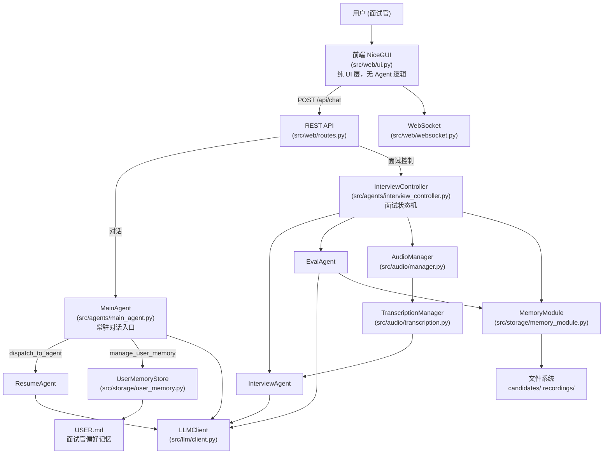

# 总体架构概览

本地单用户技术面试辅助工具的系统架构说明。

---

## 项目定位

面试助手是一个运行在本地的单用户技术面试辅助工具。它实时采集面试双方（面试官和候选人）的音频，通过语音识别转写为文字，再由 AI 自动生成追问建议，帮助面试官聚焦关键问题、减少遗漏。

整个系统是一个 Python 单进程服务。无需联网（LLM API 除外），所有数据存储在本地文件系统（`candidates/` 目录）。当音频采集不可用时（如非 Windows 平台），可通过 WebSocket `manual_input` 手动输入文字走完完整面试流程。

---

## 系统分层图



---

## 目录结构说明

```
src/
├── main.py                  # 启动入口，lifespan() 手动组装所有依赖
├── config.py                # pydantic-settings 配置，get_settings() 单例
├── logging/                 # 日志初始化（setup_logging）和 contextvars 绑定
├── web/
│   ├── app.py               # 创建 FastAPI 实例，挂载路由和中间件
│   ├── routes.py            # 所有 REST API 处理函数（/api 前缀）
│   ├── websocket.py         # WebSocket /ws/interview 处理器
│   ├── middleware.py        # 请求日志等中间件
│   ├── ui.py                # NiceGUI 单页面界面（@ui.page("/")）
│   └── schemas.py           # FastAPI 请求体 Pydantic 模型
├── agents/
│   ├── base.py              # BaseAgent、AgentRequest、AgentResponse 基类
│   ├── main_agent.py        # MainAgent：面试官唯一对话入口（常驻单例）
│   ├── interview_controller.py  # InterviewController：面试状态机控制器
│   ├── resume_agent.py      # 简历解析与题目生成（ReAct 模式）
│   ├── interview_agent.py   # 实时追问建议（流式），持有 SuggestionTrigger
│   ├── eval_agent.py        # 评价报告生成
│   └── prompts.py           # Agent system prompt 常量
├── framework/
│   ├── context.py           # ContextManager：滑动窗口 + 摘要压缩
│   ├── prompt_builder.py    # PromptBuilder：唯一组装 list[Message] 的模块
│   ├── skill.py             # SkillLoader：读取 skills/ 目录下 SKILL.md 文件
│   └── tool_registry.py     # ToolRegistry：注册和调用 LLM 工具
├── llm/
│   ├── client.py            # OpenAICompatibleClient：调用 OpenAI 兼容 API
│   ├── config.py            # LLMConfig 数据类
│   ├── protocol.py          # LLMClient 协议/抽象接口
│   └── errors.py            # LLM 相关异常
├── audio/
│   ├── manager.py           # AudioManager：协调采集/转写/录音全流程
│   ├── mock_manager.py      # MockAudioManager：脚本回放替代真实采集（调试模式）
│   ├── transcription.py     # TranscriptionManager：STT 分发与轮次管理
│   ├── trigger.py           # SuggestionTrigger：自动/手动追问触发逻辑
│   ├── recorder.py          # AudioRecorder：录音文件写入
│   ├── script_player.py     # ScriptPlayer：按 JSON 脚本注入转写片段（调试模式）
│   ├── wasapi.py            # WasapiCapturer：Windows 双声道采集（生产）
│   ├── baidu_stt.py         # BaiduRealtimeSTT：百度实时语音识别（生产）
│   ├── xunfei_stt.py        # XunfeiRealtimeSTT：讯飞实时语音转写（生产可选）
│   ├── mock.py              # MockAudioCapturer + MockSTTEngine（非 Windows）[Mock]
│   ├── stream.py            # 音频流处理辅助
│   └── protocol.py          # AudioFrame、TranscriptSegment 协议数据类
├── tools/
│   ├── _context.py          # ToolContext 单例，持有运行时组件引用
│   ├── _loader.py           # register_all 工具注册辅助
│   ├── dispatch_to_agent.py # 通用 Agent 分发工具（委托 ResumeAgent）
│   ├── manage_user_memory.py# 面试官记忆管理工具（add/replace/remove/list）
│   ├── parse_resume_pdf.py  # PDF 简历解析工具（Strategy 模式，委托 pdf_parsers/）
│   ├── file_read.py         # file_read 工具
│   ├── file_write.py        # file_write 工具
│   ├── skill_view.py        # skill_view 工具
│   ├── pdf_parsers/         # PDF 解析引擎（Strategy 模式）
│   │   ├── base.py          # BasePDFParser 抽象基类
│   │   ├── pymupdf_parser.py# PymupdfParser：本地文本提取（快速，无图像理解）
│   │   ├── qwen_vl_parser.py# QwenVLParser：Qwen-VL 多模态解析（支持复杂排版）
│   │   └── mineru_parser.py # MineruParser：MinerU Cloud API 解析
│   └── __init__.py          # 统一导出
├── storage/
│   ├── memory_module.py     # MemoryModule：文件系统存储（candidates/ 目录）
│   ├── user_memory.py       # UserMemoryStore：USER.md 条目化读写
│   └── conversation_logger.py  # ConversationLogger：JSONL 格式 Agent 对话持久化
└── models/
    ├── session.py           # InterviewSession、ConversationRound、InterviewStage 等
    ├── candidate.py         # CandidateProfile、update_candidate_from_data
    ├── evaluation.py        # EvalReport、DimensionScore
    ├── message.py           # LLM 消息 Message 数据类
    └── exceptions.py        # 业务异常定义（SessionError、StorageError 等）

skills/                      # SKILL.md 面试技巧文件，由 SkillLoader 读取
├── question_generation/     # 出题方法论（ResumeAgent 通过 skill_view 调用）
├── deep_dive/               # 技术深挖追问策略（InterviewAgent）
├── dimension_switch/        # 考察维度切换引导（InterviewAgent）
└── behavioral_probe/        # 行为追问策略（InterviewAgent）
recordings/                  # 录音文件（按 session_id 分目录）
candidates/                  # 候选人档案（profile.md / interviews/ 等）
resumes/                     # 临时存放上传的简历 PDF（解析完成后 PDF 迁移至 candidates/{id}/）
data/                        # 调试数据（如 mock_script.json 脚本回放文件）
conversations/               # Agent 对话日志 JSONL（调试用，已加入 .gitignore）
```

---

## 技术栈汇总

| 层 | 技术 / 库 | 版本要求 | 用途 |
|---|---|---|---|
| 语言 | Python | 3.12+ | 主语言，asyncio 单进程 |
| Web 框架 | FastAPI | — | REST API 和 WebSocket |
| Web 服务器 | uvicorn | — | ASGI 服务器 |
| 前端 UI | NiceGUI | — | Python 声明式单页面 UI，与后端同进程 |
| LLM | OpenAI SDK（兼容） | — | 通义千问 / DeepSeek 等 OpenAI 兼容端点 |
| 配置管理 | pydantic-settings | — | 从 `.env` 加载配置，类型安全 |
| 文件存储 | 文件系统 + PyYAML | — | 候选人档案与面试数据，原子写入（mkstemp+os.replace） |
| 音频采集 | Windows WASAPI | Windows 专属 | 双声道实时音频采集（生产） |
| 语音识别 | 百度实时 ASR / 讯飞实时 | Windows 专属 | 候选人和面试官实时转写（生产，通过 `STT_ENGINE` 选择） |
| PDF 解析 | Strategy 模式（pymupdf / qwen_vl / mineru） | — | 简历 PDF 解析，通过 `PDF_PARSER` 配置切换引擎：`pymupdf` 本地文本提取；`qwen_vl` 多模态（支持复杂排版）；`mineru` Cloud API |
| HTTP 客户端 | httpx | — | UI Agent 工具调本地 REST 接口 |

---

## 启动流程（`src/main.py` lifespan 顺序）

```
main.py 执行时：
1. setup_logging()               → 初始化日志（logs/ 目录）
2. get_settings()                → 加载 .env / 环境变量，生成 Settings 单例

lifespan(app) 启动时（FastAPI 生命周期钩子）：
3. mkdir recordings/ candidates/ resumes/  → 确保目录存在
4. MemoryModule(candidates_dir)  → 文件系统存储（candidates/ 目录）
5. UserMemoryStore(USER.md)      → 加载面试官偏好记忆
6. OpenAICompatibleClient(...)   → LLM 客户端
7. SkillLoader(SKILLS_DIR)       → 加载 skills/ 下所有 SKILL.md
8. ToolRegistry()                → 工具注册表
9. register_all(tool_registry)   → 统一注册所有工具（dispatch_to_agent / manage_user_memory / parse_resume_pdf / file_read / file_write / skill_view 等）
10. ContextManager(...)          → 滑动窗口上下文管理器
11. PromptBuilder(...)           → 组装 LLM Messages（注入 UserMemoryStore）
12. ResumeAgent(...)             → 简历分析 Agent（ReAct 模式，最大 15 轮工具调用）
13. InterviewAgent(...)          → 面试 Agent
14. EvalAgent(...)               → 评价 Agent（注入 UserMemoryStore）
15. 根据配置选择音频实现
    - MOCK_AUDIO=true  → MockAudioManager（按 mock_script.json 脚本回放，跳过采集和 STT）
    - Windows + STT_ENGINE=xunfei → WasapiCapturer + XunfeiRealtimeSTT（生产）
    - Windows（默认）  → WasapiCapturer + BaiduRealtimeSTT（生产）
    - 其他平台         → MockAudioCapturer + MockSTTEngine（开发）
    注：PDF 解析引擎由 PDF_PARSER 配置决定（pymupdf / qwen_vl / mineru），在 parse_resume_pdf 工具调用时动态选择，不影响启动流程
16. AudioManager 或 MockAudioManager(...)  → 组装音频管道
17. InterviewController(...)     → 面试状态机控制器
18. MainAgent(...)               → 常驻对话入口，绑定 ResumeAgent 和 Controller
19. tool_ctx.* = ...             → 注入工具依赖（main_agent / resume_agent / controller / memory_module / user_memory_store / prompt_builder / skill_loader）
20. app.state.* = ...            → 注入依赖到 FastAPI app.state

启动完成后：
- ui.run_with(app)   → NiceGUI 挂载到 FastAPI，提供 http://HOST:PORT/
- uvicorn.run(app)   → 启动 ASGI 服务器，监听 HOST:PORT
```
