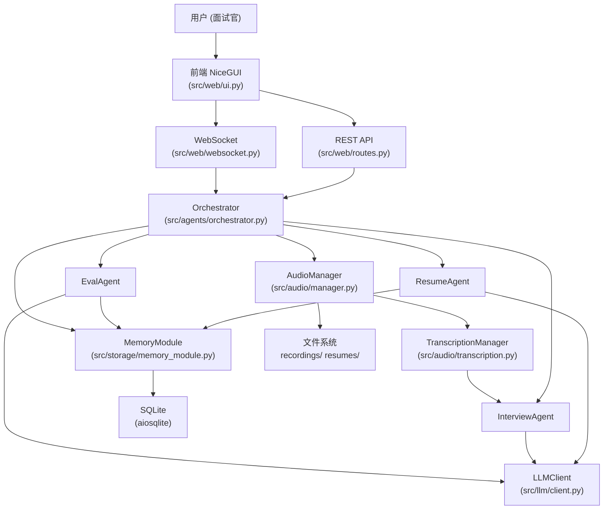

# 总体架构概览

本地单用户技术面试辅助工具的系统架构说明。

---

## 项目定位

面试助手是一个运行在本地的单用户技术面试辅助工具。它实时采集面试双方（面试官和候选人）的音频，通过语音识别转写为文字，再由 AI 自动生成追问建议，帮助面试官聚焦关键问题、减少遗漏。

整个系统是一个 Python 单进程服务。无需联网（LLM API 除外），所有数据存储在本地 SQLite 数据库和文件系统中。当音频采集不可用时（如非 Windows 平台），可通过 WebSocket `manual_input` 手动输入文字走完完整面试流程。

---

## 系统分层图



---

## 目录结构说明

```
src/
├── main.py                  # 启动入口，bootstrap() 手动组装所有依赖
├── config.py                # pydantic-settings 配置，get_settings() 单例
├── logging/                 # 日志初始化（setup_logging）和 contextvars 绑定
├── web/
│   ├── app.py               # 创建 FastAPI 实例，挂载路由和中间件
│   ├── routes.py            # 所有 REST API 处理函数（/api 前缀）
│   ├── websocket.py         # WebSocket /ws/interview 处理器
│   ├── middleware.py        # 请求日志等中间件
│   ├── ui.py                # NiceGUI 单页面界面（@ui.page("/")）
│   └── schemas.py           # FastAPI 请求体 Pydantic 模型
├── agents/
│   ├── base.py              # BaseAgent、AgentRequest、AgentResponse 基类
│   ├── orchestrator.py      # Agent 调度器，管理会话生命周期与 Agent 切换
│   ├── resume_agent.py      # 简历解析与题目生成
│   ├── interview_agent.py   # 实时追问建议（流式），持有 SuggestionTrigger
│   ├── eval_agent.py        # 评价报告生成
│   └── prompts.py           # 三个 Agent 的 system prompt 常量
├── framework/
│   ├── context.py           # ContextManager：滑动窗口 + 摘要压缩
│   ├── prompt_builder.py    # PromptBuilder：唯一组装 list[Message] 的模块
│   ├── skill.py             # SkillLoader：读取 skills/ 目录下 SKILL.md 文件
│   └── tool_registry.py     # ToolRegistry：注册和调用 LLM 工具
├── llm/
│   ├── client.py            # OpenAICompatibleClient：调用 OpenAI 兼容 API
│   ├── config.py            # LLMConfig 数据类
│   ├── protocol.py          # LLMClient 协议/抽象接口
│   └── errors.py            # LLM 相关异常
├── audio/
│   ├── manager.py           # AudioManager：协调采集/转写/录音全流程
│   ├── transcription.py     # TranscriptionManager：STT 分发与轮次管理
│   ├── trigger.py           # SuggestionTrigger：自动/手动追问触发逻辑
│   ├── recorder.py          # AudioRecorder：录音文件写入
│   ├── wasapi.py            # WasapiCapturer：Windows 双声道采集（生产）
│   ├── baidu_stt.py         # BaiduRealtimeSTT：百度实时语音识别（生产）
│   ├── mock.py              # MockAudioCapturer + MockSTTEngine（非 Windows）[Mock]
│   ├── stream.py            # 音频流处理辅助
│   └── protocol.py          # AudioFrame、TranscriptSegment 协议数据类
├── tools/
│   ├── resume_parser.py     # parse_resume_pdf：读取 PDF 文本
│   ├── skill_tools.py       # 生成 skills_list / skill_view 工具函数
│   └── interview_control_tools.py  # UI Agent 工具集（httpx 调本地 REST）
├── storage/
│   ├── database.py          # Database：aiosqlite 连接封装和表结构创建
│   ├── repositories.py      # 各表的 CRUD Repository 类
│   └── memory_module.py     # MemoryModule：短期/长期记忆统一接口
└── models/
    ├── session.py           # InterviewSession、ConversationRound、InterviewStage 等
    ├── candidate.py         # CandidateProfile、Education、WorkExperience 等
    ├── evaluation.py        # EvalReport、DimensionScore
    ├── message.py           # LLM 消息 Message 数据类
    └── exceptions.py        # 业务异常定义（SessionError、StorageError 等）

skills/                      # SKILL.md 面试技巧文件，由 SkillLoader 读取
recordings/                  # 录音文件（按 session_id 分目录）
resumes/                     # 上传的简历 PDF 和转换后的 Markdown
```

---

## 技术栈汇总

| 层 | 技术 / 库 | 版本要求 | 用途 |
|---|---|---|---|
| 语言 | Python | 3.12+ | 主语言，asyncio 单进程 |
| Web 框架 | FastAPI | — | REST API 和 WebSocket |
| Web 服务器 | uvicorn | — | ASGI 服务器 |
| 前端 UI | NiceGUI | — | Python 声明式单页面 UI，与后端同进程 |
| LLM | OpenAI SDK（兼容） | — | 通义千问 / DeepSeek 等 OpenAI 兼容端点 |
| 配置管理 | pydantic-settings | — | 从 `.env` 加载配置，类型安全 |
| 数据库 | SQLite + aiosqlite | — | 本地持久化，异步访问 |
| 音频采集 | Windows WASAPI | Windows 专属 | 双声道实时音频采集（生产） |
| 语音识别 | 百度实时 ASR | Windows 专属 | 候选人和面试官实时转写（生产） |
| PDF 解析 | pymupdf / pdfplumber | — | 简历 PDF 文本提取 |
| HTTP 客户端 | httpx | — | UI Agent 工具调本地 REST 接口 |

---

## 启动流程（`src/main.py` bootstrap 顺序）

```
main.py 执行时：
1. setup_logging()               → 初始化日志（logs/ 目录）
2. get_settings()                → 加载 .env / 环境变量，生成 Settings 单例

lifespan(app) 启动时（FastAPI 生命周期钩子）：
3. mkdir recordings/ resumes/    → 确保目录存在
4. Database(settings.DB_PATH)    → 创建 SQLite 连接
5. db.initialize()               → 建表（Candidate / Interview / ConversationRound /
                                    EvalReport / TokenUsage），启用外键
6. MemoryModule(db)              → 短期/长期记忆接口，包装各 Repository
7. OpenAICompatibleClient(...)   → LLM 客户端（base_url 指向通义等兼容端点）
8. SkillLoader(SKILLS_DIR)       → 加载 skills/ 目录下所有 SKILL.md
9. ToolRegistry()                → 注册 parse_resume / skills_list / skill_view 工具
10. ContextManager(...)          → 滑动窗口上下文管理器
11. PromptBuilder(...)           → 唯一组装 LLM Messages 的模块
12. ResumeAgent(...)             → 简历分析 Agent（使用 resume / skills 工具）
13. InterviewAgent(...)          → 面试 Agent（使用 context_manager，无工具）
14. EvalAgent(...)               → 评价 Agent（使用 skill_view 工具）
15. 根据平台选择音频实现：
    - Windows → WasapiCapturer + BaiduRealtimeSTT
    - 其他    → MockAudioCapturer + MockSTTEngine  [Mock]
16. AudioManager(capturer, stt, recorder, ...) → 组装音频管道
17. Orchestrator(agents, memory, audio)        → Agent 调度器
18. _web_ui.set_dependencies(...)              → 注入依赖到 NiceGUI UI 模块
19. app.state.* = ...                          → 注入依赖到 FastAPI app.state

启动完成后：
- ui.run_with(app)   → NiceGUI 挂载到 FastAPI，提供 http://HOST:PORT/
- uvicorn.run(app)   → 启动 ASGI 服务器，监听 HOST:PORT
```
