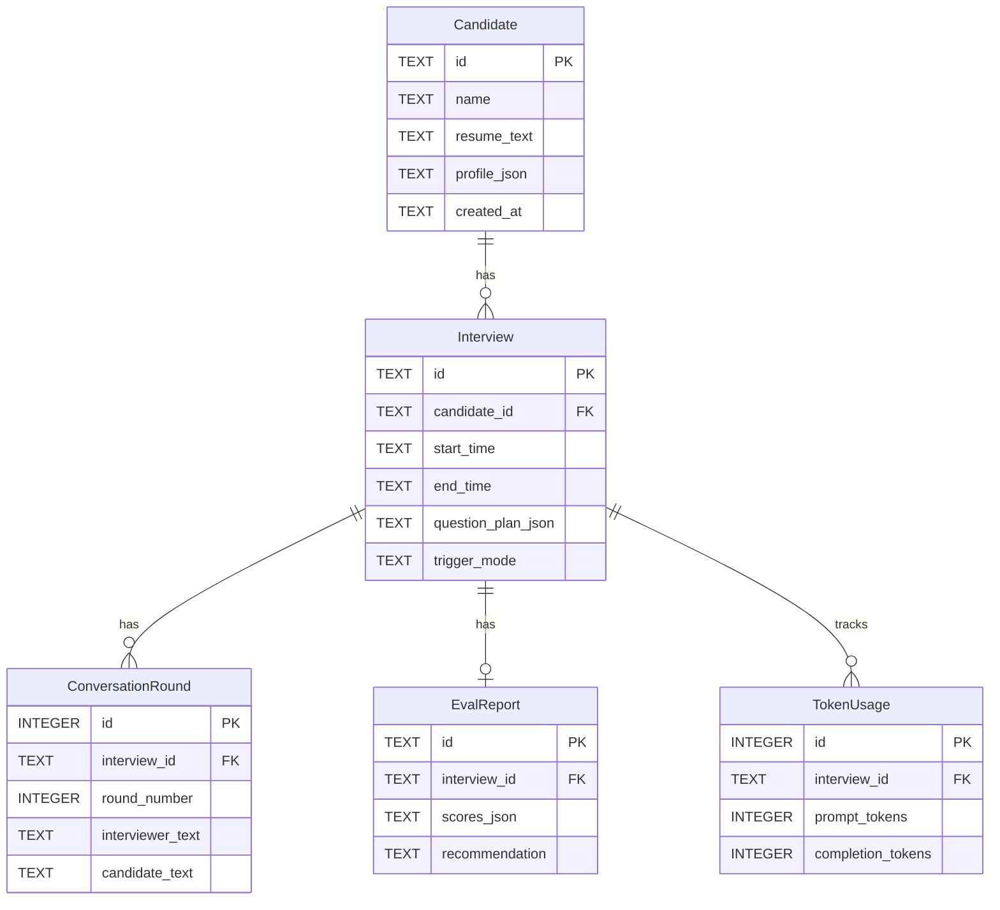

# 数据存储

本文档说明 SQLite 表结构、MemoryModule 职责划分、录音目录规则以及数据恢复逻辑。

---

## SQLite 数据库表结构

数据库文件路径由 `.env` 中 `DB_PATH` 配置（默认 `interview_assistant.db`）。

所有表在 `Database.initialize()` 时通过 `CREATE TABLE IF NOT EXISTS` 创建，外键约束在连接初始化时启用（`PRAGMA foreign_keys = ON`）。

### `Candidate` 表

存储候选人基础信息和 JSON 序列化的详细画像。

| 字段 | 类型 | 约束 | 说明 |
|---|---|---|---|
| `id` | TEXT | PRIMARY KEY | UUID，由 Orchestrator 创建会话时生成 |
| `name` | TEXT | NOT NULL | 候选人姓名 |
| `resume_text` | TEXT | NOT NULL DEFAULT `''` | PDF 提取的原始文本 |
| `profile_json` | TEXT | NOT NULL DEFAULT `'{}'` | JSON 序列化的详细画像（见下） |
| `created_at` | TEXT | NOT NULL | ISO 格式时间戳 |

`profile_json` 包含字段：`email`、`phone`、`age`、`education`（数组）、`work_experience`（数组）、`skills`（数组）、`projects`（数组）、`resume_summary`、`resume_markdown_path`、`last_interview_insights`（面试后 `consolidate_memory` 写入）

**索引**：`idx_candidate_name ON Candidate(name)`（支持姓名搜索）

---

### `Interview` 表

存储每次面试的元数据和题目清单。

| 字段 | 类型 | 约束 | 说明 |
|---|---|---|---|
| `id` | TEXT | PRIMARY KEY | 对应 `InterviewSession.id`（UUID） |
| `candidate_id` | TEXT | NOT NULL REFERENCES Candidate(id) | 关联候选人 |
| `start_time` | TEXT | NOT NULL | ISO 格式开始时间 |
| `end_time` | TEXT | — | ISO 格式结束时间，`close_session()` 时写入 |
| `stage` | TEXT | NOT NULL DEFAULT `'idle'` | 最终阶段值 |
| `question_plan_json` | TEXT | NOT NULL DEFAULT `'[]'` | JSON 序列化的 `InterviewQuestion` 数组 |
| `context_summary` | TEXT | NOT NULL DEFAULT `''` | ContextManager 压缩摘要 |
| `trigger_mode` | TEXT | NOT NULL DEFAULT `'auto'` | `auto` 或 `manual` |
| `full_recording_candidate_path` | TEXT | — | 候选人完整录音文件路径 |
| `full_recording_interviewer_path` | TEXT | — | 面试官完整录音文件路径 |

**索引**：`idx_interview_candidate ON Interview(candidate_id, start_time)`

---

### `ConversationRound` 表

存储每轮对话的转写文本和关联录音。

| 字段 | 类型 | 约束 | 说明 |
|---|---|---|---|
| `id` | INTEGER | PRIMARY KEY AUTOINCREMENT | 自增主键 |
| `interview_id` | TEXT | NOT NULL REFERENCES Interview(id) | 关联面试 |
| `round_number` | INTEGER | NOT NULL | 轮次序号（从 1 开始） |
| `interviewer_text` | TEXT | NOT NULL DEFAULT `''` | 面试官转写文本 |
| `candidate_text` | TEXT | NOT NULL DEFAULT `''` | 候选人转写文本 |
| `llm_suggestion` | TEXT | — | LLM 生成的追问建议（当前版本保留字段，未写入） |
| `candidate_audio_path` | TEXT | — | 候选人轮次录音文件路径 |
| `interviewer_audio_path` | TEXT | — | 面试官轮次录音文件路径 |
| `timestamp` | TEXT | NOT NULL | 轮次归档时间 |

**索引**：`idx_round_interview ON ConversationRound(interview_id, round_number)`

---

### `EvalReport` 表

存储评价报告。

| 字段 | 类型 | 约束 | 说明 |
|---|---|---|---|
| `id` | TEXT | PRIMARY KEY | UUID |
| `interview_id` | TEXT | NOT NULL REFERENCES Interview(id) | 关联面试 |
| `scores_json` | TEXT | NOT NULL DEFAULT `'[]'` | JSON 序列化，含 `dimensions`、`overall_score`、`generated_at` |
| `strengths` | TEXT | NOT NULL DEFAULT `'[]'` | JSON 数组，优势列表 |
| `weaknesses` | TEXT | NOT NULL DEFAULT `'[]'` | JSON 数组，不足列表 |
| `recommendation` | TEXT | — | `strong_hire \| hire \| weak_hire \| no_hire` |
| `full_report` | TEXT | — | 整体评价文字（即 `EvalReport.summary`） |

---

### `TokenUsage` 表

存储 LLM token 消耗统计（供监控用）。

| 字段 | 类型 | 约束 | 说明 |
|---|---|---|---|
| `id` | INTEGER | PRIMARY KEY AUTOINCREMENT | 自增主键 |
| `interview_id` | TEXT | NOT NULL REFERENCES Interview(id) | 关联面试 |
| `round_number` | INTEGER | — | 记录时的轮次（可为 null） |
| `prompt_tokens` | INTEGER | NOT NULL DEFAULT 0 | 输入 token 数 |
| `completion_tokens` | INTEGER | NOT NULL DEFAULT 0 | 输出 token 数 |
| `timestamp` | TEXT | NOT NULL | 记录时间 |

**索引**：`idx_token_interview ON TokenUsage(interview_id)`

---

### 表关系



---

## MemoryModule 职责划分

**文件**：`src/storage/memory_module.py`

`MemoryModule` 是唯一对外暴露的存储接口，内部通过 Repository 类与 SQLite 交互。

### 短期记忆

- **载体**：运行时 `InterviewSession` 对象（Python 内存）
- **生命周期**：从 `Orchestrator.create_session()` 到 `close_session()`
- **内容**：`session.candidate`、`session.question_plan`、`session.rounds`、`session.stage`、`session.context_summary`
- **访问方式**：直接操作 Python 对象，不经过 MemoryModule

### 长期记忆

- **载体**：SQLite 数据库（aiosqlite）
- **读写接口**（`MemoryModule` 方法）：

| 方法 | 说明 |
|---|---|
| `save_candidate(profile)` | 插入或替换候选人记录（`INSERT OR REPLACE`） |
| `get_candidate(candidate_id)` | 按 ID 查询候选人 |
| `search_candidates(keyword, limit)` | 按姓名模糊查询候选人列表 |
| `get_latest_question_plan(candidate_id)` | 从最近一次面试恢复题目清单 |
| `get_candidate_history(candidate_id, limit)` | 查询最近 N 次面试历史（含评价摘要） |
| `save_interview(session)` | UPSERT 面试记录和所有对话轮次 |
| `get_interview_detail(interview_id)` | 查询面试完整详情（含轮次和报告） |
| `save_eval_report(report)` | 插入评价报告 |
| `get_eval_report(interview_id)` | 按面试 ID 查询评价报告 |
| `consolidate_memory(session)` | 面试后将评价洞察写回候选人 `profile_json` |

---

## 录音文件命名规则与目录结构

录音根目录由 `.env` 中 `RECORDINGS_DIR` 配置（默认 `recordings/`）。

```
recordings/
└── {session_id}/                           # 每次面试对应一个 UUID 子目录
    ├── full_candidate.wav                  # 候选人音频完整录音
    ├── full_interviewer.wav                # 面试官音频完整录音
    └── rounds/
        ├── round_001_candidate.wav         # 第 1 轮候选人录音
        ├── round_001_interviewer.wav       # 第 1 轮面试官录音
        ├── round_002_candidate.wav         # 第 2 轮候选人录音
        ├── round_002_interviewer.wav       # 第 2 轮面试官录音
        └── ...
```

**命名规则**：

- 目录名：`{session_id}` = `InterviewSession.id`（UUID）
- 完整录音：`full_{source}.wav`，`source` 为 `candidate` 或 `interviewer`
- 轮次录音：`round_{round_number:03d}_{source}.wav`（三位零填充序号）

**写入时机**：

- `AudioRecorder.mark_round_boundary(round_number)` 在 `finalize_round()` 时调用，触发对应轮次录音文件的边界标记和写入
- 完整录音在面试结束（`AudioManager.stop()`）时写入

---

## DB fallback：`GET /resume/profile` 数据恢复逻辑

当前端在新会话或页面刷新后请求候选人信息时，系统按以下优先级返回数据：

```
GET /api/resume/profile?candidate_id=xxx

1. memory.get_candidate(candidate_id)
   ↓ 从 DB 的 Candidate 表读取候选人基础信息

2. session = orchestrator.get_session()
   若 session 非空 且 session.candidate.id == candidate_id
   且 session.question_plan 非空
   → 直接返回内存中的 session.question_plan（最新，未持久化的也在这里）

3. 否则：
   memory.get_latest_question_plan(candidate_id)
   ↓ 查 Interview 表，取最近一次面试的 question_plan_json 字段反序列化

最终返回：
{
  "candidate_id": "...",
  "profile": <DB 中的 CandidateProfile>,
  "questions": <内存 question_plan 或 DB 最近一次题目清单>
}
```

**注意**：若候选人 ID 在 DB 中不存在，直接返回 `404 not_found`（不做 fallback）。
