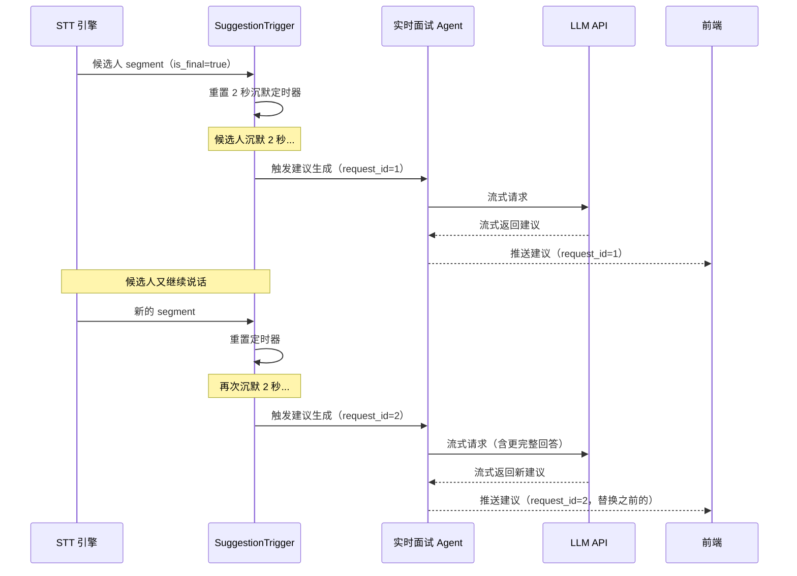

# 建议生成触发机制（SuggestionTrigger）

实时面试 Agent 生成追问建议的触发支持两种模式，可通过前端切换。

## 1. 手动触发

面试官在 Web 界面点击"生成建议"按钮，系统将当前累积的候选人回答发送给 LLM 生成追问建议。适用于面试官希望完全掌控节奏的场景。

## 2. 自动触发（沉默检测）

基于候选人沉默时长自动触发：



## 3. SuggestionTrigger 接口定义

`SuggestionTrigger` 是纯逻辑组件，只负责触发决策（沉默计时 + 防抖 + 最小间隔），不负责 LLM 调用。满足触发条件时通过回调通知 `InterviewAgent.generate_suggestion()`。

```python
class SuggestionTrigger:
    """建议生成触发器 — 纯触发决策逻辑"""

    def __init__(
        self,
        on_trigger: Callable[[int], Awaitable[None]],  # 触发回调，参数为 request_id
        silence_threshold_sec: float = 2.0,
        min_interval_sec: float = 5.0,
    ): ...

    def on_candidate_segment(self, segment: TranscriptSegment) -> None:
        """接收候选人 is_final segment，重置沉默定时器"""
        ...

    def set_mode(self, mode: str) -> None:
        """切换触发模式（"auto" | "manual"），manual 模式下不启动定时器"""
        ...

    @property
    def mode(self) -> str:
        """当前触发模式"""
        ...

    @property
    def next_request_id(self) -> int:
        """下一次触发的 request_id（递增）"""
        ...

    def cancel_pending(self) -> None:
        """取消待触发的定时器（如候选人又开始说话）"""
        ...

    def stop(self) -> None:
        """停止所有定时器，释放资源"""
        ...
```

### 生命周期

- **创建时机**：`InterviewAgent.on_activate()` 中创建，传入 `on_trigger=self.generate_suggestion`
- **销毁时机**：`InterviewAgent.on_deactivate()` 中调用 `stop()`
- **所有权**：属于 `InterviewAgent` 的内部组件

### 数据流

```
TranscriptionManager
  └─ 候选人 is_final segment → SuggestionTrigger.on_candidate_segment()
                                    │
                                    │ 沉默 2 秒后
                                    ▼
                              on_trigger(request_id) → InterviewAgent.generate_suggestion()
                                    │
                                    ├─→ PromptBuilder.build(session, config)
                                    ├─→ LLMClient.chat_stream(messages)
                                    └─→ WebSocket 流式推送建议
```

## 4. 关键设计点

- 每次触发携带递增的 `request_id`，前端始终以**最新 `request_id` 的结果**为准
- 候选人继续说话后又沉默，会以更完整的回答内容再次调用 LLM，准确度更高
- **防抖与取消**：新的建议请求到来时，若上一次 LLM 流式请求尚未完成，`InterviewAgent` 主动取消上一次请求（中断流式读取即可），避免多个并发 LLM 请求堆积
- **最小触发间隔**：两次自动触发之间至少间隔 5 秒（可配置），防止短暂停顿频繁触发。手动触发不受此限制
- 会额外消耗 token，但换取更准确的建议——这是合理的 tradeoff
- **手动触发路径**：前端按钮 → WebSocket → `InterviewAgent.handle_stream()` → `generate_suggestion()`，绕过 SuggestionTrigger 的定时器逻辑

> 参见 [音频与语音识别](./audio-and-stt.md) 了解 TranscriptionManager 如何将 STT segment 转发给 SuggestionTrigger。

---

## 5. 设计决策

### 决策 7: 建议生成触发

```
├── 方案 A: 仅 is_final segment 触发
├── 方案 B: 手动按钮 + 沉默 2 秒自动触发（双模式）
└── 选择: 方案 B
    理由: 手动模式给面试官完全控制权；自动模式更省心。沉默后又继续说话时
         再次调用 LLM 以最新结果为准，牺牲少量 token 换取准确度。
```
