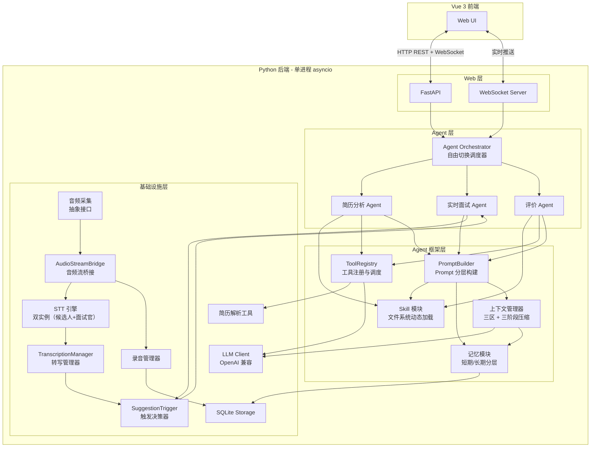

# 面试助手 — 架构设计文档

## 1. 概述

面试助手是一个**纯本地运行的单用户面试辅助系统**，面向技术面试场景，辅助面试官进行实时面试。系统采用 Python asyncio 单进程异步架构，前端为 Vue 3 SPA，通过浏览器访问 localhost 使用。

核心架构思路：
- **三 Agent 自由切换**：简历分析 Agent、实时面试 Agent、评价 Agent，通过 Orchestrator 按指令自由切换
- **自建 Agent 框架**：不依赖 LangGraph/AutoGen，通过 Skill、Tool、上下文管理、记忆四大模块构建通用能力
- **OpenAI 兼容模式接入 LLM**：统一对接通义千问/DeepSeek/文心等国产模型
- **双声道物理分离**：系统 Loopback 采集候选人音频 + 麦克风采集面试官音频，实现说话人区分
- **完整录音 + 对话切片**：保存完整面试录音和按轮次切片的音频片段，支持面试后回放核验

## 2. 架构总览图



## 3. 分层设计

系统分为四层，自上而下：

| 层级 | 职责 | 核心组件 |
|------|------|----------|
| **Web 层** | HTTP API + WebSocket 实时推送，前端资源服务 | FastAPI, WebSocket Server |
| **Agent 层** | 三个业务 Agent + 自由切换调度器 | Orchestrator, BaseAgent, ResumeAgent, InterviewAgent, EvalAgent |
| **Agent 框架层** | Agent 通用能力（技能、工具、上下文、记忆、Prompt 构建） | SkillModule, ToolRegistry, ContextManager, MemoryModule, PromptBuilder |
| **基础设施层** | 外部服务对接 + 存储 + 录音 | LLMClient, STTEngine, AudioCapture, AudioRecorder, ResumeParser, SQLite |

层间依赖方向：上层依赖下层，下层不感知上层。同层之间通过共享数据（InterviewSession）或事件通信。

各层之间的共享数据结构（`CandidateProfile`、`Message`、`EvalReport` 等）是模块间的数据契约，详见 [共享数据结构定义](./data-models.md)。

## 4. 核心模块概览

### 4.1 Agent 调度与会话

Orchestrator 是系统的"总指挥"，管理面试会话生命周期和三个 Agent 的自由切换。Agent 之间不直接通信，通过共享的 `InterviewSession` 数据容器交换信息。切换由前端指令驱动，Orchestrator 校验前置条件后即时切换，同时管理资源副作用（STT/录音的启停）。Web 框架选用 FastAPI，实时推送使用 WebSocket 双向通信。

所有 Agent 继承统一的 `BaseAgent` 抽象基类，并共用 `_run_with_tools()` 工具调用循环：

```python
class BaseAgent(ABC):
    @abstractmethod
    async def on_activate(self, session: InterviewSession) -> None: ...
    @abstractmethod
    async def on_deactivate(self, session: InterviewSession) -> None: ...
    @abstractmethod
    async def handle_request(self, request: AgentRequest) -> AgentResponse: ...
    async def handle_stream(self, request: AgentRequest) -> AsyncIterator[str]:
        """流式返回（仅 InterviewAgent 实现）"""
        raise NotImplementedError
    async def _run_with_tools(self, messages: list[Message], max_tool_rounds: int = 5) -> str:
        """标准 LLM + 工具调用循环（ResumeAgent / EvalAgent 使用）"""
        ...
```

各 Agent 的 system prompt 统一定义在 `src/agents/prompts.py` Python 常量模块中（不放配置文件，保证 prompt 变更走代码审查流程）。详见 [Agent 调度与会话](./agent-orchestrator.md) 第 6 节。

`InterviewSession` 是所有 Agent 共享的核心数据容器：

```python
@dataclass
class InterviewSession:
    id: str
    candidate: CandidateProfile
    question_plan: list[InterviewQuestion]
    rounds: list[ConversationRound]
    stage: InterviewStage
    context_summary: str
    covered_dimensions: set[str]
    metadata: SessionMetadata
```

详见 [Agent 调度与会话](./agent-orchestrator.md)

### 4.2 上下文管理与 Prompt 构建

`ContextManager` 管理上下文的三区结构（固定区 + 摘要区 + 滑动窗口），通过三阶段压缩（剪枝 → head/tail 截断 → LLM 摘要）控制 token 预算。压缩在后台异步执行，不阻塞 `PromptBuilder.build()` 调用（20% token 安全余量保证不超模型窗口）。`PromptBuilder` 是唯一对外输出 `messages` 列表的模块，接收 `AgentConfig` 参数按七层顺序组装完整 prompt。Token 计数采用 tiktoken 预估 + API 返回值实际统计的双轨方案。

详见 [上下文管理与 Prompt 构建](./context-and-prompt.md)

### 4.3 音频与语音识别

`AudioCapturer` 和 `STTEngine` 均为 Protocol 抽象接口，当前分别由 WASAPI 双声道采集和百度实时 ASR 实现，未来可替换。`TranscriptionManager` 是 STT 与上层模块之间的中间协调层，负责按候选人/面试官分流、推送 WebSocket、触发建议生成、管理轮次边界。`AudioRecorder` 负责完整录音 + 按轮次切片存储。

```python
class AudioCapturer(Protocol):
    async def start(self) -> None: ...
    async def stop(self) -> None: ...
    def set_on_frame(self, callback: Callable[[AudioFrame], None]) -> None: ...

class STTEngine(Protocol):
    async def connect(self) -> None: ...
    async def send_audio(self, audio_data: bytes) -> None: ...
    async def receive(self) -> AsyncIterator[TranscriptSegment]: ...
    async def close(self) -> None: ...
```

详见 [音频与语音识别](./audio-and-stt.md)

### 4.4 建议生成触发机制

支持手动触发和自动触发（沉默检测）两种模式，可通过前端切换。自动模式基于候选人沉默 2 秒触发，配合防抖取消和最小触发间隔（5 秒）避免频繁请求。每次触发携带递增 `request_id`，前端始终以最新结果为准。

详见 [建议生成触发机制](./suggestion-trigger.md)

### 4.5 Skill 与工具系统

`SkillModule` 采用文件系统目录结构（`skills/{name}/SKILL.md`），运行时动态扫描加载，Skill 的 prompt 内容与代码解耦。system prompt 只注入索引，按需加载完整内容。`ToolRegistry` 统一管理工具注册和调度管道（参数校验 → pre_hook → 执行 → post_hook）。

详见 [Skill 与工具系统](./skill-and-tool.md)

### 4.6 记忆与数据持久化

`MemoryModule` 分短期记忆（in-session，运行时 `InterviewSession` 对象）和长期记忆（cross-session，SQLite 持久化）两层。再次面试同一候选人时，历史摘要在准备阶段一次性注入 prompt 固定区。数据库采用 SQLite，包含 Candidate、Interview、ConversationRound、EvalReport、TokenUsage 五张表。

详见 [记忆与数据持久化](./memory-and-storage.md)

### 4.7 Web 层

FastAPI 提供 REST API（简历上传、面试控制、候选人历史等 12 个端点）+ WebSocket 双向实时通信（转写推送、建议流式推送、状态同步）。Vue 3 前端包含首页/候选人列表、面试准备页、面试控制台、评价报告页四个核心页面。生产环境打包后由 FastAPI 静态文件服务，一条命令启动。

详见 [Web 层](./web-layer.md)

### 4.8 LLM Client

基于 OpenAI SDK 兼容模式统一封装，通过配置 `base_url` 切换模型提供商。支持流式输出（追问建议推送）、内置重试 + 超时降级（10 秒超时跳过本轮建议）。简历解析采用 PyMuPDF 文本提取 + LLM 视觉模型回退方案。

详见 [LLM Client](./llm-client.md)

### 4.9 配置与运维

双层配置架构（`config.yaml` 基础配置 + `.env` 敏感信息），`pydantic-settings` 类型安全加载。日志分 `app.log`（全量）和 `app.error.log`（ERROR+）两个文件轮转。面试轨迹以 JSONL 格式记录每轮输入/输出，支持离线分析。统一异常层次 + 降级策略，保证面试主流程不因单点故障中断。

详见 [配置与运维](./config-and-ops.md)

## 5. 实时面试阶段数据流

```mermaid
sequenceDiagram
    participant Mic as 麦克风
    participant Loop as Loopback
    participant Cap as AudioCapturer
    participant Rec as AudioRecorder
    participant STT as STT 引擎
    participant TM as TranscriptionManager
    participant Trig as SuggestionTrigger
    participant IA as 实时面试 Agent
    participant Ctx as ContextManager
    participant LLM as LLM API
    participant WS as WebSocket
    participant UI as Vue 前端

    par 双声道采集
        Mic->>Cap: 面试官音频
        Loop->>Cap: 候选人音频
    end

    Cap->>Rec: AudioFrame（持续写入录音）
    Cap->>STT: PCM 音频流

    STT->>TM: TranscriptSegment
    TM->>WS: 转写文本
    WS->>UI: 实时显示转写

    alt 自动模式 - 候选人沉默 2 秒
        TM->>Trig: 候选人 final segment
        Trig->>Trig: 沉默 2 秒倒计时
        Trig->>IA: 触发建议生成
    else 手动模式 - 面试官点击按钮
        UI->>WS: request_suggestion
        WS->>IA: 触发建议生成
    end

    IA->>Ctx: 请求组装上下文
    Ctx-->>IA: messages + token 统计
    IA->>LLM: 流式请求
    LLM-->>IA: 流式 tokens
    IA-->>WS: 流式推送建议
    WS-->>UI: 实时显示追问建议
    IA->>Ctx: 更新对话轮次 + 检查摘要触发
    IA->>Rec: 标记轮次边界
```

## 6. 模块间接口关系

各模块之间的核心调用关系和数据流向（接口中的数据类型定义见 [共享数据结构](./data-models.md)）：

| 调用方 | 被调用方 | 交互方式 | 说明 |
|--------|---------|---------|------|
| Web 层 | Orchestrator | `handle_request()` / `handle_stream()` / `switch_agent()` | REST/WS 请求路由 |
| Orchestrator | 三个 Agent | `on_activate` / `on_deactivate` / `handle_request` / `handle_stream` | 生命周期管理 + 请求路由 |
| Orchestrator | AudioManager | `start()` / `stop()` / `pause()` / `resume()` | 音频子系统生命周期管理 |
| Agent | PromptBuilder | `build(session, agent_config)` | 获取组装好的 messages 列表 |
| Agent | LLMClient | `chat()` / `chat_stream()` | 发送请求获取 LLM 响应 |
| PromptBuilder | ContextManager | `get_context()` | 获取摘要区 + 滑动窗口数据（第 6-7 层） |
| PromptBuilder | SkillLoader | `load_index()` / `load_skill()` | 注入 Skill 索引和内容 |
| PromptBuilder | MemoryModule | 获取历史记忆 | 注入候选人长期记忆（第 4 层） |
| ContextManager | LLMClient | `chat()` | Phase 3 后台异步摘要压缩时调用 |
| InterviewAgent | ContextManager | `add_round(round)` | 每轮对话结束后新增轮次 |
| InterviewAgent | SuggestionTrigger | 创建 + 持有 | 活跃期间管理触发器生命周期 |
| SuggestionTrigger | InterviewAgent | `generate_suggestion(request_id)` 回调 | 沉默 2 秒后触发建议生成 |
| TranscriptionManager | SuggestionTrigger | `on_candidate_segment(segment)` | 转发候选人 is_final segment |
| TranscriptionManager | WebSocket | 推送 transcript 消息 | 实时转写展示 |
| TranscriptionManager | AudioRecorder | `mark_round_boundary()` | 标记轮次边界 |
| AudioCapturer | AudioStreamBridge | `set_on_frame(bridge.on_frame)` | 音频帧回调 |
| AudioStreamBridge | candidate_stt / interviewer_stt | `send_audio()` | 按 source 分流到双 STT 实例 |
| AudioStreamBridge | AudioRecorder | `on_audio_frame()` | 持续写入录音 |
| MemoryModule | SQLite Storage | CRUD | 长期记忆持久化 |

## 7. 启动序列（模块初始化顺序）

采用手动组装方式，`main.py` 中显式创建所有模块并注入依赖：

```python
async def bootstrap() -> FastAPI:
    # 1. 配置
    config = AppConfig.load()

    # 2. 基础设施层（无依赖）
    storage = Database(config.storage.db_path)
    await storage.initialize()
    llm_client = LLMClient(config.llm)

    # 3. 音频基础设施
    capturer = WasapiCapturer(config.audio)
    candidate_stt = BaiduRealtimeSTT(config.stt, source="candidate")
    interviewer_stt = BaiduRealtimeSTT(config.stt, source="interviewer")
    recorder = AudioRecorder(config.storage.recordings_dir)
    audio_manager = AudioManager(capturer, candidate_stt, interviewer_stt, recorder)

    # 4. 框架层
    skill_loader = SkillLoader(Path("skills/"))
    tool_registry = ToolRegistry()
    register_tools(tool_registry, llm_client)
    memory_module = MemoryModule(storage)
    context_manager = ContextManager(config.context, llm_client)
    prompt_builder = PromptBuilder(skill_loader, tool_registry, memory_module, context_manager)

    # 5. Agent 层
    resume_agent = ResumeAgent(config=resume_config, prompt_builder=prompt_builder,
                               llm_client=llm_client, tool_registry=tool_registry)
    interview_agent = InterviewAgent(config=interview_config, prompt_builder=prompt_builder,
                                     llm_client=llm_client, context_manager=context_manager)
    eval_agent = EvalAgent(config=eval_config, prompt_builder=prompt_builder,
                           llm_client=llm_client)
    orchestrator = Orchestrator(resume_agent, interview_agent, eval_agent,
                                memory_module, audio_manager)

    # 6. Web 层
    app = create_app(orchestrator)
    return app
```

依赖方向：基础设施层 → 框架层 → Agent 层 → Web 层（自下而上创建，自上而下调用）。

## 8. 目录结构

```
interviewer-assistant/
├── pyproject.toml                # 项目元数据 + 依赖管理
├── config.yaml                   # 基础配置（业务参数、阈值等）
├── .env.example                  # 敏感配置模板（API Key 等）
├── README.md
│
├── src/
│   ├── __init__.py
│   ├── main.py                   # 入口：启动 FastAPI + uvicorn
│   ├── config.py                 # 双层配置加载（config.yaml + .env → pydantic Settings）
│   │
│   ├── web/                      # Web 层
│   │   ├── __init__.py
│   │   ├── app.py                # FastAPI app 工厂
│   │   ├── routes/
│   │   │   ├── resume.py         # 简历相关 API
│   │   │   ├── interview.py      # 面试控制 API
│   │   │   └── candidates.py     # 候选人历史 API
│   │   └── ws.py                 # WebSocket 处理
│   │
│   ├── agents/                   # Agent 层
│   │   ├── __init__.py
│   │   ├── base.py               # BaseAgent ABC + _run_with_tools 工具调用循环
│   │   ├── prompts.py            # 各 Agent System Prompt 常量
│   │   ├── orchestrator.py       # Agent 调度器 + 状态机
│   │   ├── resume_agent.py       # 简历分析 Agent
│   │   ├── interview_agent.py    # 实时面试 Agent
│   │   └── eval_agent.py         # 评价 Agent
│   │
│   ├── framework/                # Agent 框架层
│   │   ├── __init__.py
│   │   ├── skill.py              # SkillLoader + SkillModule（文件系统动态加载）
│   │   ├── tool.py               # ToolEntry + ToolRegistry + @register_tool
│   │   ├── context.py            # ContextManager（三区结构 + 三阶段压缩）
│   │   ├── memory.py             # MemoryModule（短期/长期分层）
│   │   └── prompt_builder.py     # PromptBuilder（7层分层构建 + session 缓存）
│   │
│   ├── llm/                      # LLM 客户端
│   │   ├── __init__.py
│   │   ├── client.py             # OpenAI 兼容客户端封装
│   │   └── prompts.py            # Prompt 片段模板（由 PromptBuilder 引用）
│   │
│   ├── audio/                    # 音频 + STT（从 demo 迁移重构）
│   │   ├── __init__.py
│   │   ├── capture/
│   │   │   ├── __init__.py
│   │   │   ├── base.py           # AudioCapturer Protocol
│   │   │   └── wasapi.py         # WASAPI Loopback + 麦克风实现
│   │   ├── stt/
│   │   │   ├── __init__.py
│   │   │   ├── base.py           # STTEngine Protocol
│   │   │   └── baidu.py          # 百度实时 ASR 实现
│   │   ├── recorder.py           # AudioRecorder 录音管理器
│   │   ├── stream.py             # AudioStreamBridge 音频流桥接
│   │   ├── device_manager.py     # 音频设备枚举与管理
│   │   └── transcription.py      # TranscriptionManager
│   │
│   ├── tools/                    # 具体工具实现
│   │   ├── __init__.py
│   │   └── resume_parser.py      # 简历解析（PyMuPDF + LLM 视觉）
│   │
│   ├── storage/                  # 持久化
│   │   ├── __init__.py
│   │   ├── database.py           # SQLite 连接管理
│   │   ├── models.py             # 数据表模型
│   │   └── repositories.py       # CRUD 操作
│   │
│   └── models/                   # 共享数据结构（dataclass / Pydantic）
│       ├── __init__.py
│       ├── session.py            # InterviewSession, ConversationRound
│       ├── candidate.py          # CandidateProfile
│       └── evaluation.py         # EvalReport
│
├── frontend/                     # Vue 3 前端
│   ├── package.json
│   ├── vite.config.ts
│   ├── src/
│   │   ├── App.vue
│   │   ├── views/
│   │   │   ├── Home.vue          # 首页 / 候选人列表
│   │   │   ├── Prepare.vue       # 面试准备（简历上传 + 题目审阅）
│   │   │   ├── Console.vue       # 面试控制台（实时转写 + 建议）
│   │   │   └── Report.vue        # 评价报告 + 录音回放
│   │   ├── components/
│   │   ├── composables/
│   │   │   └── useWebSocket.ts   # WebSocket 组合式函数
│   │   └── stores/
│   └── index.html
│
├── skills/                       # 内置 Skill 目录（文件系统动态加载）
│   ├── deep_dive/
│   │   └── SKILL.md              # 技术细节深挖追问技巧
│   ├── dimension_switch/
│   │   └── SKILL.md              # 考察维度切换时机判断
│   ├── behavioral_probe/
│   │   └── SKILL.md              # 行为面试追问（STAR 结构验证）
│   └── resume_anchor/
│       └── SKILL.md              # 以简历具体项目为锚点展开提问
│
├── recordings/                   # 录音文件存储目录（git 忽略）
│
├── logs/                         # 运行日志（git 忽略）
│   ├── app.log                   # 主日志（轮转）
│   └── app.error.log             # 错误日志（轮转）
│
├── trajectories/                 # 面试轨迹 JSONL（git 忽略）
│   └── {session_id}.jsonl        # 每场面试一个文件，记录每轮 input/output/token
│
├── demo/                         # 保留原有 demo 代码（参考用）
│   └── ...
│
├── tests/
│   ├── test_context.py
│   ├── test_agents.py
│   └── ...
│
└── docs/
    ├── 项目需求.md
    ├── arc/                      # 架构设计文档
    │   ├── 架构设计.md            # 本文档（整体概览）
    │   ├── data-models.md         # 共享数据结构定义
    │   ├── agent-orchestrator.md  # Agent 调度与会话
    │   ├── context-and-prompt.md  # 上下文管理与 Prompt 构建
    │   ├── audio-and-stt.md       # 音频与语音识别
    │   ├── suggestion-trigger.md  # 建议生成触发机制
    │   ├── skill-and-tool.md      # Skill 与工具系统
    │   ├── memory-and-storage.md  # 记忆与数据持久化
    │   ├── web-layer.md           # Web 层
    │   ├── llm-client.md          # LLM Client
    │   └── config-and-ops.md      # 配置与运维
    └── STT方案-百度实时语音识别.md
```

## 9. 依赖清单

### Python 后端

```
# Web 框架
fastapi
uvicorn[standard]
python-multipart             # 文件上传支持

# LLM
openai                       # OpenAI 兼容 SDK，统一接入国产模型

# 简历解析
pymupdf                      # PDF 文本提取

# Token 计数
tiktoken

# 配置管理
pydantic-settings            # 类型安全配置
pyyaml                       # config.yaml 加载

# 持久化
aiosqlite                    # 异步 SQLite

# 音频（已有）
soundcard                    # 音频设备访问（WASAPI）
numpy                        # 音频数据处理
websockets                   # 百度 STT WebSocket 客户端
# webrtcvad 不引入：沉默检测依赖百度 STT is_final 信号，无需帧级 VAD（见 audio-and-stt.md 决策 11）
```

### 前端

```
vue@3
vite
vue-router
pinia                        # 状态管理
```
