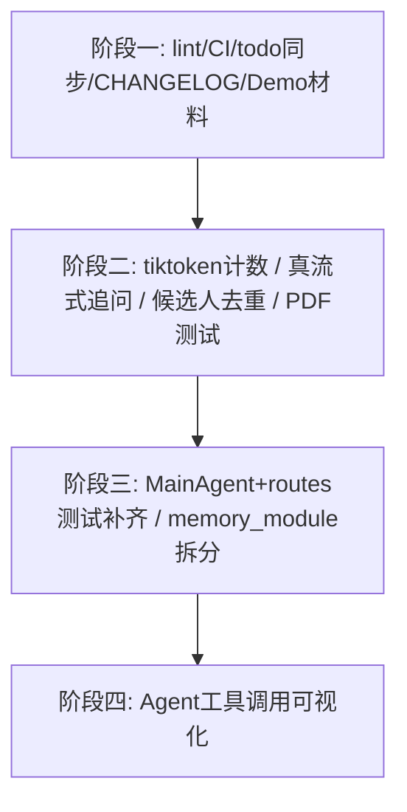

# 开源化优化实施计划

> 制定日期：2026-07-06
> 依据：`docs/opensource-review-report.md` 评审报告
> 说明：本文档是与项目负责人逐项讨论确认后的最终实施范围与顺序，讨论过程中对报告里若干"待确认"问题做了代码级复核（见下文），本文档仅为计划，尚未开始实施。

---

## 0. 复核结论（对报告的修正）

讨论前对报告中标记为"待确认"的几个问题做了针对性代码核查，结论如下：

### 0.1 已确认无需处理（从计划中移除）

| 编号 | 报告原文 | 复核结论 |
|---|---|---|
| F4-1 | EvalAgent 失败时 `close_session()` 是否会执行，报告标注"未验证" | **无需修复**。`src/web/routes.py` 第 468-487 行 `close_session()` 已在 `finally` 块中执行，带 3 次重试与失败提示 UI 文案。 |
| C-6 | 路径穿越防护未逐行验证 | **无需修复**。`src/tools/file_read.py`、`src/tools/file_write.py` 均使用 `Path.resolve()` + `relative_to()` 做规范化校验，含 symlink 场景的防护说明详见代码注释（`M6-1`）。 |

### 0.2 复核后确认属实（已纳入计划）

| 编号 | 报告原文 | 复核证据 |
|---|---|---|
| F3-4 | 追问建议实际是非流式调用 | `src/agents/interview_agent.py` 的 `generate_suggestion()` 调用 `llm_client.chat()`（非流式），拿到完整回复后 `yield reply_text` 一次；而 `src/llm/client.py` 已存在 `chat_stream()` 方法可直接复用。 |
| F1-5 | 候选人去重依赖文件名而非真实姓名 | `src/web/routes.py` 的 `upload_resume()` 用 `get_candidate_by_name(safe_stem)`（`safe_stem` 由文件名派生），确认未按解析后的真实姓名去重。 |
| P-6 | Token 预算用字符数估算而非真实 tokenizer | `src/framework/context.py` 多处使用 `len(text) // 3`；`src/agents/eval_agent.py` 第 118 行使用 `len(full_text) + system_text_len`；而 `src/llm/client.py` 第 280 行已有精确的 `count_tokens()` 方法未被这两处调用。 |
| C-1/C-2 | lint/覆盖率工具未接入项目 | `requirements-dev.txt` 确认只有 `pytest`、`pytest-asyncio`、`asgi-lifespan`；`.github/workflows/ci.yml` 确认无 lint 步骤、无覆盖率门禁。 |

---

## 1. 本轮实施范围（已与项目负责人确认）

### 已确认纳入

- **P0 全部 4 项**：lint/格式化/覆盖率工具接入 CI、Demo 材料准备、`test_volc_stt.py` 修复、`docs/todo/` 状态同步
- **P1 全部 4 项**：MainAgent+routes 测试补齐（`ui.py` 除外）、`memory_module.py` 拆分（`ui.py` 拆分除外）、tiktoken 精确计数、PDF 导出中文渲染测试
- **新增 2 项**（报告 §2.3 提及但未列入原优化清单，本次讨论后补入）：候选人去重改为按真实姓名（F1-5）、追问建议改为真流式输出（F3-4）
- **P2 中的 1 项**：Agent 工具调用可视化

### 明确排除本轮范围（记录原因，供后续排期参考）

| 项目 | 排除原因 |
|---|---|
| `ui.py` 测试补齐 | 改动成本较高，放到 MainAgent/routes 测试与 `memory_module.py` 拆分完成后再评估 |
| `ui.py` 拆分 | 同上，且依赖测试补齐后再拆分风险更低 |
| Docker 化降级体验模式 | P2 锦上添花项，本轮精力优先级更低 |
| Prompt 版本回溯 | P2 锦上添花项，本轮精力优先级更低 |
| CI 增加 ubuntu-latest matrix | P2 锦上添花项，本轮精力优先级更低 |

---

## 2. 分阶段实施计划

### 阶段一：工程规范与低成本高收益项（本周）

**1. 引入 ruff + black + isort + pytest-cov，接入 CI**
- `requirements-dev.txt` 新增 `ruff`、`black`、`isort`、`pytest-cov`
- 新建根目录 `pyproject.toml`，配置三者规则（88 列、双引号，isort `profile=black`）
- 先跑一遍 `ruff check --fix .` + `black .` + `isort .` 摸底改动量，**作为单独一次"格式化"提交**，避免与功能改动混在一起，便于 review
- `.github/workflows/ci.yml` 增加 `ruff check .` 步骤；测试步骤改为：
  ```bash
  pytest tests/unit tests/integration --cov=src --cov-report=term-missing --cov-fail-under=60
  ```
  覆盖率门槛起点定为 **60%**（略低于当前实测的 60% 基线，防止倒退），后续随覆盖率提升逐步调高至 80%

**2. 修复 `test_volc_stt.py` 环境依赖问题**
- 目标用例：`tests/unit/test_volc_stt.py::TestVolcRealtimeSTTCredentialCheck::test_connect_silent_when_no_credentials`
- 用 `monkeypatch.setenv` 显式清空 `VOLC_APP_ID`/`VOLC_ACCESS_TOKEN` 等变量，或直接 mock `get_settings()` 返回值，确保测试与本地 `.env` 的 ambient 配置隔离

**3. 同步 `docs/todo/` 状态**
- 逐一核对 6 个文件：`01-readme-demo.md`、`02-report-export-pdf.md`、`03-structured-interview-mode.md`、`04-candidate-comparison.md`、`05-ci-complete.md`、`06-observability.md`
- 重点核对 `03-structured-interview-mode.md`（已确认功能实现大半但验收条件全部未勾选）
- 已完成项勾选或归档，未完成项补充当前实际进度说明

**4. 补充 CHANGELOG.md + Issue/PR 模板**
- 新建 `CHANGELOG.md`（Keep a Changelog 格式）
- 新建 `.github/ISSUE_TEMPLATE/bug_report.md`、`.github/ISSUE_TEMPLATE/feature_request.md`
- 新建 `.github/PULL_REQUEST_TEMPLATE.md`

**5. Demo 录制材料准备**（人工分工：AI 准备材料，项目负责人实际录制）
- 新建 `docs/demo-recording-checklist.md`：`MOCK_AUDIO=true` 启动步骤 + 完整操作脚本（上传简历 → 生成简报 → 开始面试 → 追问建议弹出 → 生成评价报告）
- 新建 `docs/assets/` 目录（含占位说明），README 中预留 GIF/截图嵌入位置
- 实际录制与压缩（ScreenToGif/LICEcap）由项目负责人完成后手动放入 `docs/assets/`

---

### 阶段二：功能类小修复（与阶段一可并行，改动集中、风险可控）

**6. Token 预算改用 `tiktoken` 精确计数**
- `src/framework/context.py`：替换 `token_usage` 属性、`_estimate_tokens()`、tail 边界计算中的 `len(text) // 3` 估算，改为调用 `llm_client.count_tokens()`（已存在于 `src/llm/client.py:280`）
- `src/agents/eval_agent.py` 第 118 行：`estimated_tokens = len(full_text) + system_text_len` 同样改为 `count_tokens()`
- 需要验证：改用精确计数后，原有压缩/分块触发阈值（如 8 轮触发压缩）是否需要相应调整；测试需覆盖中英混杂场景下新旧估算差异较大的情形

**7. 追问建议改为真流式输出（原 F3-4）**
- `src/agents/interview_agent.py` 的 `generate_suggestion()` 当前调用非流式的 `llm_client.chat()`，拿到完整回复后一次性 `yield`
- 改为调用已存在的 `llm_client.chat_stream()`，逐 token 通过 `suggestion_delta` 推送
- 需要同步调整：结束后的日志统计（`prompt_tokens`/`completion_tokens` 等）改为从流式响应的累计结果中获取；`asyncio.CancelledError` 的取消逻辑需要在流式场景下重新验证

**8. 候选人去重改为按真实姓名（原 F1-5）**
- 当前 `src/web/routes.py` 的 `upload_resume()` 在**解析前**用文件名派生的 `safe_stem` 做去重判断
- 目标行为：去重检查需要从"上传时立即拦截"改为"解析完成后二次校验"（真实姓名需解析后才能拿到）
- 具体交互方案（解析后自动合并 / 弹窗提示覆盖）待实施阶段结合现有解析触发流程（`dispatch_to_agent`）细化，实施前会与项目负责人再确认一次交互细节
- 影响面：`src/web/routes.py`、`src/storage/memory_module.py`（`get_candidate_by_name` 相关方法）、可能涉及 `ui.py` 的提示交互

**9. 补充 PDF 导出中文渲染测试**
- 针对 `src/utils/pdf_export.py`（当前 0% 覆盖）
- 用已有依赖 `pymupdf` 读取生成的 PDF 提取文本，断言中文内容正确出现、无乱码字符，作为"生成 → 回读校验"的集成测试

---

### 阶段三：核心测试补齐与重构（1-2 周，建议在阶段一二完成后开始）

**10. 补齐 MainAgent + routes 关键路径测试，覆盖率提升到 70%+**
- 聚焦 `src/agents/main_agent.py`（当前 26%/41%）：工具调用循环、`_trim_history` 边界处理、Memory Nudge 触发条件
- `routes.py` 已有集成测试覆盖到 74%，补充剩余错误分支（404/409 场景）
- `ui.py` 测试本轮不做（见"明确排除范围"）

**11. 拆分 `memory_module.py`（Facade 模式，接口不变）**
- 按职责拆为 `candidate_store.py`（候选人 CRUD）、`interview_store.py`（面试生命周期 + WAL）、`eval_store.py`（评价报告）
- `MemoryModule` 保留为门面类，对外接口不变，降低回归风险
- 前置条件：拆分前确保现有测试全部通过；拆分后逐一验证测试仍然全部通过（先补测试再拆分，不新增功能）

---

### 阶段四：锦上添花项（视精力投入）

**12. Agent 工具调用可视化**
- `ui.py` 已在 SSE 流中透传 `tool_call` 事件，实施时需先确认前端当前渲染方式
- 补一个折叠式"工具调用卡片"，展示 MainAgent 何时调用了 `dispatch_to_agent` / `manage_user_memory` 等工具及其参数/结果摘要

---

## 3. 实施顺序与依赖关系



阶段一中的全量格式化（ruff/black/isort）建议作为**独立的第一个提交**先完成，再开始阶段二的行为改动，避免格式化 diff 与功能改动 diff 混在一起、难以 review。

---

## 4. 各阶段验证标准

- **阶段一**：CI 上 `ruff check .` 通过、`pytest --cov=src --cov-fail-under=60` 通过、`test_volc_stt.py` 全部用例通过
- **阶段二**：新增/调整的测试全部通过；追问建议在真实/Mock LLM 下能观察到逐 token 推送；候选人重复上传（不同文件名、同一真实姓名）场景有正确提示
- **阶段三**：覆盖率报告显示 `main_agent.py`/`routes.py` 达到 70%+；`memory_module.py` 拆分后所有既有测试（单元+集成）全部通过，公开接口无变化
- **阶段四**：手动在 Web 界面验证工具调用卡片正确展示

---

## 5. 待实施阶段进一步确认的细节

以下事项在方案层面已明确方向，但具体交互/实现细节建议在对应阶段动手前再次快速确认：

1. **候选人去重（第 8 项）**：解析后发现同名候选人时，是自动合并覆盖，还是弹窗让面试官选择"覆盖 / 保留两份 / 取消"？
2. **覆盖率门槛提升节奏（第 1 项）**：60% 门槛之后，是否需要设定后续每个阶段结束时的目标提升值（如阶段三结束后调到 70%），还是等到 80% 目标临近时再一次性调整 CI 配置？
