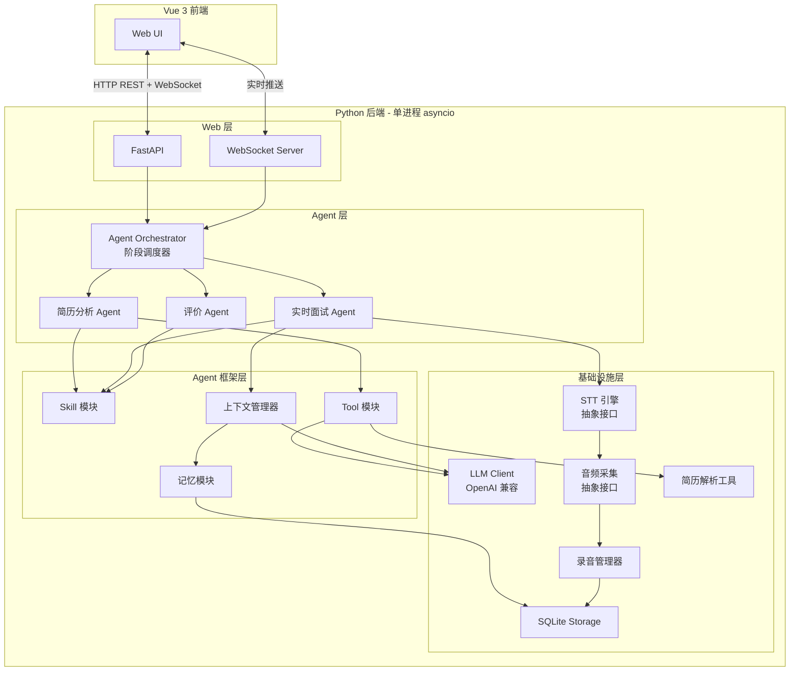
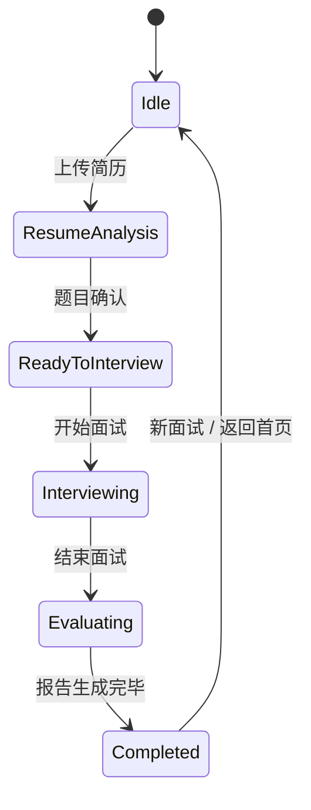
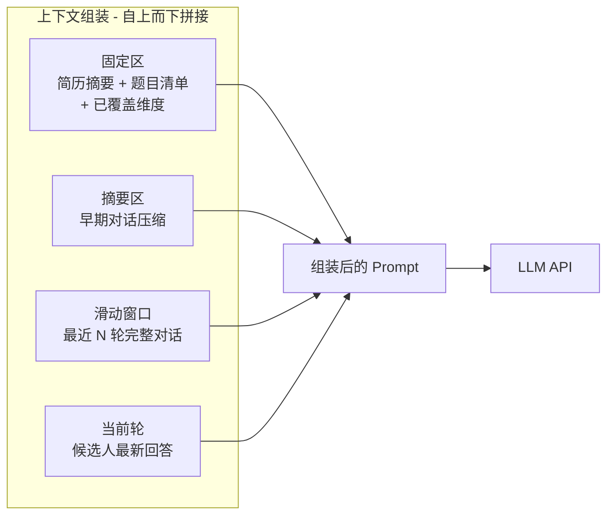
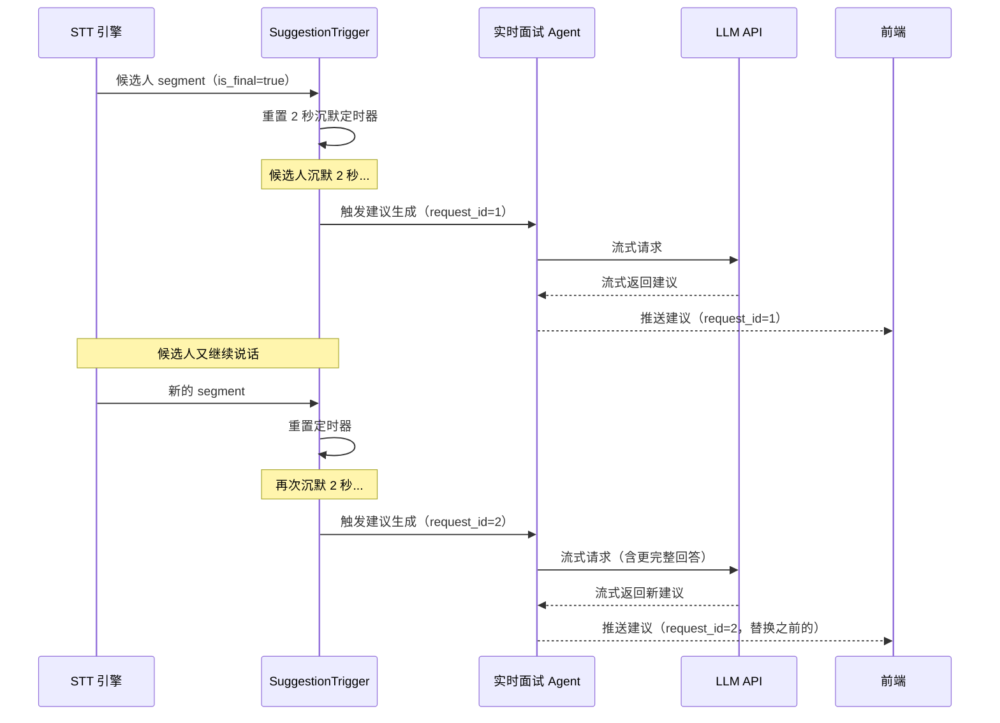
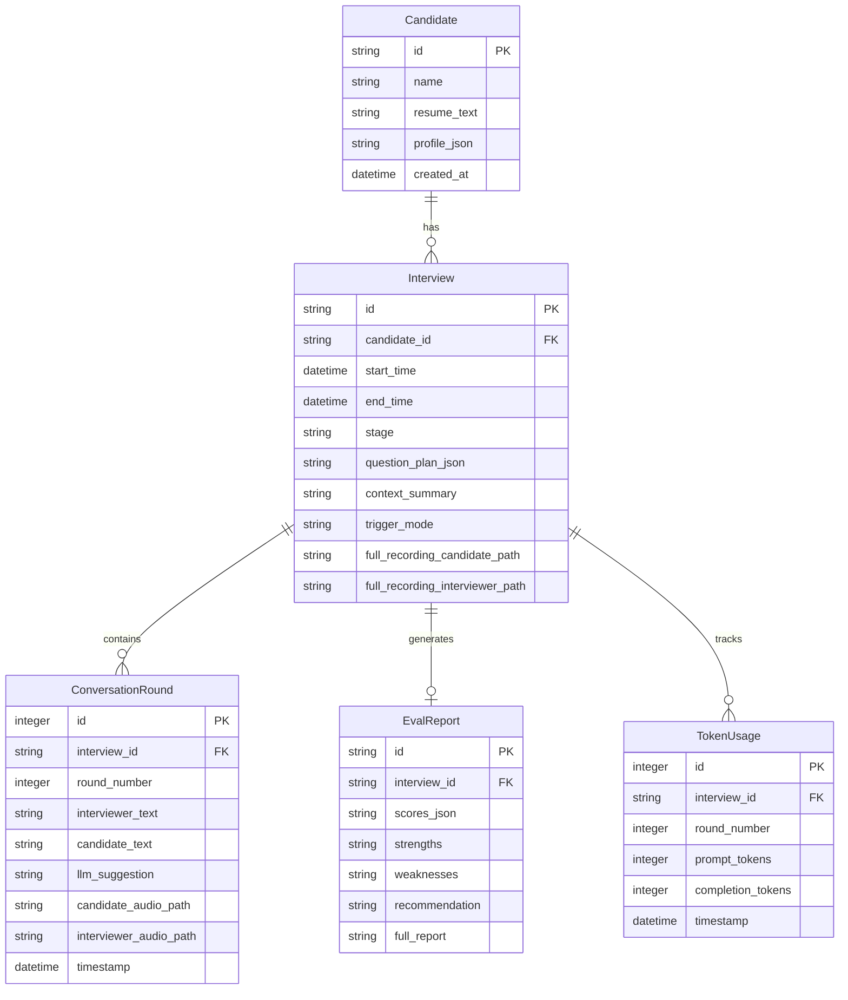

# 面试助手 — 架构设计文档

## 1. 概述

面试助手是一个**纯本地运行的单用户面试辅助系统**，面向技术面试场景，辅助面试官进行实时面试。系统采用 Python asyncio 单进程异步架构，前端为 Vue 3 SPA，通过浏览器访问 localhost 使用。

核心架构思路：
- **三 Agent 线性协作**：简历分析 Agent → 实时面试 Agent → 评价 Agent，按面试阶段切换
- **自建 Agent 框架**：不依赖 LangGraph/AutoGen，通过 Skill、Tool、上下文管理、记忆四大模块构建通用能力
- **OpenAI 兼容模式接入 LLM**：统一对接通义千问/DeepSeek/文心等国产模型
- **双声道物理分离**：系统 Loopback 采集候选人音频 + 麦克风采集面试官音频，实现说话人区分
- **完整录音 + 对话切片**：保存完整面试录音和按轮次切片的音频片段，支持面试后回放核验

## 2. 架构总览图



## 3. 分层设计

系统分为四层，自上而下：

| 层级 | 职责 | 核心组件 |
|------|------|----------|
| **Web 层** | HTTP API + WebSocket 实时推送，前端资源服务 | FastAPI, WebSocket Server |
| **Agent 层** | 三个业务 Agent + 阶段调度器 | Orchestrator, ResumeAgent, InterviewAgent, EvalAgent |
| **Agent 框架层** | Agent 通用能力（技能、工具、上下文、记忆） | SkillModule, ToolModule, ContextManager, MemoryModule |
| **基础设施层** | 外部服务对接 + 存储 + 录音 | LLMClient, STTEngine, AudioCapture, AudioRecorder, ResumeParser, SQLite |

层间依赖方向：上层依赖下层，下层不感知上层。同层之间通过共享数据（InterviewSession）或事件通信。

## 4. 核心模块详细设计

### 4.1 Agent Orchestrator（阶段调度器）

系统的"总指挥"，管理面试会话的生命周期和 Agent 切换：



职责：
- 维护当前 `InterviewSession` 状态机
- 根据阶段激活对应 Agent
- Agent 之间不直接通信，通过 Session 共享数据

### 4.2 InterviewSession（面试会话）

所有 Agent 共享的核心数据容器：

```python
@dataclass
class InterviewSession:
    id: str
    candidate: CandidateProfile          # 简历解析结果
    question_plan: list[InterviewQuestion] # 面试题目清单
    rounds: list[ConversationRound]       # 对话轮次（实时积累）
    stage: InterviewStage                  # 当前阶段枚举
    context_summary: str                   # 早期对话压缩摘要
    covered_dimensions: set[str]           # 已覆盖的考察维度
    metadata: SessionMetadata              # 开始时间、候选人 ID 等
```

```python
@dataclass
class ConversationRound:
    round_number: int
    interviewer_text: str                  # 面试官发言（STT / 手动输入）
    candidate_text: str                    # 候选人回答（STT）
    llm_suggestion: str | None             # LLM 生成的追问建议
    interviewer_audio_path: str | None     # 面试官本轮音频切片路径
    candidate_audio_path: str | None       # 候选人本轮音频切片路径
    timestamp: datetime
```

### 4.3 上下文管理器（ContextManager）

面试持续 30-60 分钟，上下文管理是保证 LLM 输出质量和控制 token 开销的关键模块。

#### 上下文组装结构



各区域说明：

| 区域 | 内容 | 大小估算 |
|------|------|----------|
| 固定区 | 候选人简历摘要 + 面试题目清单 + 已覆盖维度 + 系统提示词 | ~1000-2000 tokens，始终在头部，不被截断 |
| 摘要区 | 超出窗口的早期对话由 LLM 压缩生成，保留关键信息（技术短板、亮点、疑点） | 动态大小，超预算时优先压缩此区 |
| 滑动窗口 | 最近 N 轮完整对话（默认 5-8 轮），确保当前话题连续性 | ~3000-8000 tokens |
| 当前轮 | 候选人最新回答文本 | 可变 |

#### 摘要触发机制

当满足以下**任一**条件时触发摘要压缩：

1. **轮次阈值**：对话轮次数超过配置值（如 > 8 轮），最早的轮次被压缩进摘要区
2. **Token 预算阈值**：当前上下文总 token 数超过预算值（根据模型窗口动态计算，如 DeepSeek 128K 设 80K 预算），超出部分通过压缩摘要区释放空间

压缩流程：
```
检查触发条件 → 取出窗口外最早的 M 轮对话 → 调用 LLM 压缩为摘要 → 追加到摘要区 → 丢弃原始轮次
```

#### 上下文感知能力

- 追踪已提问的题目和已覆盖的维度，注入固定区，避免重复提问
- 在摘要中标注候选人的关键表现（亮点/疑点），供评价 Agent 最终使用
- Token 预算实时追踪，前端可展示用量

### 4.4 建议生成触发机制（SuggestionTrigger）

实时面试 Agent 生成追问建议的触发支持两种模式，可通过前端切换：

#### 模式一：手动触发

面试官在 Web 界面点击"生成建议"按钮，系统将当前累积的候选人回答发送给 LLM 生成追问建议。适用于面试官希望完全掌控节奏的场景。

#### 模式二：自动触发（沉默检测）

基于候选人沉默时长自动触发：



关键设计点：
- 每次触发携带递增的 `request_id`，前端始终以**最新 `request_id` 的结果**为准
- 候选人继续说话后又沉默，会以更完整的回答内容再次调用 LLM，准确度更高
- 前一次请求不主动取消（让它自然完成或丢弃结果），避免 cancel 带来的复杂度
- 会额外消耗 token，但换取更准确的建议——这是合理的 tradeoff

### 4.5 音频模块（抽象接口设计）

将 `demo/audio` 迁移到 `src/audio/`，重构为接口 + 实现的分离结构。

#### AudioCapturer 接口

```python
from typing import Protocol, AsyncIterator, Callable

class AudioFrame:
    """音频帧数据"""
    data: bytes              # PCM 音频数据
    source: str              # "candidate" | "interviewer" | "mixed"
    timestamp: float         # 时间戳

class AudioCapturer(Protocol):
    """音频采集抽象接口"""
    async def start(self) -> None: ...
    async def stop(self) -> None: ...
    def set_on_frame(self, callback: Callable[[AudioFrame], None]) -> None: ...
    @property
    def is_running(self) -> bool: ...
```

当前实现：`WasapiCapturer` — 基于 soundcard 库，WASAPI Loopback + 麦克风双声道采集（Windows）。

#### STTEngine 接口

```python
class TranscriptSegment:
    """语音识别片段"""
    text: str
    source: str              # "candidate" | "interviewer"
    is_final: bool
    start_time: float | None
    end_time: float | None
    timestamp: datetime

class STTEngine(Protocol):
    """语音转文字抽象接口"""
    async def connect(self) -> None: ...
    async def send_audio(self, audio_data: bytes) -> None: ...
    async def receive(self) -> AsyncIterator[TranscriptSegment]: ...
    async def close(self) -> None: ...
```

当前实现：`BaiduRealtimeSTT` — 百度实时语音识别 WebSocket API。

未来可替换为 FunASR、Whisper 等实现。

### 4.6 录音管理器（AudioRecorder）

新增模块，负责面试全程录音和按轮次切片：

```python
class AudioRecorder:
    """录音管理器 - 完整录音 + 按轮次切片"""

    async def start_recording(self, session_id: str) -> None:
        """开始全程录音，创建两个 WAV 文件（候选人声道 + 面试官声道）"""
        ...

    async def on_audio_frame(self, frame: AudioFrame) -> None:
        """接收音频帧，写入全程录音文件"""
        ...

    def mark_round_boundary(self, round_number: int) -> None:
        """标记对话轮次边界，用于后续切片"""
        ...

    async def stop_recording(self) -> RecordingResult:
        """停止录音，生成切片文件，返回录音结果"""
        ...
```

#### 存储策略

```
recordings/
└── {session_id}/
    ├── full_candidate.wav        # 候选人声道完整录音
    ├── full_interviewer.wav      # 面试官声道完整录音
    └── rounds/
        ├── round_001_candidate.wav
        ├── round_001_interviewer.wav
        ├── round_002_candidate.wav
        ├── round_002_interviewer.wav
        └── ...
```

- 完整录音：持续写入 WAV 文件，面试全程不中断
- 轮次切片：根据 `mark_round_boundary()` 标记的时间戳，在录音结束后从完整录音中切出每轮音频
- 数据库中存储文件路径引用，不存储音频二进制数据
- 面试后人工核验：前端可按轮次回放音频，对照 STT 转写文本进行修正

### 4.7 LLM Client

基于 OpenAI SDK 兼容模式，统一封装：

```python
class LLMClient(Protocol):
    async def chat(self, messages: list[Message], **kwargs) -> str: ...
    async def chat_stream(self, messages: list[Message], **kwargs) -> AsyncIterator[str]: ...
    def count_tokens(self, text: str) -> int: ...
```

关键设计：
- 通过配置 `base_url` 切换模型提供商（通义千问/DeepSeek/文心）
- 流式输出用于实时追问建议推送到前端
- 内置重试 + 超时降级（10 秒超时跳过本轮建议，不阻塞面试）
- Token 计数：`tiktoken` 做预估控制预算，API 返回的 `usage` 字段做实际统计

### 4.8 记忆模块（MemoryModule）

持久化存储，支持跨面试会话的数据查询：

- 候选人信息与历史面试记录 CRUD
- 按姓名/时间检索
- 存储对话文本记录、LLM 上下文摘要、评价报告、录音文件路径

### 4.9 Web 层

#### 后端 API

| 端点 | 方法 | 说明 |
|------|------|------|
| `/api/resume/upload` | POST | 上传简历 PDF |
| `/api/resume/profile` | GET | 获取候选人画像 |
| `/api/interview/questions` | GET/PUT | 获取/修改题目清单 |
| `/api/interview/start` | POST | 开始面试（启动音频 + STT + 录音） |
| `/api/interview/stop` | POST | 结束面试（停止录音、触发评价） |
| `/api/interview/suggest` | POST | 手动触发建议生成 |
| `/api/interview/eval` | GET | 获取评价报告 |
| `/api/candidates` | GET | 候选人列表/搜索 |
| `/api/candidates/{id}/history` | GET | 历史面试记录 |
| `/api/recordings/{session_id}/rounds/{round}` | GET | 获取某轮次音频切片 |
| `/ws/interview` | WebSocket | 实时推送转写 + 建议 |

#### WebSocket 消息协议

下行消息（后端 → 前端）：

```jsonc
// 实时转写
{
    "type": "transcript",
    "source": "candidate",       // "candidate" | "interviewer"
    "text": "我在上一个项目中使用了 Redis 做分布式缓存...",
    "is_final": true
}

// 追问建议（流式，逐 token 推送）
{
    "type": "suggestion",
    "request_id": 3,             // 递增 ID，前端以最新为准
    "delta": "Redis 集群",       // 本次增量文本片段（流式中间态）
    "text": "可以追问：Redis 集群的数据分片策略是怎样的？",  // 累积完整文本（仅 is_final=true 时有意义）
    "is_final": false            // false=流式中间片段, true=生成完毕
}
// 前端处理逻辑：
// - is_final=false 时：将 delta 追加到当前建议文本末尾，实现打字机效果
// - is_final=true 时：以 text 字段为最终完整内容
// - 收到新 request_id 时：清空旧建议内容，开始渲染新建议

// 状态变更
{
    "type": "status",
    "stage": "interviewing",
    "message": "面试进行中"
}

// Token 用量
{
    "type": "token_usage",
    "used": 12000,
    "budget": 80000
}
```

上行消息（前端 → 后端）：

```jsonc
// 手动触发建议生成
{
    "type": "request_suggestion"
}

// 手动输入文字（STT 降级时使用）
{
    "type": "manual_input",
    "source": "interviewer",
    "text": "请详细说一下你做的分布式缓存方案"
}

// 切换建议触发模式
{
    "type": "set_trigger_mode",
    "mode": "auto"               // "auto" | "manual"
}
```

#### Vue 3 前端

核心页面：

1. **首页/候选人列表** — 历史面试记录检索，按姓名/时间筛选
2. **面试准备页** — 上传简历、查看候选人画像、审阅/调整题目清单
3. **面试控制台** — 左侧主区域实时转写记录，右侧栏追问建议（流式打字机效果逐 token 渲染，新建议到达时替换旧内容），底部控制栏（开始/结束/触发模式切换/Token 用量）
4. **评价报告页** — 结构化评分 + 文字报告 + 面试记录回放（可按轮次播放音频、对照转写文本）

## 5. 实时面试阶段数据流

```mermaid
sequenceDiagram
    participant Mic as 麦克风
    participant Loop as Loopback
    participant Cap as AudioCapturer
    participant Rec as AudioRecorder
    participant STT as STT 引擎
    participant TM as TranscriptionManager
    participant Trig as SuggestionTrigger
    participant IA as 实时面试 Agent
    participant Ctx as ContextManager
    participant LLM as LLM API
    participant WS as WebSocket
    participant UI as Vue 前端

    par 双声道采集
        Mic->>Cap: 面试官音频
        Loop->>Cap: 候选人音频
    end

    Cap->>Rec: AudioFrame（持续写入录音）
    Cap->>STT: PCM 音频流

    STT->>TM: TranscriptSegment
    TM->>WS: 转写文本
    WS->>UI: 实时显示转写

    alt 自动模式 - 候选人沉默 2 秒
        TM->>Trig: 候选人 final segment
        Trig->>Trig: 沉默 2 秒倒计时
        Trig->>IA: 触发建议生成
    else 手动模式 - 面试官点击按钮
        UI->>WS: request_suggestion
        WS->>IA: 触发建议生成
    end

    IA->>Ctx: 请求组装上下文
    Ctx-->>IA: messages + token 统计
    IA->>LLM: 流式请求
    LLM-->>IA: 流式 tokens
    IA-->>WS: 流式推送建议
    WS-->>UI: 实时显示追问建议
    IA->>Ctx: 更新对话轮次 + 检查摘要触发
    IA->>Rec: 标记轮次边界
```

## 6. 数据模型



## 7. 关键设计决策

### 决策 1: Agent 间通信方式

```
├── 方案 A: 共享 Session 对象（进程内直接读写）
├── 方案 B: 消息队列（事件驱动）
└── 选择: 方案 A
    理由: 单进程、串行面试、简单优先。Session 就是共享状态，无需引入消息中间件。
```

### 决策 2: Web 框架

```
├── 方案 A: FastAPI（原生 async、WebSocket 支持好、自带 OpenAPI 文档）
├── 方案 B: aiohttp（更底层，灵活度高）
└── 选择: FastAPI
    理由: 开发效率高，生态好，与 asyncio 原生配合，自带 API 文档。
```

### 决策 3: 实时推送协议

```
├── 方案 A: WebSocket（双向通信，低延迟）
├── 方案 B: SSE（单向推送，简单）
└── 选择: WebSocket
    理由: 前端也需要发送命令（手动触发建议、切换模式、手动输入），双向通信更合适。
```

### 决策 4: 前端部署方式

```
├── 方案 A: 开发期独立 dev server + 代理，生产打包后 FastAPI 静态文件服务
├── 方案 B: 完全分离的前后端
└── 选择: 方案 A
    理由: 本地单机部署，最终打包为一个服务最简单，一条命令启动。
```

### 决策 5: 简历 OCR 方案

```
├── 方案 A: PyMuPDF 文本提取 + 回退到 LLM 视觉模型处理截图类 PDF
├── 方案 B: 本地 OCR（Tesseract）
└── 选择: 方案 A
    理由: 大多数简历是文本 PDF，截图 PDF 用 LLM 视觉能力处理更准确、免部署。
```

### 决策 6: Token 计数

```
├── 方案 A: tiktoken 本地预估
├── 方案 B: 模型 API 返回 usage 字段
└── 选择: 两者结合
    理由: tiktoken 做发送前预估以控制预算，API 返回值做发送后实际统计以追踪消耗。
```

### 决策 7: 建议生成触发

```
├── 方案 A: 仅 is_final segment 触发
├── 方案 B: 手动按钮 + 沉默 2 秒自动触发（双模式）
└── 选择: 方案 B
    理由: 手动模式给面试官完全控制权；自动模式更省心。沉默后又继续说话时
         再次调用 LLM 以最新结果为准，牺牲少量 token 换取准确度。
```

### 决策 8: 录音存储

```
├── 方案 A: 仅存完整录音
├── 方案 B: 完整录音 + 按轮次切片
└── 选择: 方案 B
    理由: 完整录音用于全程回放，轮次切片方便定位特定回答进行 STT 核验。
         音频文件存储在本地文件系统，数据库中仅存路径引用。
```

## 8. 目录结构

```
interviewer-assistant/
├── pyproject.toml                # 项目元数据 + 依赖管理
├── .env.example                  # 环境变量模板
├── README.md
│
├── src/
│   ├── __init__.py
│   ├── main.py                   # 入口：启动 FastAPI + uvicorn
│   ├── config.py                 # 配置加载（.env → pydantic Settings）
│   │
│   ├── web/                      # Web 层
│   │   ├── __init__.py
│   │   ├── app.py                # FastAPI app 工厂
│   │   ├── routes/
│   │   │   ├── resume.py         # 简历相关 API
│   │   │   ├── interview.py      # 面试控制 API
│   │   │   └── candidates.py     # 候选人历史 API
│   │   └── ws.py                 # WebSocket 处理
│   │
│   ├── agents/                   # Agent 层
│   │   ├── __init__.py
│   │   ├── base.py               # BaseAgent ABC
│   │   ├── orchestrator.py       # Agent 调度器 + 状态机
│   │   ├── resume_agent.py       # 简历分析 Agent
│   │   ├── interview_agent.py    # 实时面试 Agent
│   │   └── eval_agent.py         # 评价 Agent
│   │
│   ├── framework/                # Agent 框架层
│   │   ├── __init__.py
│   │   ├── skill.py              # Skill 基类 + 注册
│   │   ├── tool.py               # Tool 基类 + 注册
│   │   ├── context.py            # 上下文管理器（滑动窗口 + 摘要压缩）
│   │   └── memory.py             # 记忆模块接口
│   │
│   ├── llm/                      # LLM 客户端
│   │   ├── __init__.py
│   │   ├── client.py             # OpenAI 兼容客户端封装
│   │   └── prompts.py            # Prompt 模板管理
│   │
│   ├── audio/                    # 音频 + STT（从 demo 迁移重构）
│   │   ├── __init__.py
│   │   ├── capture/
│   │   │   ├── __init__.py
│   │   │   ├── base.py           # AudioCapturer Protocol
│   │   │   └── wasapi.py         # WASAPI Loopback + 麦克风实现
│   │   ├── stt/
│   │   │   ├── __init__.py
│   │   │   ├── base.py           # STTEngine Protocol
│   │   │   └── baidu.py          # 百度实时 ASR 实现
│   │   ├── recorder.py           # AudioRecorder 录音管理器
│   │   ├── stream.py             # 音频流管理
│   │   ├── vad.py                # VAD 语音活动检测
│   │   ├── device_manager.py     # 音频设备枚举与管理
│   │   └── transcription.py      # TranscriptionManager
│   │
│   ├── tools/                    # 具体工具实现
│   │   ├── __init__.py
│   │   └── resume_parser.py      # 简历解析（PyMuPDF + LLM 视觉）
│   │
│   ├── storage/                  # 持久化
│   │   ├── __init__.py
│   │   ├── database.py           # SQLite 连接管理
│   │   ├── models.py             # 数据表模型
│   │   └── repositories.py       # CRUD 操作
│   │
│   └── models/                   # 共享数据结构（dataclass / Pydantic）
│       ├── __init__.py
│       ├── session.py            # InterviewSession, ConversationRound
│       ├── candidate.py          # CandidateProfile
│       └── evaluation.py         # EvalReport
│
├── frontend/                     # Vue 3 前端
│   ├── package.json
│   ├── vite.config.ts
│   ├── src/
│   │   ├── App.vue
│   │   ├── views/
│   │   │   ├── Home.vue          # 首页 / 候选人列表
│   │   │   ├── Prepare.vue       # 面试准备（简历上传 + 题目审阅）
│   │   │   ├── Console.vue       # 面试控制台（实时转写 + 建议）
│   │   │   └── Report.vue        # 评价报告 + 录音回放
│   │   ├── components/
│   │   ├── composables/
│   │   │   └── useWebSocket.ts   # WebSocket 组合式函数
│   │   └── stores/
│   └── index.html
│
├── recordings/                   # 录音文件存储目录（git 忽略）
│
├── demo/                         # 保留原有 demo 代码（参考用）
│   └── ...
│
├── tests/
│   ├── test_context.py
│   ├── test_agents.py
│   └── ...
│
└── docs/
    ├── 项目需求.md
    ├── 架构设计.md                # 本文档
    └── STT方案-百度实时语音识别.md
```

## 9. 依赖清单

### Python 后端

```
# Web 框架
fastapi
uvicorn[standard]
python-multipart             # 文件上传支持

# LLM
openai                       # OpenAI 兼容 SDK，统一接入国产模型

# 简历解析
pymupdf                      # PDF 文本提取

# Token 计数
tiktoken

# 配置管理
pydantic-settings            # .env → 类型安全配置

# 持久化
aiosqlite                    # 异步 SQLite

# 音频（已有）
soundcard                    # 音频设备访问（WASAPI）
numpy                        # 音频数据处理
webrtcvad                    # VAD 语音活动检测
websockets                   # 百度 STT WebSocket 客户端
```

### 前端

```
vue@3
vite
vue-router
pinia                        # 状态管理
```

## 10. 降级与容错

| 异常场景 | 降级策略 |
|----------|----------|
| STT 连接断开 | 自动重连（最多 3 次），失败后前端提示，切换为手动输入模式 |
| LLM API 超时/限流 | 前端显示"建议生成中..."，超时 10 秒跳过本轮建议，不阻塞面试 |
| 音频设备不可用 | 启动时检测，无可用设备降级为纯手动输入模式 |
| LLM 返回异常 | 丢弃本轮建议，前端不展示，记录日志 |
| 简历解析失败 | 提示失败原因，面试官可手动输入候选人关键信息 |
| 录音写入失败 | 记录日志告警，不影响面试主流程继续 |
| Token 预算耗尽 | 强制压缩摘要区，极端情况下仅保留固定区 + 最近 2 轮 |
